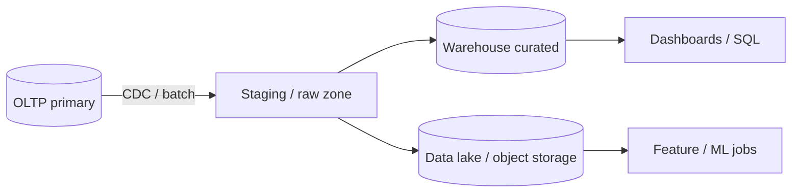

# OLTP vs OLAP

Separate **transactional** and **analytical** workloads so reporting does not compete with user-facing writes and short reads.

> **Related:** Columnar ops (ClickHouse, warehouse day-2) → [§1A](01A-columnar-olap-operations.md) · Batch/ETL(Extract, Transform, Load) → [HTS §8](../../high-throughput-systems/includes/08-batch-and-etl.md) · PG replicas → [PG §11](../../postgresql-performance/includes/11-read-scaling-and-caching.md) · Cost of retention → [finops §4](../../finops-and-cost/includes/04-storage-and-retention-cost.md)

---

## At a glance

| | **OLTP(Online Transaction Processing)** | **OLAP(Online Analytical Processing)** |
|--|----------------------------------------|----------------------------------------|
| **Goal** | Correct, fast single-row / small-set ops | Scan, join, aggregate large history |
| **Latency** | ms | seconds–minutes OK |
| **Schema** | Normalized, constraints | Denormalized facts/dims or wide tables |
| **Freshness** | Current | Minutes to day lag typical |
| **Examples** | Orders API(Application Programming Interface), payments, inventory adjust | Revenue dashboards, cohort, ML(Machine Learning) features |

**Rule of thumb:** If a query needs **yesterday's truth across millions of rows**, it belongs in a **warehouse or lake**, not on the primary.

---

## Roles of warehouse and lake

| Store | Strength | Weakness |
|-------|----------|----------|
| **Warehouse** (BigQuery, Snowflake, Redshift, PG analytics) | SQL(Structured Query Language) BI, governed schemas, predictable cost models | Less ideal as raw dump forever |
| **Lake** (S3/GCS + Iceberg/Delta/Parquet) | Cheap history, multi-engine consumers | Needs catalog + quality jobs or it becomes a swamp |
| **Lakehouse** | Lake storage + warehouse query engine | Ops for table format + permissions |

**Prefer warehouse** when analysts need trusted metrics with SLAs. **Prefer lake** when you retain raw events cheaply and multiple engines consume them. Many orgs run **both**: raw in lake, curated marts in warehouse.

---

## Sync patterns

| Pattern | Freshness | When |
|---------|-----------|------|
| **Batch ETL(Extract, Transform, Load) / ELT(Extract, Load, Transform)** | Hours–day | Stable reporting; simplest ops |
| **CDC(Change Data Capture) → warehouse** | Seconds–minutes | Near-real-time ops metrics |
| **Replica as "analytics DB"** | Replication lag | Small team; still isolate heavy queries |
| **Application dual-write** | "Immediate" | Avoid — consistency and failure modes |

ELT loads raw then transforms in-warehouse; ETL transforms before load. Pick based on warehouse compute cost and skill — both beat querying production.

---

## What stays in OLTP

| Keep in OLTP | Move out |
|--------------|----------|
| Authoritative entities and FKs | Multi-year clickstream |
| Row-level auth for product APIs | Cross-product monthly rollups |
| Short transactional history needed for UX | Ad-hoc analyst SQL |
| Idempotency / outbox tables | ML training corpora |

Document **freshness SLOs** for each mart ("orders_fact ≤ 15 minutes behind primary"). Product and finance should agree — not discover lag in an incident.

---

## Schema design split

| Concern | OLTP | OLAP |
|---------|------|------|
| **Keys** | Surrogate + natural business keys | Degenerate keys + surrogate dims |
| **Updates** | In-place / MVCC(Multi-Version Concurrency Control) | Append facts; SCD for dimensions |
| **Deletes** | Soft/hard per product rules | Retain tombstones or rebuild partitions |
| **PII(Personally Identifiable Information)** | Minimize; encrypt | Tokenize / hash in curated layer |

---

## Common mistakes

| Mistake | Fix |
|---------|-----|
| "Temporary" Tableau on primary | Dedicated warehouse or guarded replica |
| One giant lake with no owners | Catalog + domain ownership — [§5](05-data-ownership-lineage-retention.md) |
| Same retention for hot OLTP and cold analytics | Tier retention — [finops §4](../../finops-and-cost/includes/04-storage-and-retention-cost.md) |
| CDC without schema evolution plan | Version connectors; test migrations — [§6](06-migration-coordination.md) |

---

## Pros and cons

### Splitting OLTP and OLAP early

**Pros:** Protects SLO(Service Level Objective)s; clearer ownership; cheaper scale for history.

**Cons:** Sync lag education; more platforms to secure; migration cost when schemas change.