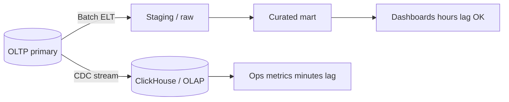

# Columnar OLAP Operations

> **Scope:** This section owns day-2 columnar OLAP(Online Analytical Processing) operations — ClickHouse-first partitions/TTL(Time To Live), MergeTree mental model, query kill, replica lag, and freshness SLO(Service Level Objective) versus OLTP(Online Transaction Processing). When to split OLTP vs warehouse/lake → [§1 OLTP vs OLAP](01-oltp-vs-olap.md). Protecting the primary from analytics → [§7](07-analytics-without-harming-oltp.md).

> **Related:** [§1 OLTP vs OLAP](01-oltp-vs-olap.md) · [§5 Ownership / retention](05-data-ownership-lineage-retention.md) · Batch/ETL(Extract, Transform, Load) → [HTS §8](../../high-throughput-systems/includes/08-batch-and-etl.md) · Cost → [finops §4](../../finops-and-cost/includes/04-storage-and-retention-cost.md)

---

## At a glance

| Concern | ClickHouse default | Managed warehouse note |
|---------|--------------------|------------------------|
| Layout | MergeTree family + partition key | Engine hides files; you still choose partition/cluster keys |
| Retention | TTL on tables/columns | Table expiration / lifecycle policies |
| Bad query | `KILL QUERY` + quotas | Cancel + slot/concurrency limits |
| Freshness | CDC(Change Data Capture) or ELT(Extract, Load, Transform) lag SLO | Same product conversation — different tooling |
| HA | ReplicatedMergeTree + ZooKeeper/Keeper | Vendor region/HA SKUs |

**Rule of thumb:** Columnar systems win on scans and compression; they lose when you treat them like an OLTP primary (point updates, tiny partitions, unbounded interactive SQL(Structured Query Language)).

---

## Managed warehouse vs self-managed ClickHouse

| Dimension | BigQuery / Snowflake / Redshift | Self-managed ClickHouse |
|-----------|----------------------------------|-------------------------|
| **Ops burden** | Jobs, slots/warehouses, cost controls | Nodes, disks, replication, upgrades |
| **Elasticity** | Scale compute nearly on demand | Plan capacity; add shards/replicas deliberately |
| **Cost model** | Bytes scanned / credits / nodes | Hardware + eng time; cheaper at steady high QPS |
| **Latency shape** | Seconds OK for BI; interactive varies | Sub-second possible for well-keyed merges |
| **Mutations** | MERGE/UPDATE patterns | Sparse updates; prefer append + Replacing/Collapsing |
| **When to prefer** | Analyst breadth, low ops staff, bursty load | High sustained ingest, strict latency, deep control |

Pick managed when the org buys **governance and elasticity**. Pick ClickHouse when ingest volume and interactive latency justify owning MergeTree ops. Hybrid is common: lake/warehouse for breadth, CH for a hot product analytics path.

---

## MergeTree mental model

Parts are immutable sorted chunks that **merge** in the background. Inserts create parts; merges coalesce them. Queries read many parts and merge results — too many small parts (insert chatter) hurts latency.

| Concept | Ops implication |
|---------|-----------------|
| **ORDER BY / primary key** | Sparse index; choose for filter selectivity |
| **PARTITION BY** | Drop/TTL whole partitions; avoid thousands of tiny partitions |
| **TTL** | Drop or move data by age; align with legal retention |
| **ReplicatedMergeTree** | Async replication; lag is a freshness signal |
| **Mutations** | Rewrites parts; treat as heavy maintenance |

Prefer **append-heavy** fact tables. Model corrections as new rows (ReplacingMergeTree / CollapsingMergeTree) rather than frequent in-place updates.

---

## Partitions, TTL, and retention

| Practice | Why |
|----------|-----|
| Partition by month/day matching drop cadence | Cheap `DROP PARTITION` / TTL |
| Cap partition cardinality | Avoid partition explosion (e.g. high-cardinality user id) |
| Column TTL for PII(Personally Identifiable Information) | Erase sensitive columns earlier than facts |
| Align TTL with lake/warehouse copies | One delete policy story — [§5](05-data-ownership-lineage-retention.md) |
| Prove restore/rebuild before aggressive TTL | Same rule as search ILM(Index Lifecycle Management) |

Retention is a product/legal decision expressed as TTL — not a disk-full emergency.

---

## Freshness: warehouse ELT vs CDC

| Path | Typical freshness | Ops focus |
|------|-------------------|-----------|
| **Batch ELT** | Hours–day | Job duration, watermark, late data |
| **CDC → columnar** | Seconds–minutes | Consumer lag, insert batching, replica lag |
| **Dual-write from app** | "Immediate" | Avoid — split brain on failure |

Document freshness SLOs per mart ("orders_fact ≤ 15 minutes behind primary") — [§1](01-oltp-vs-olap.md). Columnar replica lag is **not** a substitute for CDC consumer lag alerts.

---

## Query kill, quotas, and replica lag

| Signal | Meaning | Response |
|--------|---------|----------|
| Long-running scan | Missing filter / bad key | Kill; add quota; fix query or projection |
| Memory limit exceeded | Huge GROUP BY / JOIN | Cap memory; rewrite; pre-aggregate |
| Replica lag rising | Insert burst or slow merges | Throttle ingest; check disk/CPU |
| Too many parts | Tiny frequent inserts | Batch inserts; adjust merge settings |
| Mutation backlog | Heavy UPDATE/DELETE | Pause mutations; prefer rebuild partition |

Use server quotas and per-user limits so one analyst notebook cannot starve product dashboards. Prefer killing the query over restarting the node.

---

## Operational checklist

1. Name the freshness SLO per table/mart and the pipeline that feeds it (ELT job or CDC).
2. Alert on insert failures, too-many-parts, replica lag, disk, and killed/OOM(Out Of Memory) queries.
3. Set partition + TTL to match retention; test drop/TTL on a non-prod clone.
4. Enforce query timeouts, memory limits, and concurrency quotas per workload class.
5. Batch inserts; avoid row-at-a-time from OLTP request paths.
6. Run kill/cancel drills; document who may cancel production queries.
7. Separate ad-hoc analyst warehouses from latency-sensitive product OLAP when noisy-neighbor risk is high.

## Common mistakes

| Mistake | Fix |
|---------|-----|
| Point-update ClickHouse like PostgreSQL | Append + collapsing/replacing; rebuild partitions |
| Partition by high-cardinality id | Time (or coarse) partitions only |
| No query kill / quotas | Timeouts + workload isolation |
| Freshness SLO only on warehouse, ignore CDC lag | Alert both pipeline lag and replica lag |
| Run heavy BI on the OLTP primary "just once" | Warehouse/CH — [§7](07-analytics-without-harming-oltp.md) |
| TTL without lineage/erasure plan | Tie TTL to [§5](05-data-ownership-lineage-retention.md) ownership |
| Treat managed warehouse as zero-ops | Still own slots, cost, and schema contracts |