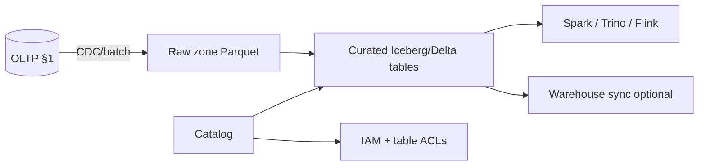

# Lakehouse Table Formats and Ops

**Lakehouse** storage combines cheap object-store files with **table formats** (Apache Iceberg, Delta Lake, Apache Hudi) so multiple engines query the same governed dataset. Day-2 ops — catalogs, compaction, ACLs(Access Control Lists), time travel — determine whether the lake stays trustworthy or becomes a swamp.

> **Scope:** Iceberg/Delta/Hudi operations on object storage. OLTP(Online Transaction Processing) vs lake split → [§1](01-oltp-vs-olap.md). Columnar/warehouse day-2 → [§1A](01A-columnar-olap-operations.md). Ownership and retention → [§5](05-data-ownership-lineage-retention.md). Cost → [finops §4](../../finops-and-cost/includes/04-storage-and-retention-cost.md).
>
> **Related:** Data contracts on marts → [§5A](05A-data-contracts-and-registries.md) · Quality checks → [§5B](05B-data-quality-and-pipeline-testing.md) · Analytics without harming OLTP → [§7](07-analytics-without-harming-oltp.md)

---

## At a glance

| Concern | Iceberg | Delta Lake | Hudi |
|---------|---------|------------|------|
| **Catalog** | REST(Representational State Transfer) / Glue / Hive / Nessie | Unity / Hive | Hive / OneTable |
| **Compaction** | Rewrite data files; expire snapshots | OPTIMIZE / Z-order | Clustering / compaction jobs |
| **Time travel** | Snapshot ID / timestamp | Version / timestamp | Instant timeline |
| **Row-level ops** | MERGE/DELETE (v2+) | MERGE common | Upserts / CDC(Change Data Capture) native |
| **Typical fit** | Multi-engine open lake | Databricks / Spark shops | Streaming upsert heavy |

**Rule of thumb:** Pick **one primary format per lake zone**; avoid three formats on the same prefix without strong platform reason.

---

## Architecture slice

Warehouse vs lake roles → [§1](01-oltp-vs-olap.md). This section owns **file-table ops**, not OLTP offload policy — [§7](07-analytics-without-harming-oltp.md).

---

## Catalogs

| Function | Why it matters |
|----------|----------------|
| **Table pointer** | Engines resolve `s3://…` + schema |
| **Atomic commit** | Concurrent writers don’t corrupt table |
| **Branch/tag (Iceberg)** | WAP(Write-Audit-Publish) publish flow |

| Practice | Detail |
|----------|--------|
| One catalog authority per environment | Avoid dual Hive + Glue drift |
| Name zones (`raw`, `curated`, `mart`) | Matches [§5](05-data-ownership-lineage-retention.md) ownership |
| Register in data catalog (DataHub, etc.) | Lineage and owner tags |

---

## Compaction and file layout

Small files from streaming ingest kill scan performance.

| Job | Trigger | Outcome |
|-----|---------|---------|
| **Compaction / rewrite** | File count / size threshold | Fewer, larger objects |
| **Snapshot expiration** | Retention policy | Lower storage; limits time travel |
| **Partition tuning** | Wrong grain (daily vs hourly) | Pruning matches query filters |

Align partition keys with **filter columns** in BI queries — same mental model as [PG §10](../../postgresql-performance/includes/10-partitioning.md) pruning. Monitor **metadata size** (Iceberg manifest growth).

---

## ACLs and governance

| Layer | Control |
|-------|---------|
| **Object storage IAM(Identity and Access Management)** | Prefix per zone/team |
| **Catalog ACL(Access Control List)** | Who may CREATE/ALTER/SELECT |
| **Column mask / row filter** | Engine-specific (Trino, Snowflake sync) |
| **Audit** | Who read PII(Personally Identifiable Information) tables |

Lake ACLs are **coarse** compared to PostgreSQL RLS(Row-Level Security) — [PG §17](../../postgresql-performance/includes/17-row-level-security-multi-tenant.md). Sensitive marts often land in warehouse with tighter policy — [§1A](01A-columnar-olap-operations.md).

---

## Time travel and recovery

| Use | Mechanism |
|-----|-----------|
| **Debug bad deploy** | Query snapshot before write |
| **Rollback table** | Restore snapshot / clone branch |
| **Compliance audit** | Prove historical state |

Document **retention**: expired snapshots are gone. Time travel is not backup — pair with object versioning and [§5](05-data-ownership-lineage-retention.md) retention classes.

---

## Day-2 checklist

- [ ] Compaction job owned with SLO(Service Level Objective) on file count
- [ ] Snapshot expiration aligned to legal hold exceptions
- [ ] Catalog HA and access audited quarterly
- [ ] Schema evolution via [§5A contracts](05A-data-contracts-and-registries.md)
- [ ] Freshness and volume monitors — [§5B](05B-data-quality-and-pipeline-testing.md)

---

## Common mistakes

| Mistake | Fix |
|---------|-----|
| Raw zone without catalog | Register tables early |
| Never compact streaming tables | Scheduled rewrite |
| Infinite time travel retention | Cost + finops §4 |
| Same format per engine whim | Standardize per zone |
| PII in raw without ACL | Zone isolation + audit |

---

## Pros and cons

| | Pros | Cons |
|--|------|------|
| **Open table format** | Engine choice; portable files | You operate compaction |
| **Warehouse-only curated** | Simpler ACLs | Duplicate storage if lake also full copy |
| **Hudi for CDC** | Upsert-native | Ops learning curve |
