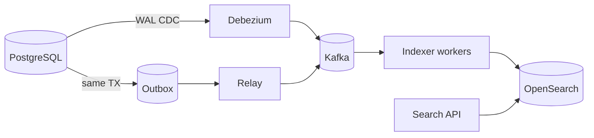

# Search Systems

Full-text, fuzzy, and faceted search usually live in **Elasticsearch / OpenSearch**. Treat them as **derived indexes** synced via CDC(Change Data Capture) or outbox — not a second write path in the request.

> **Scope:** Product search roles, mapping, reindex, and staleness UX. Pipeline depth and reindex runbook → [HTS §15 CDC and search indexing](../../high-throughput-systems/includes/15-cdc-and-search-indexing.md). Day-2 cluster ops (shards, ILM(Index Lifecycle Management), alias cutover, latency triage) → [§2A](02A-search-cluster-operations.md).
>
> **Related:** Cluster ops → [§2A](02A-search-cluster-operations.md) · Kafka Connect/integration → [apache-kafka §8](../../apache-kafka/includes/08-integration-patterns.md) · Outbox → [ES §5](../../event-sourcing-and-cqrs/includes/05-async-integration.md) · PG GIN(Generalized Inverted Index) limits → [PG §2](../../postgresql-performance/includes/02-indexing.md)

---

## At a glance

| Need | Prefer |
|------|--------|
| Simple keyword on modest data | PostgreSQL `tsvector` / GIN(Generalized Inverted Index) |
| Relevance, typo tolerance, facets at scale | OpenSearch / Elasticsearch |
| Sync without dual-write | CDC (Debezium) or transactional outbox → indexer |
| Analytics "search" over history | Warehouse / lake — not the user search cluster |

**Rule of thumb:** Billions of docs or heavy facets → dedicated search. Sync **async**; document lag in the API(Application Programming Interface).

---

## Sync architecture

| Path | Pros | Cons |
|------|------|------|
| **CDC** | Minimal app change per table | Connector + schema migration coupling |
| **Outbox** | Explicit domain events | App must write outbox row |
| **Batch snapshot** | Simple rebuild | High lag; load spikes |

Do **not** `INSERT` into search inside the same HTTP(Hypertext Transfer Protocol) handler as the OLTP write — partial failure leaves split brain.

Deep dive: [HTS §15](../../high-throughput-systems/includes/15-cdc-and-search-indexing.md).

---

## Index design

| Topic | Guidance |
|-------|----------|
| **Mapping** | Explicit types; avoid dynamic mapping in prod |
| **IDs** | Stable document id = business key (e.g. `order_id`) |
| **Deletes** | Soft-delete flag or delete-by-id from CDC tombstones |
| **Multi-tenant** | Tenant id in every doc + filter; or index-per-tenant at scale |
| **Analyzers** | Language-specific; test relevance with real queries |

Separate **user search** from **internal ops search** indexes when query shapes and SLOs differ.

---

## Consistency and UX

| Expectation | Pattern |
|-------------|---------|
| Search lags writes by seconds | Async index; show "updating…" or accept stale |
| Read-your-writes after create | Fallback to OLTP by id, or refresh primary shard for that user |
| Mapping change | New index + backfill + alias swap ([deployment blue/green](../../deployment-strategies/includes/03-blue-green.md)) |

Publish a freshness SLO(Service Level Objective): e.g. **p95 index lag < 30s**. Alert on consumer lag growth, not only absolute lag.

---

## Reindex checklist

| Step | Action |
|------|--------|
| 1 | Create `orders_vN` with new mapping |
| 2 | Backfill from snapshot or replay Kafka topic |
| 3 | Compare counts + sample query golden set |
| 4 | Alias `orders` → `orders_vN` |
| 5 | Retain old index until rollback window ends |

Coordinate with schema migrations — [§6](06-migration-coordination.md) and [PG §15](../../postgresql-performance/includes/15-schema-migration-checklist.md).

---

## When PostgreSQL search is enough

| Signal | Stay on PG |
|--------|------------|
| Corpus small; simple `ILIKE` / FTS | Yes |
| No fuzzy/geo/heavy facets | Yes |
| Search share of CPU already high | Move out |
| Need cross-service unified search | OpenSearch |

---

## Common mistakes

| Mistake | Fix |
|---------|-----|
| Dual-write in request path | CDC/outbox — [HTS §15](../../high-throughput-systems/includes/15-cdc-and-search-indexing.md) |
| Search as inventory source of truth | OLTP owns stock; search is display |
| In-place mapping break | Blue/green index + alias |
| One cluster for prod search + ad-hoc analytics | Split or warehouse |
| No lag alerts | Monitor indexer consumer group lag |

---

## Pros and cons

### Dedicated search cluster

**Pros:** Relevance tooling; scale reads independently; protects OLTP.

**Cons:** Sync complexity; reindex cost; eventual consistency UX.