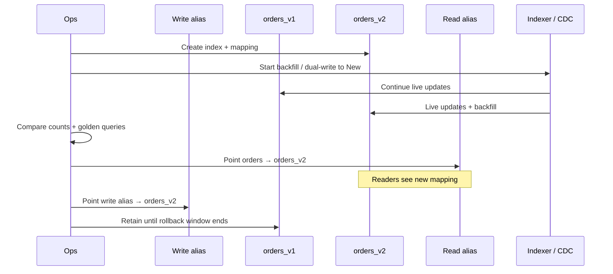
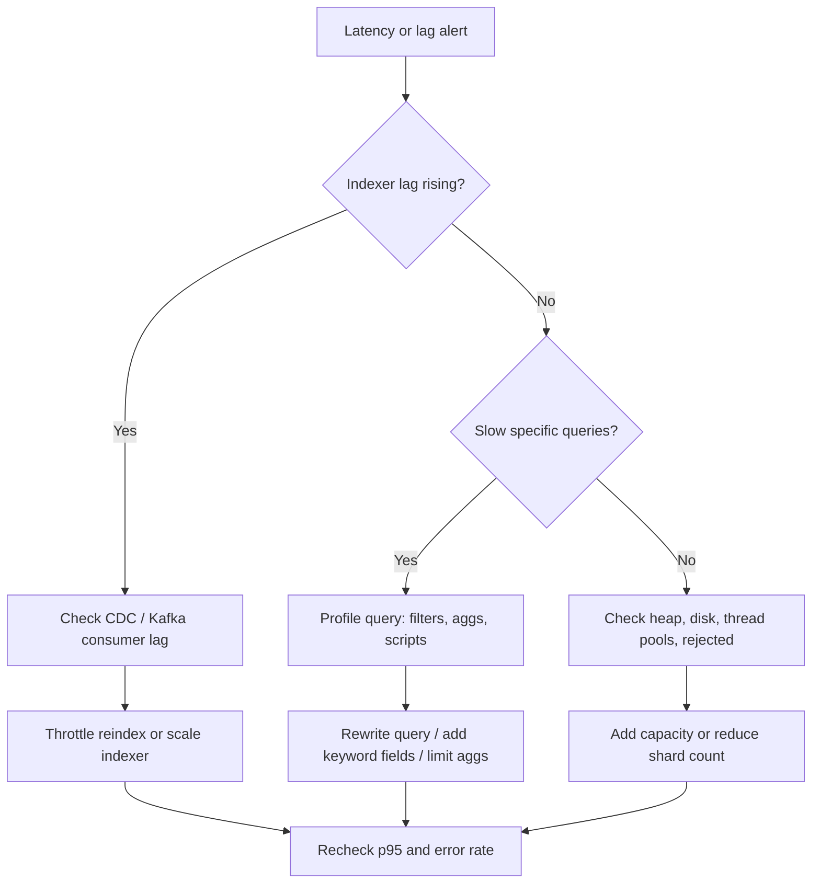

# Search Cluster Operations

> **Scope:** This section owns day-2 search cluster operations — shards/replicas, ILM(Index Lifecycle Management)/rollover, alias blue/green, query latency triage, and reindex under traffic. Product search roles, mapping, and sync architecture → [§2 Search systems](02-search-systems.md). CDC(Change Data Capture) pipeline depth and reindex runbook outline → [HTS §15](../../high-throughput-systems/includes/15-cdc-and-search-indexing.md).

> **Related:** [§2 Search systems](02-search-systems.md) · [HTS §15 CDC and search](../../high-throughput-systems/includes/15-cdc-and-search-indexing.md) · [§6 Migration coordination](06-migration-coordination.md) · [Deployment blue/green](../../deployment-strategies/includes/03-blue-green.md)

---

## At a glance

| Concern | Default | Trade-off |
|---------|---------|-----------|
| Shards | Size for target docs/primary; avoid tiny shards | Oversharding wastes heap and merge CPU |
| Replicas | ≥1 for HA; more only for read scale | Extra replica = write amplification |
| Lifecycle | ILM/ISM rollover by size + age | Hot/warm/cold needs capacity planning |
| Mapping change | New index + alias swap | Dual-write/backfill cost during cutover |
| Latency | Triage query shape before adding nodes | Hardware rarely fixes bad aggregations |

**Rule of thumb:** Search is a **derived** cluster — ops success is healthy shards, bounded lag, and safe cutovers, not treating the index as a second OLTP(Online Transaction Processing) primary.

---

## Shards, replicas, and capacity

| Signal | Meaning | Response |
|--------|---------|----------|
| Heap pressure / GC storms | Too many shards or oversized heap | Reduce shard count; keep heap ≤ ~50% RAM |
| Uneven shard sizes | Hot indices or bad routing | Rebalance; review routing keys |
| Replica unassigned | Node loss or disk watermark | Free disk; replace node; restore |
| Write reject / flood stage | Disk watermark hit | Delete/rollover cold data; add capacity |
| Segment merge backlog | Write burst or undersized I/O | Throttle indexing; scale data nodes |

Prefer **fewer, larger** primaries over hundreds of tiny shards. Size for expected growth through the next rollover window, not theoretical max forever. Separate **user-search** and **ops/analytics** clusters when query shapes and SLOs diverge — [§2](02-search-systems.md).

---

## ILM / rollover and aliases

Time- or size-based indices (logs, events, append-heavy catalogs) need **rollover** so shards stay healthy. Alias the write target (`orders-write`) and the read target (`orders`) separately when dual-writing during a cutover.

| Phase | Hot | Warm / cold | Delete |
|-------|-----|-------------|--------|
| Role | Index + serve interactive queries | Rarely updated; cheaper storage | Past retention |
| Ops | Rollover by max size / age / docs | Force-merge optional; move nodes | ILM delete after legal window |
| Risk | Too-large shards slow recovery | Premature force-merge blocks updates | Deleting before rebuild path exists |

Document retention with domain owners — [§5](05-data-ownership-lineage-retention.md). Do not rely on ILM delete if legal hold or rebuild-from-source is unclear.

---

## Reindex under traffic (alias blue/green)

Architecture and sync stay in [§2](02-search-systems.md) and [HTS §15](../../high-throughput-systems/includes/15-cdc-and-search-indexing.md). Ops own the **cutover under load**: dual-index while CDC catches up, validate, swap alias, keep rollback.

| Step | Guardrail |
|------|-----------|
| Create `*_vN` | Explicit mapping; no dynamic surprises |
| Dual-write / replay | Indexer lag SLO(Service Level Objective) still met on both |
| Validate | Doc counts, id samples, relevance golden set |
| Alias swap | Atomic alias actions; monitor p95 latency |
| Cleanup | Delete old only after rollback window |

Coordinate DB schema changes that feed fields — [§6](06-migration-coordination.md).

---

## Lag and query latency triage

| Symptom | Likely cause | First check |
|---------|--------------|-------------|
| All queries slow | Cluster saturation, GC, disk | Node CPU, heap, disk watermarks |
| One query slow | Heavy agg, script, wildcard | Profile API(Application Programming Interface); simplify query |
| Freshness complaints | Indexer / CDC lag | Consumer group lag vs SLO |
| Spiky latency | Merges, snapshots, reindex job | Concurrent heavy tasks |
| Timeouts after deploy | Mapping/query mismatch | Golden query suite |

Publish a freshness SLO(Service Level Objective) (e.g. p95 index lag < 30s) and alert on **lag growth rate**, not only absolute lag — [§2](02-search-systems.md).

---

## Operational checklist

1. Document shard strategy, replica count, ILM phases, and retention per index family.
2. Alert on unassigned shards, disk watermarks, JVM heap, rejected requests, and indexer lag.
3. Keep write and read aliases separate during blue/green cutovers.
4. Run golden query + count validation before every alias swap.
5. Cap concurrent reindex/snapshot/force-merge so interactive search keeps SLO.
6. Test restore or rebuild-from-source before relying on delete policies.
7. Split analytics scans off the user-search cluster.

## Common mistakes

| Mistake | Fix |
|---------|-----|
| Hundreds of tiny shards "for scale" | Size shards; rollover instead of oversharding |
| In-place mapping change on live index | New index + alias swap under traffic |
| Reindex without dual-write catch-up | Keep CDC writing both until lag clears |
| Scale nodes to fix one bad aggregation | Profile and rewrite the query first |
| Same cluster for product search and ad-hoc BI | Separate cluster or warehouse — [§1](01-oltp-vs-olap.md) |
| ILM delete with no rebuild path | Prove restore/rebuild before automate delete |
| Lag alert only on absolute seconds | Alert on lag growth and SLO burn |