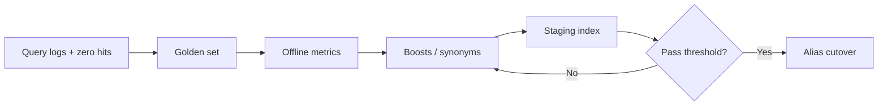

# Search Relevance and Ranking

Search quality is **query analysis, field boosts, synonyms, and eval** — not only cluster uptime. Relevance regressions ship silently until users complain; golden sets and offline metrics catch drift before deploy.

> **Scope:** Ranking design, tuning workflow, and evaluation harness. Index sync and cluster ops → [§2](02-search-systems.md) · [§2A](02A-search-cluster-operations.md). Autocomplete latency patterns → [system-design §8](../../system-design-walkthroughs/includes/08-search-autocomplete.md). CDC(Change Data Capture) freshness → [HTS §15](../../high-throughput-systems/includes/15-cdc-and-search-indexing.md).
>
> **Related:** Data quality tests → [§5B](05B-data-quality-and-pipeline-testing.md) · Hybrid RAG(Retrieval-Augmented Generation) ranking → [SDS §3](../../specialized-data-systems/includes/03-vector-and-rag.md) · Product API(Application Programming Interface) surfacing → [api-design §1](../../api-design-and-protection/includes/01-api-design.md)

---

## At a glance

| Layer | Question |
|-------|----------|
| **Analysis** | Tokenization, stemming, language — match user intent |
| **Query** | Multi-match, filters, boosts — which fields matter |
| **Synonyms** | Brand aliases, typos, domain terms |
| **Eval** | Golden queries + graded relevance — gate deploy |
| **Ops** | Slow query log, zero-result rate — [§2A](02A-search-cluster-operations.md) |

**Rule of thumb:** Tune with **labeled queries**, not gut feel. If you cannot replay a golden set in CI(Continuous Integration), you do not control relevance.

---

## Tuning loop

| Artifact | Content |
|----------|---------|
| **Golden set** | 200–2000 queries with expected doc ids (graded 0–3) |
| **Synonym map** | Curated + reviewed; version in git |
| **Boost config** | `title^3`, recency decay, popularity signal |
| **Negative cases** | Queries that must not return competitor/internal docs |

---

## Query analysis and boosts

| Technique | When |
|-----------|------|
| **Standard + edge n-gram** | Prefix match on titles — autocomplete path → [system-design §8](../../system-design-walkthroughs/includes/08-search-autocomplete.md) |
| **`multi_match` best_fields** | General keyword search — [§2](02-search-systems.md) |
| **Function score** | Recency, click-through, inventory |
| **Filters** | Tenant, ACL(Access Control List), facet constraints — never post-filter alone at scale |
| **Highlight** | Snippet fields for UX; not for ranking |

Document boost rationale in PR(Pull Request); avoid one-off prod edits without eval rerun.

---

## Synonyms and expansions

| Type | Example | Risk |
|------|---------|------|
| **Equivalents** | `laptop` ↔ `notebook` | Over-broad merges |
| **One-way** | `iphone` → `apple phone` | Safer for brands |
| **Domain glossary** | Internal SKU(Stock Keeping Unit) codes | Stale without owner |

Review quarterly with support ticket tags. Test synonym changes against golden set before alias swap — [§2A](02A-search-cluster-operations.md).

---

## Evaluation metrics

| Metric | Measures |
|--------|----------|
| **Precision@K** | Top K results relevant |
| **nDCG(Normalized Discounted Cumulative Gain)@K** | Graded relevance with position discount |
| **MRR(Mean Reciprocal Rank)** | Rank of first good hit |
| **Zero-result rate** | Coverage gaps (prod monitor) |

Set minimum nDCG delta for deploy. Pair offline wins with **canary** search traffic compare.

---

## Common mistakes

| Mistake | Fix |
|---------|-----|
| Boost-only tuning without eval | Golden set in CI |
| Synonyms from raw query logs unchecked | Human review + negative tests |
| Ignoring tenant filter in eval | Per-tenant golden subsets |
| Staging index stale vs prod mapping | Same analyzer chain — [§2](02-search-systems.md) |
| Popularity dominates new items | Decay or explore bucket |
| Relevance-only, latency ignored | p99 budget — [§2A](02A-search-cluster-operations.md) |

---

## Pros and cons

| Approach | Pros | Cons |
|----------|------|------|
| **OpenSearch learning-to-rank** | Data-driven | Needs click logs + governance |
| **Hand-tuned BM25(Best Matching 25) + boosts** | Explainable; fast to start | Drifts without eval |
| **External search SaaS(Software as a Service)** | Managed relevance features | Vendor lock-in; less control |
