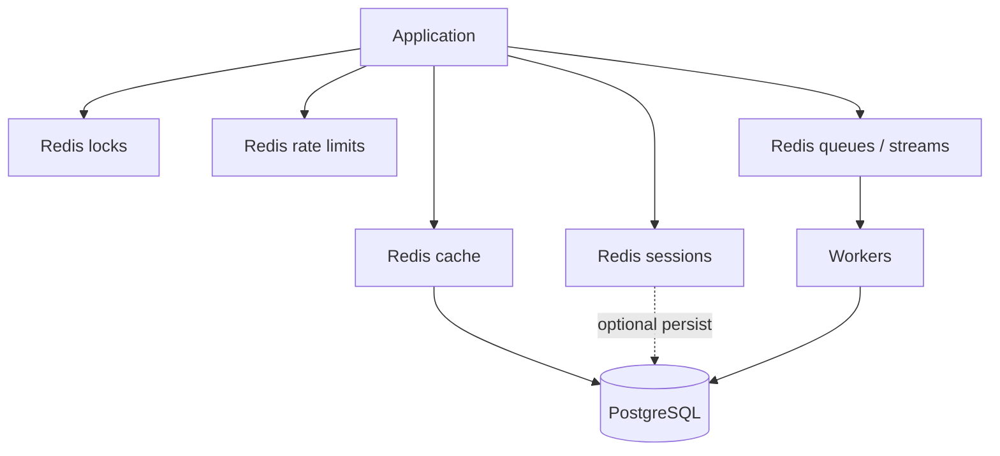

# Redis and In-Memory

Redis is a **multi-role** tool: cache, lock, session, lightweight queue, and rate-limit store. Pick **one primary role per keyspace** and never treat Redis as the durable system of record unless you design for persistence and failover explicitly.

> **Related:** Cache patterns → [HTS §4](../../high-throughput-systems/includes/04-caching-layers.md) · End-to-end coherence → [§4](04-caching-end-to-end.md) · Distributed limits → [api-rate-limiting §12](../../api-rate-limiting/includes/12-distributed-rate-limiting.md) · Connection security → [database-connection](../../database-connection-and-security/README.md)

---

## At a glance

| Role | Typical commands | Durability need |
|------|------------------|-----------------|
| **Cache** | `GET`/`SET` + TTL | Low — rebuild from DB |
| **Session** | Hash / string + TTL | Medium — sticky UX |
| **Distributed lock** | `SET NX PX` / Redlock caution | Ephemeral |
| **Queue** | Lists / Streams | Medium–high — ack semantics |
| **Rate limit** | Counters / tokens + TTL | Low — fail-open/closed policy |

**Rule of thumb:** If losing Redis means **losing money or legal state**, that state belongs in PostgreSQL (or a dedicated durable store) — Redis holds a **projection** or **coordination** token.

---

## Role boundaries

| Do | Don't |
|----|-------|
| Namespace keys: `svc:env:purpose:id` | Mix cache and queue keys without prefix |
| Set TTL on cache and sessions | Infinite keys without eviction policy |
| Document fail-open vs fail-closed for limits | Silent allow-all on Redis outage without policy |
| Use Streams or a real broker for critical jobs | Unbounded `LPUSH` as the only job system at scale |

For high-volume event fan-out, prefer [Kafka](../../apache-kafka/README.md) over Redis lists — [HTS §14](../../high-throughput-systems/includes/14-message-brokers-and-queues.md).

---

## Cache role

| Pattern | Notes |
|---------|-------|
| **Cache-aside** | Default — miss loads DB, sets TTL |
| **Invalidation** | Delete keys on write; avoid write-through unless required |
| **Stampede** | Singleflight / lock / probabilistic early refresh — [HTS §4](../../high-throughput-systems/includes/04-caching-layers.md) |

Hot keys: shard key, local in-process cache with short TTL, or read replica for that entity.

---

## Locks and sessions

| Concern | Guidance |
|---------|----------|
| **Lock TTL** | Always expire; holder renews if work longer |
| **Lock value** | Token so only owner unlocks |
| **Redlock** | Understand limits; prefer single Redis with fencing token for many cases |
| **Sessions** | Encrypt payloads; rotate signing keys; prefer server session id → Redis over giant cookies |

Do not hold DB transactions open while waiting on Redis locks — lock scope should be app-level critical section only.

---

## Queue and rate limit

| Use | Prefer Redis when | Prefer elsewhere when |
|-----|-------------------|------------------------|
| **Jobs** | Low volume, simple retries | Need replay, many consumers → Kafka/SQS |
| **Rate limits** | Shared multi-instance counters | Edge-only static limits → CDN(Content Delivery Network)/WAF(Web Application Firewall) |

Rate-limit topology and fail modes: [api-rate-limiting §12](../../api-rate-limiting/includes/12-distributed-rate-limiting.md).

---

## Operations checklist

| Item | Why |
|------|-----|
| Memory + eviction policy (`allkeys-lru` vs `noeviction`) | Cache vs queue need different policies — **split instances** if both |
| Persistence (AOF/RDB) | Only if role requires restart survival |
| Replica + failover | Session/lock outage = user impact |
| Key cardinality alerts | Unbounded user ids → OOM |
| AUTH / TLS(Transport Layer Security) / network isolation | Redis is a high-value target |

---

## Common mistakes

| Mistake | Fix |
|---------|-----|
| Redis as order database | PostgreSQL source of truth |
| One Redis for cache + unbounded queue | Separate instances/policies |
| No TTL on cache | Eviction + explicit TTL |
| Lock without expiry | Always `PX` / watchdog |
| Rate limit fail-open undocumented | Explicit policy — [rate-limiting §11](../../api-rate-limiting/includes/11-common-mistakes-and-architecture.md) |

---

## Pros and cons

### Redis as platform Swiss Army knife

**Pros:** Fast; versatile; widely understood; great for coordination.

**Cons:** Easy to overload one cluster with conflicting roles; durability misconceptions; ops under memory pressure.