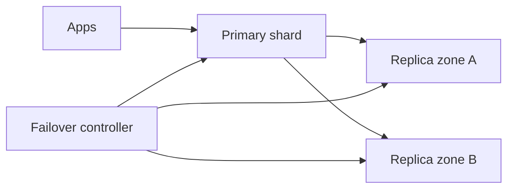
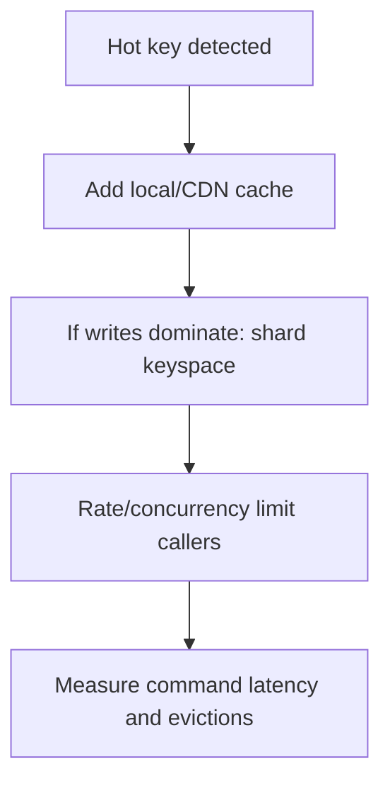

# Redis Operations

> **Scope:** This section owns Redis production topology, persistence, memory, hot keys, and failover. For cache semantics and invalidation, see [high-throughput-systems §4](../../high-throughput-systems/includes/04-caching-layers.md).

> **Related:** [§3 Redis and in-memory](03-redis-and-in-memory.md) · [§4 Caching end to end](04-caching-end-to-end.md) · [HTS caching layers](../../high-throughput-systems/includes/04-caching-layers.md)

---

## At a glance

| Choice | Default | Trade-off |
|--------|---------|-----------|
| Role | Separate cache, rate-limit, and durable-state workloads | Limits noisy-neighbor failure |
| Persistence | RDB(Redis Database) snapshots plus AOF(Append-Only File) where loss budget demands | More disk and recovery work |
| Memory | Max memory and explicit eviction policy | Prevents host OOM(Out Of Memory) |
| Topology | Replica/automatic failover; cluster only for scale | More shards increase operational complexity |
| Keys | Bounded TTL(Time To Live), namespace, small values | Enables safe eviction and migration |

**Rule of thumb:** Redis is fast because it is memory-bound; capacity, eviction, and recovery are product requirements, not afterthoughts.

---

## Topology and failure domains

| Shape | Use when | Guardrail |
|-------|----------|-----------|
| Single primary + replica | Small, one failure domain acceptable | Test promotion and client reconnect |
| Sentinel/managed failover | Need automatic primary promotion | Quorum and split-brain runbook |
| Cluster shards | Memory/write capacity exceeds one node | Design hash tags and handle multi-key limits |
| Separate clusters | Different durability/latency/security needs | Do not share cache eviction with sessions |

Plan capacity for failover: remaining nodes must carry the failed node's traffic and replica promotion lag. Clients need short connect timeouts, bounded retries, and topology refresh; a perfect failover is useless if clients pin the dead primary.

---

## Persistence and recovery

RDB snapshots provide compact point-in-time recovery. AOF records writes for lower data loss, with rewrite cost and longer recovery potential. Neither makes Redis a substitute for a transactional system unless the durability design has been tested.

| Mode | RPO(Recovery Point Objective) shape | Operational concern |
|------|-------------------------------------|---------------------|
| RDB only | Since last snapshot | Faster restart; more loss window |
| AOF every second | Approximately one second of acknowledged writes | Disk fsync and rewrite headroom |
| AOF every write | Lower loss | Latency/throughput penalty |
| No persistence | Cache only | Rebuild source and warm-up plan |

Restore drills must measure dataset load time, replica catch-up, cache warm-up, and application behavior while keys are missing. Back up persistence files securely and validate restoring to an isolated environment.

---

## Memory and hot keys

Memory includes key/value bytes, allocator overhead, replication buffers, client output buffers, and fragmentation. Set `maxmemory` below host/container limit and choose eviction deliberately.

| Signal | Meaning | Response |
|--------|---------|----------|
| Used memory near max | Eviction/OOM risk | Reduce dataset or scale before saturation |
| Evictions rising | TTL/capacity mismatch | Verify policy and cache hit impact |
| Fragmentation high | Allocator/large-value churn | Restart/shard after investigating |
| One command latency spike | Hot key or slow command | Inspect command latency and key access |
| Replica lag | Recovery/read freshness risk | Reduce write burst or increase capacity |

Do not “fix” a hot key by increasing one node's memory. Replication copies the same hot workload; use local cache, request coalescing, key sharding where semantics permit, and caller limits.

---

## Eviction, keys, and commands

Choose `noeviction` for correctness-critical state so writes fail loudly; choose an LRU(Latest Recently Used)-like TTL policy only for rebuildable cache data. Use key namespaces such as `cache:catalog:v2:` and bounded TTLs. Scan incrementally for maintenance; never run blocking `KEYS *` in production.

Avoid unbounded lists, sets, hashes, and large values. Prefer pipelining for independent operations, but cap pipeline size. Lua scripts and transactions are atomic but can block the single-threaded command path; keep them small and measure their latency.

---

## Operational checklist

1. Document each cluster's role, source of truth, TTL, eviction policy, and data-loss budget.
2. Alert on memory, evictions, command latency, replication lag, persistence failures, and failovers.
3. Test primary promotion, client topology refresh, and restore at realistic dataset size.
4. Enforce TLS(Transport Layer Security), AuthN(Authentication), ACL(Access Control List), and network isolation.
5. Review top keys/commands without logging sensitive values.

## Common mistakes

| Mistake | Fix |
|---------|-----|
| Put sessions and disposable cache in one eviction pool | Separate roles/clusters or use noeviction for state |
| Assume replica promotion has no capacity cost | Reserve headroom and test client reconnect |
| Enable persistence without restore drills | Measure restore, catch-up, and warm-up |
| Use `KEYS *` or long Lua scripts | Use SCAN and bounded operations |
| Treat hot keys as a memory problem | Reduce concentrated reads/writes and fan-out |
| Leave max memory unset | Set a safe limit and alert before eviction |