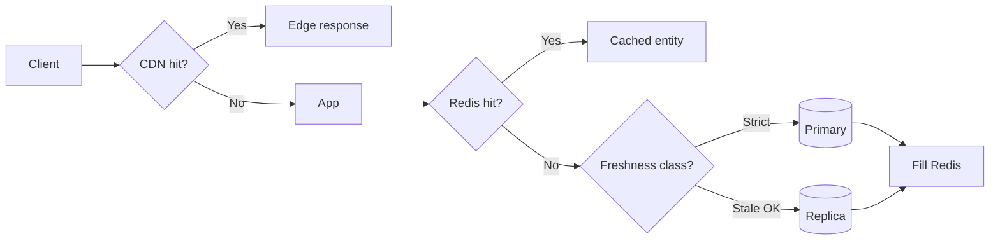

# Caching End to End

Coherence from **CDN(Content Delivery Network) → application cache → database** — what each layer may serve, how invalidation propagates, and what users can believe about freshness.

> **Scope:** Cross-layer coherence, TTLs, purge, and consistency promises for Tech Leads. Per-layer algorithms (cache-aside, stampede, write-through) → [HTS §4 caching layers](../../high-throughput-systems/includes/04-caching-layers.md).
>
> **Related:** PG read scaling → [PG §11](../../postgresql-performance/includes/11-read-scaling-and-caching.md) · Consistency costs → [PG §14](../../postgresql-performance/includes/14-consistency-promises-and-costs.md) · Redis roles → [§3](03-redis-and-in-memory.md)

---

## At a glance

| Layer | Typical TTL | Invalidate how | Serves |
|-------|-------------|----------------|--------|
| **CDN** | Seconds–hours | Purge by URL/tag | Public/cacheable GET |
| **App (Redis)** | Seconds–minutes | Key delete on write | Personalized + hot entities |
| **Replica** | Lag-based | N/A (replication) | Stale-OK reads |
| **Primary** | — | — | Authoritative writes + critical reads |

**Rule of thumb:** Every cacheable response needs a **stated freshness class** (public CDN, private Redis, or primary-only). Mixing classes without docs causes "I updated it but still see old" incidents.

---

## Request path

| Freshness class | Example | Path |
|-----------------|---------|------|
| **Public cacheable** | Marketing page, public catalog | CDN → app → Redis/DB |
| **Private short TTL** | Logged-in dashboard widgets | App Redis; `Cache-Control: private` |
| **Read-your-writes** | Post-checkout order view | Primary or bypass CDN; optional Redis skip |
| **Eventually consistent OK** | Search results | Search index — [§2](02-search-systems.md) |

---

## Invalidation strategies

| Strategy | Works well when | Fails when |
|----------|-----------------|------------|
| **TTL only** | Low change rate | Users expect instant updates |
| **Write-delete** | Known key set | Fan-out many keys / CDN URLs |
| **Tag / surrogate keys** | Page composed of many entities | Tags unbounded |
| **Event-driven** | CDC(Change Data Capture)/outbox already exists | No bus yet |
| **Version in key** | `product:42:v7` | Clients hold old URLs |

CDN purge is **expensive and eventual** — prefer short TTL for volatile public content; reserve purge for emergencies and deploys.

---

## Coherence rules

1. **Writes always hit the system of record first** (PostgreSQL), then invalidate outward.
2. **Never** serve CDN-cached personalized data with shared cache keys.
3. **Align TTLs:** CDN TTL ≤ app cache TTL is safer than the reverse for the same resource (or use different URLs).
4. **Document bypass:** admin/preview routes skip CDN and optionally Redis.
5. **Measure hit ratio and origin load** — a "cache" that always misses still costs Redis RTT.

Stampede and pattern details: [HTS §4](../../high-throughput-systems/includes/04-caching-layers.md).

---

## Multi-region note

| Pattern | Implication |
|---------|-------------|
| Regional Redis | Invalidate local; cross-region may lag |
| Global CDN | Purge is multi-POP; expect seconds |
| Read-local DB | Pair with [HTS §13](../../high-throughput-systems/includes/13-multi-region-read-routing.md) |

---

## Common mistakes

| Mistake | Fix |
|---------|-----|
| CDN caching `Set-Cookie` / personalized HTML | `private, no-store` or vary correctly |
| Invalidate Redis but not CDN | Purge tags or shorter CDN TTL |
| Duplicate HTS §4 content here without linking | Keep algorithms in HTS; coherence here |
| Infinite TTL + rare writes | Still set TTL as safety net |
| Cache negative lookups forever | Short TTL on 404s |

---

## Pros and cons

### Layered caching with explicit classes

**Pros:** Huge read scale; clear UX expectations; protects primary.

**Cons:** Invalidation bugs; harder debugging; cost of multi-layer ops — [finops](../../finops-and-cost/README.md).