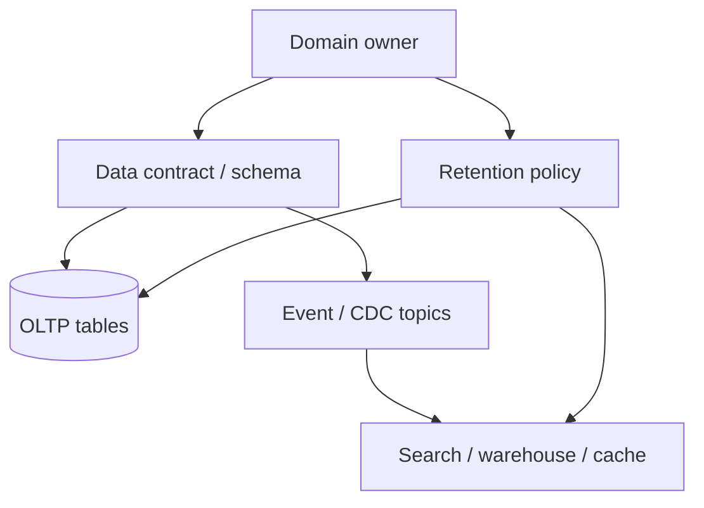

# Data Ownership, Lineage, and Retention

Every derived store needs a **named owner**, a **lineage path** back to the system of record, and a **retention policy** that finance, legal, and engineering agree on.

> **Related:** Contracts / Schema Registry day-2 → [§5A](05A-data-contracts-and-registries.md) · OLTP vs warehouse → [§1](01-oltp-vs-olap.md) · Kafka retention → [apache-kafka §5](../../apache-kafka/includes/05-retention-compaction-and-storage.md) · Kafka event catalog / freshness SLOs → [apache-kafka §9](../../apache-kafka/includes/09-cluster-setup-and-requirements.md#event-catalog-and-ownership-slos) · Storage cost → [finops §4](../../finops-and-cost/includes/04-storage-and-retention-cost.md) · Multi-tenant isolation → [api-design §16](../../api-design-and-protection/includes/16-multi-tenant-apis.md)

---

## At a glance

| Question | Answer owner |
|----------|--------------|
| Who can change the schema? | Domain / data product owner |
| How did this row get here? | Lineage (job, topic, CDC(Change Data Capture)) |
| How long do we keep it? | Retention + legal hold policy |
| Who pays for storage? | FinOps(Cloud Financial Operations) / product budget — [finops §6](../../finops-and-cost/includes/06-cost-visibility-and-budgets.md) |

**Rule of thumb:** If you cannot name the **producer**, **consumer**, and **delete path** for a dataset, do not put production traffic on it.

---

## Ownership model

| Role | Responsibility |
|------|----------------|
| **Domain owner** | Semantics, access, SLA(Service Level Agreement) for freshness |
| **Platform** | Pipelines, catalogs, access machinery |
| **Consumers** | Declare needs; do not fork silent copies |
| **Security / legal** | PII(Personally Identifiable Information) classes, residency, erasure |

Prefer **data products** (orders_fact, customer_profile) over "the analytics dump" shared folders.

---

## Lineage minimum

| Artifact | Capture |
|----------|---------|
| **Source** | DB table / API(Application Programming Interface) / file |
| **Transform** | Job name, version, git SHA |
| **Sink** | Table, index, bucket path |
| **Time** | Batch watermark or CDC offset |
| **Schema version** | Compatibility mode |

Catalog tools (OpenMetadata, DataHub, vendor catalogs) help — start with a **markdown/registry row per dataset** if tooling is immature.

For **Kafka topics**, the topic manifest **is** the event catalog (owner, consumers, classification, freshness SLO(Service Level Objective)) — [apache-kafka §9 event catalog](../../apache-kafka/includes/09-cluster-setup-and-requirements.md#event-catalog-and-ownership-slos). Trace topics to sinks: [apache-kafka §8](../../apache-kafka/includes/08-integration-patterns.md).

---

## Retention tiers

| Tier | Example | Typical retention |
|------|---------|-------------------|
| **Hot OLTP** | Active orders | Days–months online; archive older |
| **Ops logs / Kafka** | Audit stream | Days–weeks, then warehouse export |
| **Warehouse marts** | Finance facts | Years per regulation |
| **Raw lake** | Clickstream | Cheap storage; lifecycle to cold/glacier |
| **Search index** | Product docs | Online working set only; rebuild from source |

Align Kafka topic retention with downstream durability — do not assume infinite log ([kafka §5](../../apache-kafka/includes/05-retention-compaction-and-storage.md)).

---

## Privacy and erasure

| Requirement | Pattern |
|-------------|---------|
| **Right to erasure** | Delete/anonymize in OLTP; propagate tombstones via CDC to search/warehouse |
| **Legal hold** | Freeze deletion jobs for case ids |
| **Residency** | Region-scoped buckets and clusters |
| **PII in derived stores** | Minimize; hash/tokenize in curated layers |

Event-sourced systems need explicit erasure strategies — [ES decision guide](../../event-sourcing-and-cqrs/includes/06-decision-guide.md).

---

## Access and contracts

| Practice | Why |
|----------|-----|
| Column-level classification | Stop PII leaking to BI tools |
| Versioned schemas / contracts | Break consumers intentionally |
| Read replicas / warehouse roles | Least privilege vs primary superuser |
| Quotas on expensive scans | Protect shared warehouses — [§7](07-analytics-without-harming-oltp.md) |

---

## Common mistakes

| Mistake | Fix |
|---------|-----|
| "Shared" tables with no owner | Assign domain owner before go-live |
| Infinite retention "just in case" | Default delete + legal exceptions |
| Erase in OLTP only | Propagate to search, lake, backups policy |
| Shadow ETL(Extract, Transform, Load) in a spreadsheet | Register dataset or refuse production use |
| Kafka retention < warehouse lag | Extend retention or land to durable store first |
| Kafka topic with no catalog owner / freshness SLO | Require manifest before produce — [kafka §9](../../apache-kafka/includes/09-cluster-setup-and-requirements.md#event-catalog-and-ownership-slos) |

---

## Pros and cons

### Explicit ownership and lineage

**Pros:** Faster incident debug; compliance readiness; cost control.

**Cons:** Process overhead; catalog maintenance; requires org buy-in.