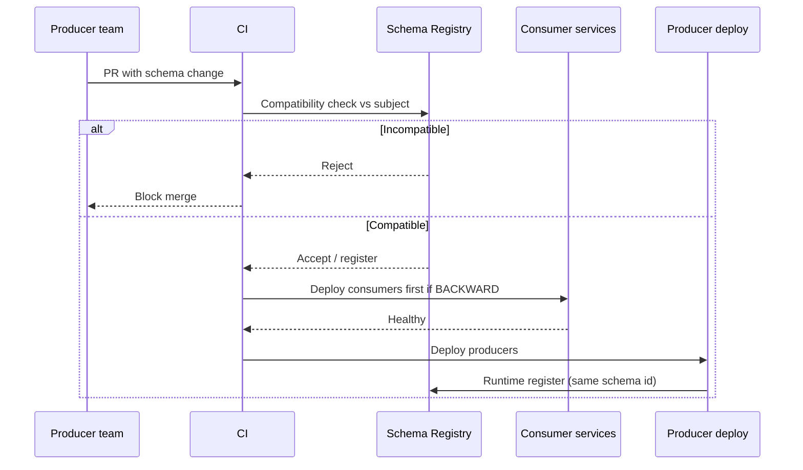

# Data Contracts and Registries

> **Scope:** This section owns **data contracts** across REST(Representational State Transfer) APIs, event streams, and warehouse marts — Schema Registry day-2 ops, producer CI(Continuous Integration) gates, subject ownership, and breaking-change process. Dataset ownership, lineage, and retention → [§5](05-data-ownership-lineage-retention.md). Avro/Protobuf evolution rules → [apache-kafka §6](../../apache-kafka/includes/06-serialization-and-schema-evolution.md). OpenAPI contract CI → [api-design §15](../../api-design-and-protection/includes/15-contract-and-schema-testing.md).

> **Related:** [§5 Ownership / lineage](05-data-ownership-lineage-retention.md) · [Kafka §6 Serialization](../../apache-kafka/includes/06-serialization-and-schema-evolution.md) · [API §15 Contract testing](../../api-design-and-protection/includes/15-contract-and-schema-testing.md) · [§6 Migration coordination](06-migration-coordination.md)

---

## At a glance

| Surface | Contract artifact | Gate |
|---------|-------------------|------|
| **REST / HTTP(Hypertext Transfer Protocol) API(Application Programming Interface)** | OpenAPI | Lint + breaking diff in CI — [api §15](../../api-design-and-protection/includes/15-contract-and-schema-testing.md) |
| **Events** | Avro / Protobuf / JSON Schema + Registry subject | Compatibility check before produce |
| **Warehouse marts** | Table contract (columns, types, freshness, owner) | Schema PR + consumer notify |

**Rule of thumb:** A contract is useless without an **owner**, a **compatibility mode**, and a **CI gate** that can block merge. Catalog prose alone does not protect consumers.

---

## One ownership model, three surfaces

| Role | REST | Events | Marts |
|------|------|--------|-------|
| **Domain owner** | Spec semantics, deprecation | Subject + `event_type` meaning | Metric definitions, grain |
| **Platform** | Gateway, lint rules | Schema Registry, ACLs | Catalog, warehouse roles |
| **Consumers** | Pact / contract tests | Compatible readers | Downstream jobs / BI |

Prefer **data products** (`orders_fact`, `commerce.order.created`) over anonymous shared dumps — [§5](05-data-ownership-lineage-retention.md). Subject naming strategies and format rules live in [Kafka §6](../../apache-kafka/includes/06-serialization-and-schema-evolution.md); this section owns the **operating process**.

---

## Compatibility modes

| Mode | Allows | Deploy order |
|------|--------|--------------|
| **BACKWARD** | New schema reads old data | Consumers before producers |
| **FORWARD** | Old schema reads new data | Producers before consumers |
| **FULL** | Both directions | Either order (safer rolling) |
| **FULL_TRANSITIVE** | Full across all history | Strict multi-version pipelines |
| **NONE** | Anything | Emergencies only — not default prod |

Default prod value subjects: **BACKWARD** or **FULL**. Document the mode on the subject; changing mode is itself a breaking process change. Format-specific safe/unsafe field edits → [Kafka §6 evolution rules](../../apache-kafka/includes/06-serialization-and-schema-evolution.md).

---

## Producer → registry → consumer deploy order

| Compatibility | Safe sequence |
|---------------|---------------|
| **BACKWARD** / **FULL** | Register → deploy consumers that understand new+old → deploy producers |
| **FORWARD** | Register → deploy producers → upgrade consumers before removing old fields |
| **Breaking (intentional)** | New subject or major version + dual-publish window — see below |

Never let producers register a breaking schema at runtime that CI never saw. Prefer **register-in-CI** (or dry-run compatibility) as a merge gate.

---

## Schema Registry day-2

| Concern | Practice |
|---------|----------|
| **Subject ownership** | CODEOWNERS / catalog row: domain team + on-call |
| **ACLs** | Producers can register only their subjects; consumers read |
| **Mode** | Per-subject compatibility; audit changes |
| **Hard deletes** | Disable by default; soft-delete + retention |
| **Drift** | Alert on runtime register failures and UNKNOWN schema ids |
| **Multi-env** | Promote schemas DEV → STG → PROD; do not invent PROD-only versions |

Pair Registry with the Kafka event catalog (owner, freshness SLO(Service Level Objective)) — [apache-kafka §9](../../apache-kafka/includes/09-cluster-setup-and-requirements.md#event-catalog-and-ownership-slos).

---

## Producer CI gates

Minimal gate for event schemas (mirror OpenAPI discipline in [api §15](../../api-design-and-protection/includes/15-contract-and-schema-testing.md)):

1. **Lint** — naming, required envelope fields, no PII(Personally Identifiable Information) in cleartext without classification.
2. **Compatibility** — Registry dry-run or `buf breaking` / equivalent against the subject baseline.
3. **Contract tests** — consumer fixtures deserialize last N production-compatible versions.
4. **Ownership** — PR touches subject mapped to CODEOWNERS.

Warehouse marts: treat dbt/SQL(Structured Query Language) schema PRs like API diffs — added columns optional by default; renames and type changes require a versioned mart or expand/contract — [§6](06-migration-coordination.md).

---

## Breaking-change process

| Step | Action |
|------|--------|
| 1 | Classify: additive vs breaking (remove/rename/tighten type) |
| 2 | Choose path: expand/contract on same subject, or new subject / major API version |
| 3 | Dual-publish or dual-read for a declared window |
| 4 | Notify consumers via catalog + ticket; set sunset date |
| 5 | Verify lag/error dashboards; then remove old fields/paths |
| 6 | Update retention and lineage entries — [§5](05-data-ownership-lineage-retention.md) |

Intentional REST breaks bump `/v2` and reset the OpenAPI diff baseline — [api §15](../../api-design-and-protection/includes/15-contract-and-schema-testing.md). Events prefer a **new event type** over silently reusing a subject with `NONE`.

---

## Operational checklist

1. Every production subject/API/mart has a named domain owner and compatibility/version policy.
2. CI blocks incompatible schema merges; runtime register cannot bypass the gate.
3. Catalog links producer, consumers, freshness SLO, and PII class.
4. Breaking changes use dual-publish + sunset; no surprise field removals.
5. Registry ACLs and hard-delete policy reviewed quarterly.
6. Consumer deploys respect compatibility mode (BACKWARD ⇒ consumers first).

## Common mistakes

| Mistake | Fix |
|---------|-----|
| Schema in git only; no Registry gate | Compatibility check in CI before merge |
| Producer deploys before consumers under BACKWARD | Follow deploy order table above |
| `NONE` compatibility in prod "for speed" | BACKWARD or FULL; use new subject for breaks |
| Events owned by "platform", marts by "analytics", nobody for semantics | Domain owner per [§5](05-data-ownership-lineage-retention.md) |
| OpenAPI linted but event schemas unchecked | Same CI rigor on Registry subjects — [Kafka §6](../../apache-kafka/includes/06-serialization-and-schema-evolution.md) |
| Rename column in mart without consumer window | Expand/contract or versioned mart — [§6](06-migration-coordination.md) |
| Hard-delete schema versions under active consumers | Soft-delete; retain until consumers upgraded |