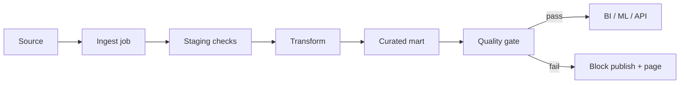

# Data Quality and Pipeline Testing

Pipelines that “usually work” still ship silent wrong data. Treat quality as **testable contracts**: freshness, volume, schema, and null/uniqueness checks at boundaries — with **freshness burn** alerting before dashboards lie.

> **Scope:** Checks, test placement, and freshness SLO(Service Level Objective) math. Contract artifacts and CI(Continuous Integration) gates → [§5A](05A-data-contracts-and-registries.md). Ownership and retention → [§5](05-data-ownership-lineage-retention.md). Lake ops → [§1B](01B-lakehouse-table-formats-and-ops.md).
>
> **Related:** Kafka schema evolution → [apache-kafka §6](../../apache-kafka/includes/06-serialization-and-schema-evolution.md) · Batch/ETL(Extract, Transform, Load) → [HTS §8](../../high-throughput-systems/includes/08-batch-and-etl.md) · OLTP(Online Transaction Processing) protection → [§7](07-analytics-without-harming-oltp.md)

---

## At a glance

| Dimension | Question | Example failure |
|-----------|----------|-----------------|
| **Freshness** | Is data current enough? | Pipeline stalled 6 h |
| **Volume** | Row/byte count in band? | Half the events missing |
| **Schema** | Columns/types as contract? | New field broke BI |
| **Distribution** | Nulls, enums, ranges sane? | `country` 90% null |
| **Uniqueness** | Keys still unique? | Duplicate fact rows |

**Rule of thumb:** Assert at **dataset publish boundary** (mart/table/topic), not only unit tests inside transforms.

---

## Quality in the pipeline



Contract fields for marts → [§5A](05A-data-contracts-and-registries.md). Do not duplicate Registry compatibility rules here.

---

## Check types

| Check | Implementation sketch |
|-------|------------------------|
| **Freshness** | `max(event_time)` vs `now()` < threshold |
| **Volume** | Row count vs trailing 7-day median ± band |
| **Schema** | Contract diff vs actual columns/types |
| **Null rate** | `null_fraction(col)` < cap |
| **Referential** | FK-like keys present in dim table |
| **Custom SQL(Structured Query Language)** | Business rule (`revenue >= 0`) |

| Layer | Run when |
|-------|----------|
| **Producer unit tests** | CI on merge |
| **Staging integration** | Pre-prod env with sample data |
| **Production monitors** | Every schedule / continuously |

---

## Freshness burn

Borrow error-budget thinking — [sre §2](../../sre-and-incidents/includes/02-error-budgets.md).

| Concept | Definition |
|---------|------------|
| **Freshness SLI(Service Level Indicator)** | `1` if lag ≤ target, else `0` (or fractional) |
| **SLO** | e.g. 99% of hours under 15 min lag |
| **Burn** | Fast consumption of budget → page before SLA(Service Level Agreement) breach |

```text
lag_minutes = now() - max(_loaded_at)
burn_alert if lag_minutes > 2 × target for 2 consecutive runs
```

Pair **freshness** with **volume**: stalled pipeline sometimes shows “fresh” empty files.

---

## Pipeline testing practices

| Practice | Why |
|----------|-----|
| **Fixture datasets** | Reproducible transform tests |
| **Contract tests on publish** | Block bad mart deploy — [§5A](05A-data-contracts-and-registries.md) |
| **Idempotent reruns** | Safe replay after fix — [api §13](../../api-design-and-protection/includes/13-idempotency.md) patterns for jobs |
| **DLQ(Dead Letter Queue) inspection** | Poison messages don’t silently drop |
| **End-to-end smoke** | One golden metric matches source sample |

For event pipelines, assert **compatible schema** before produce — [Kafka §6](../../apache-kafka/includes/06-serialization-and-schema-evolution.md).

---

## Ownership

| Role | Owns |
|------|------|
| **Domain owner** | Metric definitions, thresholds |
| **Platform** | Runner, alerting, block policy |
| **Consumers** | Downstream contract tests |

Failed gate policy: **block downstream reads** vs **warn** — document per dataset tier. Revenue marts block; experimental sandboxes warn.

---

## Operational checklist

- [ ] Each curated mart has freshness + volume monitors
- [ ] Schema check wired to [§5A](05A-data-contracts-and-registries.md) artifact
- [ ] Null/uniqueness rules for key columns
- [ ] On-call runbook for “quality gate failed”
- [ ] Post-fix backfill procedure documented

---

## Common mistakes

| Mistake | Fix |
|---------|-----|
| Checks only in notebooks | Scheduled production gates |
| Static volume thresholds | Trailing median bands |
| Schema break discovered in Looker | CI on publish |
| Freshness without row count | Add volume check |
| Warn-only on revenue marts | Block consume |

---

## Pros and cons

| Tooling | Pros | Cons |
|---------|------|------|
| **Great Expectations / Soda / dbt tests** | Rich assertions | Another system to maintain |
| **Custom SQL monitors** | Simple | Duplicated logic |
| **Block on fail** | Prevents bad decisions | Needs on-call for pipeline |
