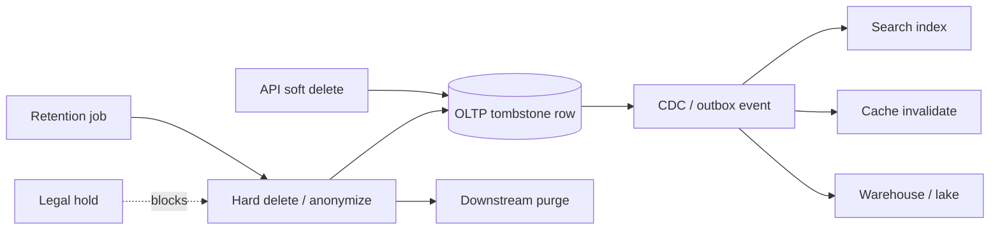

# Soft Delete, Retention, and Purge

Soft delete (`deleted_at`, `is_active=false`) keeps user-facing APIs fast and reversible. Production also needs a **hard-delete path**: retention windows, legal hold, fan-out purge, and proof — or you accumulate liability and cost forever.

> **Scope:** End-to-end delete semantics from OLTP(Online Transaction Processing) through search, cache, warehouse, and backups. Ownership and retention policy → [§5](05-data-ownership-lineage-retention.md). DSAR(Data Subject Access Request) / erasure runbook → [ESC §7A](../../enterprise-security-compliance/includes/07A-erasure-and-dsar.md). PostgreSQL physical reclaim → [PG §6](../../postgresql-performance/includes/06-vacuum-and-bloat.md) · partition drops → [PG §10](../../postgresql-performance/includes/10-partitioning.md).
>
> **Related:** Contracts and schema evolution → [§5A](05A-data-contracts-and-registries.md) · Kafka tombstones → [kafka §5](../../apache-kafka/includes/05-retention-compaction-and-storage.md) · Storage cost → [finops §4](../../finops-and-cost/includes/04-storage-and-retention-cost.md) · Migration coordination → [§6](06-migration-coordination.md)

---

## At a glance

| Phase | Behavior |
|-------|----------|
| **Soft delete** | Row hidden from default queries; reversible within grace |
| **Retention** | Policy-driven hold period before purge eligible |
| **Legal hold** | Blocks purge regardless of TTL(Time To Live) |
| **Hard delete** | Irreversible removal or anonymization in SoR(System of Record) |
| **Fan-out purge** | Search, cache, warehouse, events, backups |
| **Evidence** | Audit log + completion marker for compliance |

**Rule of thumb:** If soft delete has no **scheduled purge job** and **downstream delete contract**, you only built a hide button — [§5](05-data-ownership-lineage-retention.md).

---

## End-to-end flow

| Store | Soft delete pattern | Hard delete pattern |
|-------|---------------------|---------------------|
| **PostgreSQL** | `deleted_at` + partial index | `DELETE` or anonymize; vacuum — [PG §6](../../postgresql-performance/includes/06-vacuum-and-bloat.md) |
| **Search** | Tombstone doc or `-deleted` flag | Delete by id; force merge |
| **Redis** | Key TTL or tombstone | `DEL` / overwrite |
| **Warehouse** | Partition filter | Drop partition or overwrite row — [PG §10](../../postgresql-performance/includes/10-partitioning.md) |
| **Kafka** | Tombstone compacted key | Retention + compaction — [kafka §5](../../apache-kafka/includes/05-retention-compaction-and-storage.md) |

---

## Retention policy

| Field | Owner — [§5](05-data-ownership-lineage-retention.md) |
|-------|------------------------------------------------------|
| **Retention period** | Legal + product (e.g. 30d grace, 7y finance) |
| **Purge cadence** | Daily batch or streaming consumer |
| **Anonymize vs delete** | PII(Personally Identifiable Information) fields vs full row |
| **Backup handling** | PITR(Point-in-Time Recovery) window vs crypto-shred — [ESC §7A](../../enterprise-security-compliance/includes/07A-erasure-and-dsar.md) |
| **Exceptions** | Legal hold, open dispute, audit freeze |

Document retention in the **data contract** — [§5A](05A-data-contracts-and-registries.md) — not only in wiki prose.

---

## Purge job design

| Practice | Why |
|----------|-----|
| Chunk by primary key / time | Avoid long locks — [PG §12](../../postgresql-performance/includes/12-bulk-operations-and-concurrency.md) |
| Idempotent purge steps | Safe retries |
| Emit `RecordPurged` event | Downstream idempotent cleanup |
| Metrics: lag, rows/day, failures | SLO(Service Level Objective) on erasure backlog |
| Separate user-initiated vs batch | DSAR path may skip grace — [ESC §7A](../../enterprise-security-compliance/includes/07A-erasure-and-dsar.md) |

Default queries must filter `deleted_at IS NULL` (or RLS(Row-Level Security) equivalent — [PG §17](../../postgresql-performance/includes/17-row-level-security-multi-tenant.md)).

---

## Operational checklist

- [ ] Named owner and retention per dataset — [§5](05-data-ownership-lineage-retention.md)
- [ ] Soft delete in API(Application Programming Interface) + DB; hard purge job scheduled
- [ ] Downstream delete handlers for search/cache/WH
- [ ] Legal hold flag tested against purge
- [ ] DSAR erasure reuses purge pipeline — [ESC §7A](../../enterprise-security-compliance/includes/07A-erasure-and-dsar.md)
- [ ] Vacuum / bloat monitored after large purges — [PG §6](../../postgresql-performance/includes/06-vacuum-and-bloat.md)

---

## Common mistakes

| Mistake | Fix |
|---------|-----|
| Soft delete only, forever | Retention job + policy — [§5](05-data-ownership-lineage-retention.md) |
| Purge OLTP but not search | Fan-out contract + CDC(Change Data Capture) |
| Full-table delete in one TX | Chunked purge — [PG §12](../../postgresql-performance/includes/12-bulk-operations-and-concurrency.md) |
| Unique constraints ignore soft-deleted rows | Partial unique indexes |
| Backups retain PII after erasure | Backup window + crypto-shred playbook — [ESC §7A](../../enterprise-security-compliance/includes/07A-erasure-and-dsar.md) |
| No audit of purge completion | Evidence store — [ESC §6](../../enterprise-security-compliance/includes/06-audit-logging-and-retention.md) |
