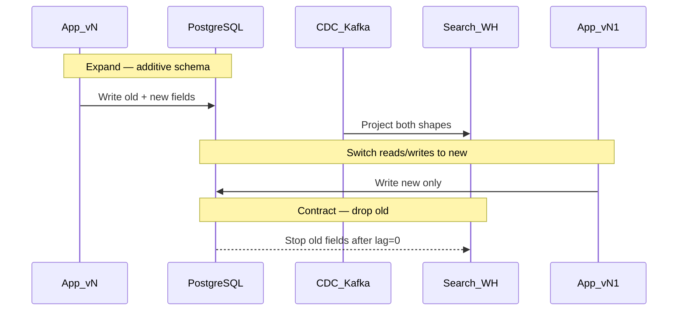

# Migration Coordination

Org-scale schema and data-platform changes need **expand/contract**, **multi-system sequencing**, and **communication** — not only a clever SQL(Structured Query Language) migration.

> **Scope:** Coordination across apps, CDC(Change Data Capture), search, and warehouses. Concrete PostgreSQL expand/contract steps → [PG §15 schema migration checklist](../../postgresql-performance/includes/15-schema-migration-checklist.md).
>
> **Related:** Deploy + schema order → [deployment §12](../../deployment-strategies/includes/12-schema-migrations-and-deploy.md) · Kafka schema evolution → [apache-kafka §6](../../apache-kafka/includes/06-serialization-and-schema-evolution.md) · Search reindex → [§2](02-search-systems.md)

---

## At a glance

| Change | Coordinate with |
|--------|-----------------|
| Add/rename OLTP(Online Transaction Processing) column | App dual-write window, CDC connectors, warehouse models |
| Drop column / table | All readers offline first — contract phase |
| Change event payload | Schema Registry compatibility + consumers |
| Search mapping break | Blue/green index before cutover |
| Tenant shard move | Dual-run, lag monitors, rollback plan |

**Rule of thumb:** Assume **old and new producers/consumers** run together. If that is impossible, you do not have a migration — you have an outage window.

---

## Expand / contract at platform scale

| Phase | OLTP | Downstream |
|-------|------|------------|
| **Expand** | Add nullable column / new topic field | Consumers ignore or dual-read |
| **Backfill** | Batch job — [PG §12](../../postgresql-performance/includes/12-bulk-operations-and-concurrency.md) | Reindex / rematerialize |
| **Switch** | App uses new field | Consumers prefer new |
| **Contract** | Drop old after verification | Remove old mapping / columns |

DDL checklist: [PG §15](../../postgresql-performance/includes/15-schema-migration-checklist.md).

---

## Multi-system checklist

| Step | Owner | Done when |
|------|-------|-----------|
| 1. Design expand schema | Domain | Review signed off |
| 2. Ship additive migration | DBA / platform | Online; no long locks |
| 3. Update CDC / Connect | Platform | Lag healthy; no errors |
| 4. Dual-write or dual-read apps | Service teams | Metrics prove parity |
| 5. Backfill | Data eng | Row counts / checksums |
| 6. Cutover feature flag | Service | Rollback flag ready |
| 7. Contract | DBA | After min versions retired |
| 8. Update lineage docs | Domain | Catalog reflects new path |

Pair with [deployment §12](../../deployment-strategies/includes/12-schema-migrations-and-deploy.md) for release ordering.

---

## Communication and freeze windows

| Practice | Why |
|----------|-----|
| **Migration calendar** | Avoid overlapping breaking changes |
| **Consumer roster** | Know who reads the table/topic |
| **Compat policy** | BACKWARD/FORWARD for events |
| **Freeze** | No contract drops during peak / audits |
| **Rollback criteria** | Lag, error rate, SLO(Service Level Objective) burn — [deployment §13](../../deployment-strategies/includes/13-slo-rollback-triggers.md) |

---

## High-risk patterns

| Pattern | Risk | Mitigation |
|---------|------|------------|
| Rename column in place | Breaks CDC and ORM mid-deploy | Add new → backfill → switch → drop |
| Rebuild huge table in TX | Locks / replication lag | Batched expand |
| Reindex search in place | Query downtime | Alias swap — [§2](02-search-systems.md) |
| Warehouse model before OLTP expand | Null storms | Expand OLTP first |
| Silent consumer | Undetected break | Contract tests / canaries |

---

## Common mistakes

| Mistake | Fix |
|---------|-----|
| "Just run the Flyway in prod Friday" | Expand/contract + roster |
| Drop column while CDC still maps it | Contract after connector update |
| Backfill in one transaction | Chunked jobs — [PG §15](../../postgresql-performance/includes/15-schema-migration-checklist.md) |
| No owner for warehouse break | Ownership — [§5](05-data-ownership-lineage-retention.md) |
| Skip dual-running versions | Rolling deploy always dual |

---

## Pros and cons

### Coordinated expand/contract

**Pros:** Near-zero downtime; safer CDC/search; reversible.

**Cons:** Longer calendar time; more tickets; needs discipline across teams.