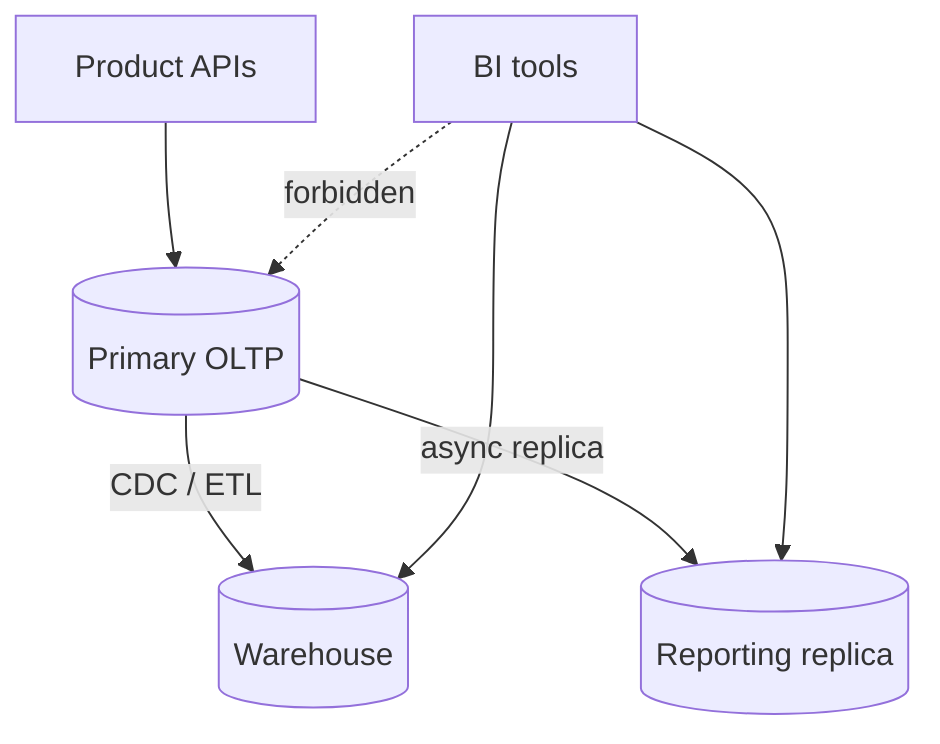

# Analytics Without Harming OLTP

Protect the primary OLTP(Online Transaction Processing) database from analytical load — dashboards, exports, and "quick SQL(Structured Query Language)" that become production incidents.

> **Related:** OLTP vs OLAP → [§1](01-oltp-vs-olap.md) · Batch patterns → [HTS §8](../../high-throughput-systems/includes/08-batch-and-etl.md) · PG pooling → [PG §7](../../postgresql-performance/includes/07-connection-management.md) · Measurement → [HTS §1](../../high-throughput-systems/includes/01-measurement-and-slo.md)

---

## At a glance

| Approach | Protects primary? | Freshness |
|----------|-------------------|-----------|
| **Warehouse / lake queries** | Yes | Batch or CDC(Change Data Capture) lag |
| **Reporting replica** (isolated) | Mostly | Replication lag |
| **Materialized views** refreshed off-peak | Partial | Refresh interval |
| **Primary with statement timeout** | Weak | Real-time |
| **Primary unrestricted BI** | No | Real-time until outage |

**Rule of thumb:** Analysts never get unrestricted access to the **primary**. Replica or warehouse only — with timeouts and row limits.

---

## Isolation patterns

| Pattern | Setup | Guardrails |
|---------|-------|------------|
| **Warehouse** | ETL(Extract, Transform, Load)/CDC pipeline | Roles, cost quotas, approved marts |
| **Replica** | Streaming replica | Separate pool; `default_transaction_read_only`; statement timeout |
| **Follower + queue** | Export jobs read replica | Rate-limit export concurrency |
| **Approx on primary** | Counters / rollup tables | Maintained by app or jobs — not ad-hoc joins |

---

## Guardrails on any live DB

| Control | Value |
|---------|-------|
| `statement_timeout` | Seconds for BI roles; higher for known jobs |
| `idle_in_transaction_session_timeout` | Kill abandoned sessions |
| Max connections via pool | Separate BI pool — never share app pool |
| Concurrent large queries | Cap (queue or warehouse) |
| `pg_stat_activity` / kill runbook | On-call can cancel offenders |

Connection patterns: [PG §7](../../postgresql-performance/includes/07-connection-management.md), [database-connection](../../database-connection-and-security/README.md).

---

## Safe export and reporting jobs

| Do | Don't |
|----|-------|
| `COPY` / chunked keyset pagination from replica | `SELECT *` without LIMIT into memory |
| Run heavy jobs in off-peak windows | Schedule full scans at noon peak |
| Incremental watermarks | Nightly full table pull forever |
| Write results to object storage / warehouse | Spool huge CSVs on the DB host |

Batch technique depth: [HTS §8](../../high-throughput-systems/includes/08-batch-and-etl.md).

---

## Product analytics vs warehouse

| Need | Prefer |
|------|--------|
| In-app "your stats this week" | Pre-aggregated tables / Redis / search — not live multi-join |
| Executive dashboards | Warehouse marts |
| Real-time ops board | Metrics system (Prometheus) or CDC-fed store — not heavy SQL on primary |

Precompute on write or via async jobs when the UI needs sub-second stats.

---

## Detecting harm early

| Signal | Action |
|--------|--------|
| Primary CPU / IO correlated with BI hours | Move workloads |
| Lock waits / long transactions | Kill + revoke; add timeout |
| Replication lag spikes during reports | Throttle replica queries or move to WH |
| Connection pool exhaustion | Split pools; fix leaks |

Tie alerts to SLO(Service Level Objective) burn — [HTS §11](../../high-throughput-systems/includes/11-observability.md).

---

## Common mistakes

| Mistake | Fix |
|---------|-----|
| Looker/Metabase on primary "temporarily" | Replica/warehouse with deadline |
| Shared PgBouncer pool for app + BI | Separate pools/databases |
| No statement timeout for analysts | Enforce at role level |
| Real-time dashboard = live 12-way join | Pre-aggregate |
| Export during peak deploy window | Calendar + freeze — [§6](06-migration-coordination.md) |

---

## Pros and cons

### Strict analytics isolation

**Pros:** Stable product latency; clearer cost attribution; fewer Sev1s from "one query".

**Cons:** Lag; extra platforms; culture change for analysts used to prod access.