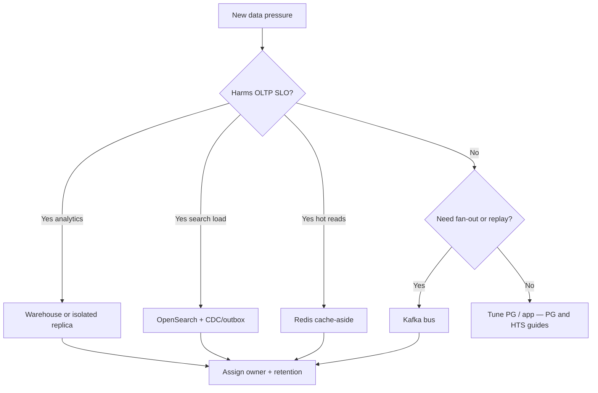

# Decision Guide

Choose **when to add** a warehouse, search, Redis role, or bus — and the anti-patterns that recreate a distributed monolith of data.

> **Related:** Overview → [§0](00-overview.md) · HTS system decisions → [HTS §12](../../high-throughput-systems/includes/12-decision-guide-and-common-mistakes.md) · Kafka vs queue → [apache-kafka §11](../../apache-kafka/includes/11-decision-guide-and-common-mistakes.md) · Cost tradeoffs → [finops §7](../../finops-and-cost/includes/07-architecture-cost-tradeoffs.md)

---

## At a glance

| Pressure | First move | Avoid |
|----------|------------|-------|
| Slow analytical SQL(Structured Query Language) | Warehouse / replica | Bigger primary only |
| Bad full-text UX | OpenSearch + CDC(Change Data Capture) | Dual-write in request |
| Hot-key reads | Redis cache | Cache without query fix |
| Many consumers | Kafka + outbox/CDC | Per-consumer polling primary |
| Schema change at org scale | Expand/contract calendar | Big-bang rename Friday |

**Rule of thumb:** Add a store for **one measured pressure**. Do not "build a data platform" before the second use case appears.

---

## Decision flow

---

## Store selection matrix

| Need | PostgreSQL | Warehouse | OpenSearch | Redis | Kafka |
|------|------------|-----------|------------|-------|-------|
| ACID(Atomicity, Consistency, Isolation, Durability) writes | ✅ | ❌ | ❌ | ❌ | ❌ |
| Ad-hoc BI | ❌ | ✅ | ❌ | ❌ | ❌ |
| Relevance search | Limited | ❌ | ✅ | ❌ | ❌ |
| Sub-ms hot get | Sometimes | ❌ | ❌ | ✅ | ❌ |
| Multi-consumer replay | ❌ | ❌ | ❌ | Weak | ✅ |

Detail sections: [§1](01-oltp-vs-olap.md), [§2](02-search-systems.md), [§3](03-redis-and-in-memory.md).

---

## When to stay on one database

| Signal | Action |
|--------|--------|
| Team < few engineers; one product | Optimize PG first — [postgresql-performance](../../postgresql-performance/README.md) |
| Search is simple `ILIKE` | Stay on PG FTS |
| Reporting is a weekly CSV | Scheduled replica export |
| Cache hit ratio would be low | Fix queries before Redis |

Complexity tax is real — [finops §5](../../finops-and-cost/includes/05-build-vs-managed-cost.md).

---

## Anti-patterns catalog

| Anti-pattern | Why it hurts | Fix |
|--------------|--------------|-----|
| Dual-write DB + search | Split brain | CDC/outbox — [HTS §15](../../high-throughput-systems/includes/15-cdc-and-search-indexing.md) |
| BI on primary | Sev1 latency | [§7](07-analytics-without-harming-oltp.md) |
| Redis as source of truth | Data loss | OLTP owns state — [§3](03-redis-and-in-memory.md) |
| Infinite retained everything | Cost + risk | [§5](05-data-ownership-lineage-retention.md) |
| Uncoordinated drops | Broken CDC | [§6](06-migration-coordination.md) + [PG §15](../../postgresql-performance/includes/15-schema-migration-checklist.md) |
| Cache without freshness class | Confusing UX | [§4](04-caching-end-to-end.md) |
| Kafka for one email worker | Ops > benefit | SQS(Simple Queue Service) — [kafka §11](../../apache-kafka/includes/11-decision-guide-and-common-mistakes.md) |

---

## Rollout checklist

| # | Check |
|---|-------|
| 1 | Pressure measured (query, lag, CPU) — not anecdotal |
| 2 | System of record named |
| 3 | Sync path chosen (batch / CDC / cache-aside) |
| 4 | Freshness SLO(Service Level Objective) written |
| 5 | Owner + retention set |
| 6 | Failure mode: rebuild / fail-open documented |
| 7 | Cost estimate — [finops §1](../../finops-and-cost/includes/01-unit-economics.md) |
| 8 | On-call dashboards for lag and errors |

---

## Common mistakes (summary)

| Mistake | Section |
|---------|---------|
| Platform before pain | This page — start smaller |
| Skip ownership | [§5](05-data-ownership-lineage-retention.md) |
| Ignore migration roster | [§6](06-migration-coordination.md) |
| Duplicate HTS cache advice without scope | [§4](04-caching-end-to-end.md) vs [HTS §4](../../high-throughput-systems/includes/04-caching-layers.md) |

---

## Pros and cons

### Deliberate multi-store platform

**Pros:** Scale specialized workloads; protect OLTP; clearer product boundaries.

**Cons:** Operational surface; eventual consistency education; coordination cost on every schema change.