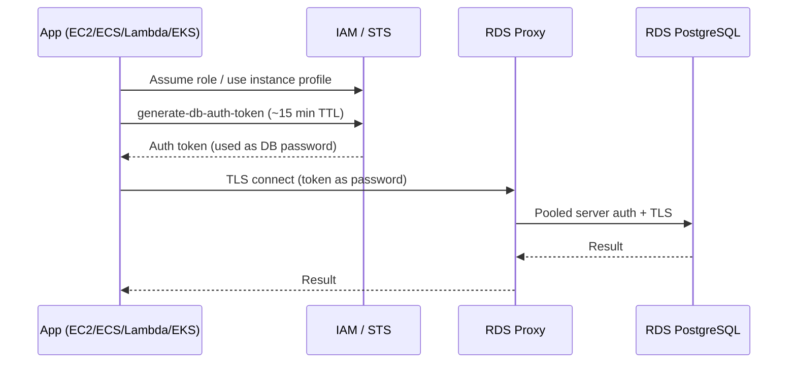
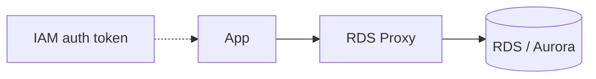

# AWS IAM auth + RDS Proxy

> AWS-native path for the same goals as Vault — no DB password in code, short-lived credentials, least privilege — without running HashiCorp Vault.

> **Scope:** **AWS-native path** — IAM auth tokens, RDS Proxy, least privilege without Vault. HashiCorp Vault alternative → [§3 HCV Vault](03-hcv-vault.md). Direct RDS without Proxy → [§6 Direct RDS IAM](06-direct-rds-iam.md).
>
> **Related:** Direct RDS without Proxy → [§6 Direct RDS IAM](06-direct-rds-iam.md) · Vault comparison → [§3 HashiCorp Vault](03-hcv-vault.md) · Pool tuning → [postgresql-performance §7](../../postgresql-performance/includes/07-connection-management.md)

## What it solves

- No DB password in `.env`, git, or container images
- Short-lived credentials (IAM auth tokens expire in ~15 minutes)
- Least privilege via IAM policies (`rds-db:connect` scoped to specific DB users)
- Connection pooling and fewer open connections to RDS (via RDS Proxy)

It is **AWS-managed** — no Vault cluster to run — but **AWS-specific** and less flexible than Vault for multi-cloud or per-request dynamic DB users.

---

## Architecture



App connects to the **proxy endpoint** in a private subnet — never the public RDS endpoint.



---

## Two IAM + Proxy patterns

### Pattern A: Standard IAM auth (most common)

| Hop | Who authenticates | How |
|-----|-------------------|-----|
| App → RDS Proxy | App via **IAM** | App calls `aws rds generate-db-auth-token`; token is used as the DB **password** |
| RDS Proxy → RDS | Proxy via **Secrets Manager** | Proxy reads stored username/password for the DB user |

Setup:

1. Enable IAM auth on the RDS instance/cluster (`--enable-iam-database-authentication`).
2. Create a **database user** mapped for IAM auth (PostgreSQL: `GRANT rds_iam TO app_user`).
3. Attach an IAM policy to the app's role allowing `rds-db:connect` for that DB user ARN.
4. Configure RDS Proxy with **Secrets Manager** credentials for the backend DB login.
5. Apps connect **through the proxy endpoint**, not directly to RDS.

**Flow:**

1. App runs with an IAM role (EC2 instance profile, ECS task role, Lambda execution role, or EKS IRSA).
2. App generates a token:

```bash
aws rds generate-db-auth-token \
  --hostname my-proxy.proxy-abc123.us-east-1.rds.amazonaws.com \
  --port 5432 \
  --username app_user \
  --region us-east-1
```

3. App opens a TLS(Transport Layer Security) connection to the **proxy endpoint** — username = DB user, password = token.
4. Proxy validates IAM auth, pools the connection, and connects to RDS using Secrets Manager credentials.

---

### Pattern B: End-to-end IAM auth

| Hop | Who authenticates | How |
|-----|-------------------|-----|
| App → RDS Proxy | App via **IAM** | Same token generation |
| RDS Proxy → RDS | Proxy via **IAM** | Proxy's IAM role has `rds-db:connect`; no Secrets Manager DB password needed |

- Proxy is configured with IAM as the default auth scheme.
- Proxy's IAM role gets `rds-db:connect` for target DB users.
- Eliminates storing DB passwords in Secrets Manager for proxy-to-DB hops.
- Stronger, but more IAM wiring; both app role and proxy role need correct `rds-db:connect` grants.

---

## Key components

1. **RDS** — PostgreSQL or MySQL/Aurora; IAM auth enabled; private subnet; no public IP; TLS required.
2. **Database user** — Dedicated per service; granted `rds_iam` (Postgres) or equivalent; least-privilege on schemas/tables.
3. **IAM policy on app role** — Allow `rds-db:connect` only for that user's ARN:

```json
{
  "Effect": "Allow",
  "Action": "rds-db:connect",
  "Resource": "arn:aws:rds-db:us-east-1:ACCOUNT_ID:dbuser:DB_RESOURCE_ID/app_user"
}
```

4. **RDS Proxy** — Same VPC/subnets as app; security group allows app tier → proxy only; proxy target = RDS cluster/instance.
5. **Secrets Manager** (Pattern A) — Stores DB credentials the proxy uses to reach RDS; proxy IAM role can read that secret.
6. **App code** — Generate token before connect (or refresh before ~15 min expiry); use proxy hostname, not RDS hostname.

Example connect:

```bash
export PGPASSWORD=$(aws rds generate-db-auth-token \
  --hostname my-proxy.proxy-abc123.us-east-1.rds.amazonaws.com \
  --port 5432 \
  --username app_user \
  --region us-east-1)

psql "host=my-proxy.proxy-abc123.us-east-1.rds.amazonaws.com port=5432 dbname=mydb user=app_user sslmode=require"
```

---

## How this maps to security layers

| Layer | IAM + RDS Proxy coverage |
|-------|--------------------------|
| 1. Network isolation | RDS + Proxy in private subnets; SG: app → proxy → RDS only |
| 2. TLS | Required for IAM auth connections |
| 3. Authentication | IAM token + dedicated DB user per service |
| 4. Secrets management | No app-side password; Pattern A still uses Secrets Manager for proxy→RDS |
| 5. Connection proxy | RDS Proxy handles pooling and multiplexing |
| 6. Workload identity | EC2/ECS/Lambda/EKS IAM roles — native AWS identity |
| 9. Monitoring | CloudWatch, RDS logs, IAM CloudTrail for `rds-db:connect` |

---

## IAM + RDS Proxy vs HashiCorp Vault

| | IAM + RDS Proxy | Vault dynamic DB creds |
|--|-----------------|------------------------|
| Credential type | IAM auth **token** (password field); DB user is **fixed** | New **DB user/password** per lease |
| Scope | AWS only | Multi-cloud |
| Ops burden | Low (managed AWS) | High (run/maintain Vault) |
| Per-instance users | Same DB user; identity is IAM role | Unique temp DB user per request |
| Proxy/pooling | Built into RDS Proxy | You add PgBouncer or connect direct |

See [03-hcv-vault.md](03-hcv-vault.md) for the Vault approach.

---

## When IAM + RDS Proxy is sufficient

Use this instead of Vault when:

- Everything runs on AWS (EC2, ECS, Lambda, EKS with IRSA)
- One or a few services share RDS
- You want short-lived auth without operating Vault
- RDS Proxy connection pooling is enough for your scale
- AWS IAM + CloudTrail audit meets compliance needs

Consider Vault (or Pattern B + stricter IAM) when:

- Multi-cloud or on-prem workloads also need DB access
- You need **unique temporary DB users** per session/instance
- You want centralized secrets across non-AWS systems
- You need Vault-style dynamic user revocation independent of IAM token TTL(Time To Live)

## Common mistakes

| Mistake | Fix |
|---------|-----|
| IAM auth but connect directly to RDS at scale | Use Proxy endpoint; see connection count limits |
| Token generated for RDS hostname, connect to Proxy | `generate-db-auth-token` hostname must match connect target |
| Missing `GRANT rds_iam` on DB user | Enable IAM auth on PostgreSQL role |
| Over-broad `rds-db:connect` IAM policy | Scope to specific DB user ARN per service |
| Token not refreshed before ~15 min expiry | Refresh on connect or background renewal loop |