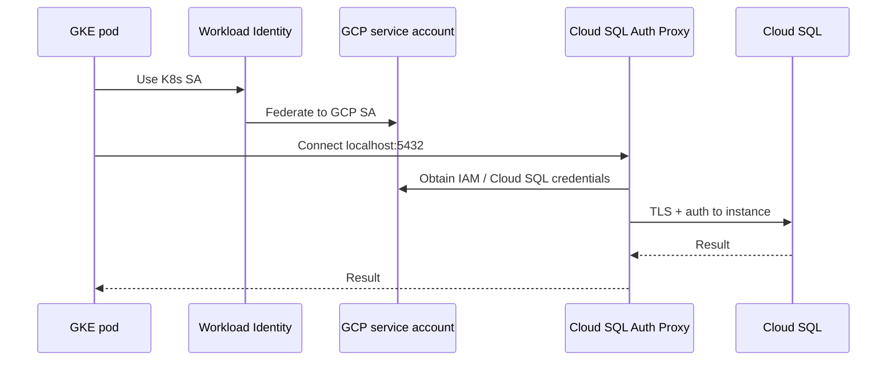

# GCP Cloud SQL identity

> Connect to Cloud SQL (PostgreSQL / MySQL) using GCP-native identity, proxies, and Secret Manager — the GCP equivalent of AWS IAM(Identity and Access Management) + RDS patterns.

> **Related:** AWS equivalents → [§4 IAM + RDS Proxy](04-aws-iam-rds-proxy.md), [§6 Direct RDS IAM](06-direct-rds-iam.md) · Static secret baseline → [§5 Secret manager](05-secret-manager-password.md) · Decision guide → [§13 Decision guide](13-decision-guide.md)

## What it solves

- No DB password in application code (when using IAM / Workload Identity)
- Encrypted connections via Cloud SQL Auth Proxy or connector libraries
- Integration with GKE Workload Identity and GCP service accounts
- Private connectivity without exposing the DB to the public internet

---

## Three main patterns

### Pattern A: Cloud SQL Auth Proxy (sidecar or daemon)

```
App → localhost:5432 → Auth Proxy → Cloud SQL instance
              ↑
        Proxy handles TLS + authentication to Cloud SQL
```

The **Cloud SQL Auth Proxy** (or **Cloud SQL Connector** in app code) runs as:

- Sidecar container in GKE / Cloud Run
- Local daemon on a VM
- Embedded via language connectors (Go, Java, Python)

App connects to `127.0.0.1:5432`; the proxy authenticates to Cloud SQL using the pod/VM's GCP credentials.

**Setup:**

1. Cloud SQL instance with **private IP** (VPC) or authorized networks restricted.
2. Enable **Cloud SQL Admin API(Application Programming Interface)**.
3. Grant the app's service account `roles/cloudsql.client`.
4. Run proxy with instance connection name: `project:region:instance`.

```bash
cloud-sql-proxy project:region:my-instance --port 5432
```

5. App connects with DB user/password **or** IAM database auth (see Pattern B).

---

### Pattern B: IAM database authentication

Cloud SQL supports **IAM users** as database principals (PostgreSQL and MySQL).



```
GKE pod → Workload Identity → GCP SA → IAM token → Cloud SQL
```

**Setup:**

1. Enable IAM DB auth on the Cloud SQL instance.
2. Add IAM user in Cloud SQL (e.g. `service-account@project.iam`).
3. Bind GKE **Workload Identity**: K8s SA → GCP SA.
4. Grant GCP SA `roles/cloudsql.instanceUser` and `roles/cloudsql.client`.
5. App uses Cloud SQL Connector with automatic IAM auth — no password in env.

**Benefit:** Same philosophy as AWS RDS IAM — identity-based, no long-lived password.

---

### Pattern C: Secret Manager + static password

Same as [05-secret-manager-password.md](05-secret-manager-password.md), using **GCP Secret Manager**:

```
App → fetch secret (Workload Identity) → TLS → Cloud SQL
```

Common when IAM DB auth is not enabled or for legacy apps.

---

## Architecture comparison

| Pattern | Short-lived creds | Pooling | Complexity |
|---------|-------------------|---------|------------|
| Auth Proxy + password | No | Via app / PgBouncer | Low |
| Auth Proxy + IAM auth | Yes (IAM token) | Via app / PgBouncer | Medium |
| Secret Manager + password | No (rotated) | Via app | Low |

---

## How this maps to security layers

| Layer | Coverage |
|-------|----------|
| 1. Network isolation | Private IP / VPC peering; no public IP |
| 2. TLS(Transport Layer Security) | Proxy or connector enforces encryption |
| 3. Authentication | IAM DB user or dedicated SQL user |
| 4. Secrets management | Secret Manager or IAM (no app password) |
| 6. Workload identity | GKE Workload Identity → GCP SA |

---

## GCP vs AWS equivalents

| GCP | AWS equivalent |
|-----|----------------|
| Cloud SQL Auth Proxy | RDS Proxy / direct connect |
| IAM DB auth on Cloud SQL | RDS IAM auth |
| Secret Manager | Secrets Manager |
| Workload Identity | EKS IRSA |

See [04-aws-iam-rds-proxy.md](04-aws-iam-rds-proxy.md) and [06-direct-rds-iam.md](06-direct-rds-iam.md) for AWS detail.

---

## When to use

**Use Cloud SQL Auth Proxy when:**

- Running on GKE, Cloud Run, or GCE
- You want Google-managed TLS and auth to Cloud SQL

**Use IAM DB auth when:**

- No static passwords; GKE Workload Identity is in place

**Use Secret Manager + password when:**

- Simplest migration path from dev — see [05-secret-manager-password.md](05-secret-manager-password.md)

## Common mistakes

| Mistake | Fix |
|---------|-----|
| Public IP on Cloud SQL for app convenience | Private IP + Auth Proxy |
| Missing `roles/cloudsql.client` on service account | Grant before deploy |
| Auth Proxy not colocated with app | Sidecar on GKE / daemon on VM |
| Workload Identity not wired on GKE | Bind K8s SA → GCP SA |
| IAM DB auth without testing token refresh | Same ~hourly token expiry patterns as AWS |