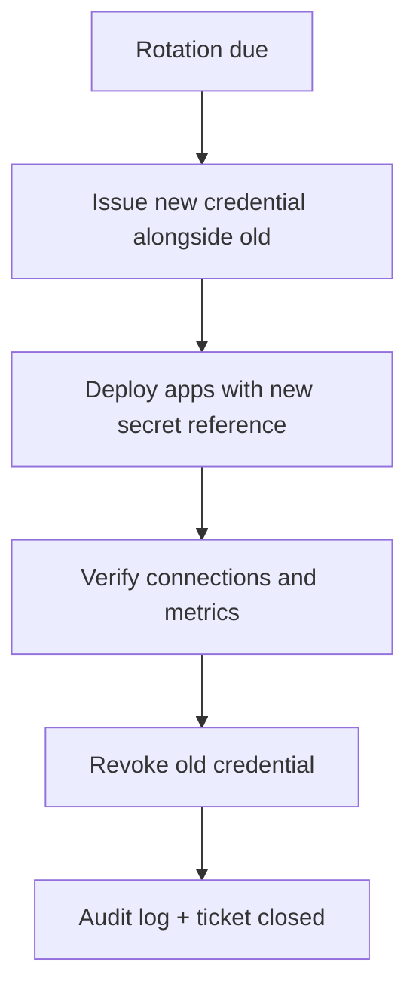
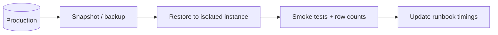

# Credential Rotation and Disaster Recovery

Production database security does not end at **first connection** — credentials rotate, backups fail silently, and restores are untested until you need them.

> **Related:** Secret patterns → [05-secret-manager-password.md](05-secret-manager-password.md) · PG backup/PITR(Point-in-Time Recovery) ops → [postgresql-performance §16](../../postgresql-performance/includes/16-backup-restore-and-pitr.md) · Deploy rollout → [deployment-strategies/includes/12-schema-migrations-and-deploy.md](../../deployment-strategies/includes/12-schema-migrations-and-deploy.md) · Connection pooling → [postgresql-performance/includes/07-connection-management.md](../../postgresql-performance/includes/07-connection-management.md)

---

## At a glance

| Practice | Frequency | Owner |
|----------|-----------|-------|
| **Password / token rotation** | 30–90 days or on incident | Platform + app teams |
| **Backup verification** | Daily automated; monthly restore test | DBA / platform |
| **PITR drill** | Quarterly on staging clone | DBA |
| **Runbook review** | After every production incident | On-call |

**Rule of thumb:** A backup you have **never restored** is a hypothesis, not a recovery plan.

---

## Credential rotation runbook

| Step | Detail |
|------|--------|
| **1. Dual-active window** | Vault/Secrets Manager holds `current` + `pending`; RDS supports two passwords briefly on some setups |
| **2. Rolling app restart** | Stateless pods pick up new secret via sidecar or env reload |
| **3. Pooler refresh** | PgBouncer/RDS Proxy may cache — plan reconnect or pool reload |
| **4. Revoke old** | Only after error rate and connection count stable |
| **5. Document** | Rotation date in CMDB; alert before next due |

Coordinate with [deployment-strategies](../../deployment-strategies/README.md) — rotate during low traffic; avoid same window as schema contract migrations.

---

## Rotation by pattern

| Pattern | Rotation approach |
|---------|-------------------|
| **Static password in Secrets Manager** | Generate new password → update secret → rolling restart → DB user password change |
| **Vault dynamic credentials** | TTL(Time To Live) handles expiry; ensure app renews leases |
| **RDS IAM(Identity and Access Management) auth token** | Short-lived tokens; no manual password rotation |
| **mTLS(Mutual Transport Layer Security) client certs** | CA + cert expiry alerts; renew before 30-day window |
| **PaaS connection string** | Provider dashboard rotation; update platform env |

---

## Backup and PITR fundamentals

| Term | Meaning |
|------|---------|
| **Full backup** | Snapshot of data at a point in time |
| **WAL(Write-Ahead Log) / transaction log** | Continuous archive for point-in-time recovery |
| **PITR** | Restore to arbitrary second between backups |
| **RPO(Recovery Point Objective)** | Max acceptable data loss (backup interval) |
| **RTO(Recovery Time Objective)** | Max acceptable downtime to restore |

Typical managed PostgreSQL (RDS, Cloud SQL(Structured Query Language), Azure): enable automated backups + WAL; set retention to meet compliance.

---

## DR drill flow

| Drill step | Verify |
|------------|--------|
| Restore latest snapshot | Instance starts; extensions present |
| PITR to specific timestamp | Data matches expected transaction boundary |
| App connectivity | TLS(Transport Layer Security), security group, credentials from secret |
| Replication re-establish | If promoting replica — lag and cutover steps |

Record **actual RTO** from drill — update on-call runbook.

---

## What to backup beyond the database

| Asset | Why |
|-------|-----|
| **Schema migrations history** | Rebuild empty DB correctly |
| **Vault policies / IAM bindings** | Restore access paths |
| **PgBouncer / proxy config** | Pool rules match app |
| **Encryption keys** | KMS(Key Management Service) keys and rotation state |

---

## Checklist

- [ ] Automated daily backups enabled with retention ≥ compliance requirement
- [ ] PITR window documented (e.g. 7–35 days)
- [ ] Restore tested to non-production in last 90 days
- [ ] Credential rotation runbook with dual-active window
- [ ] Alerts on backup failure and cert expiry
- [ ] Secrets not in git; rotation does not require code deploy (env/secret reference only)
- [ ] On-call runbook includes RDS/Cloud SQL restore commands

---

## Common mistakes

| Mistake | Fix |
|---------|-----|
| Rotate password without rolling apps | Connection storm and auth errors |
| Backup enabled but never restored | Schedule quarterly drill |
| Single shared DB user for all services | Per-service identity; rotate independently |
| Revoke old credential immediately | Dual-active verification period |
| DR instance in same region only | Cross-region snapshot for regional outage |

---

## Pros and cons

### Regular rotation + tested restore

**Pros:** Limits blast radius of leaked creds; proven RTO/RPO; audit-friendly.

**Cons:** Operational overhead; coordination with deploys; brief dual-credential complexity.