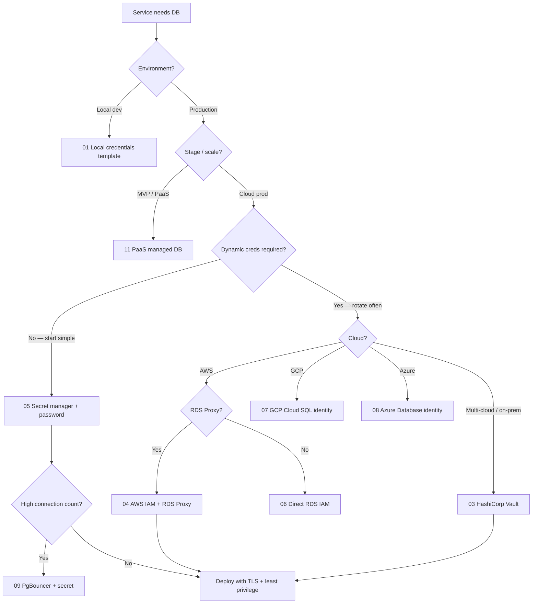

# Decision Guide — Connection Patterns

Eleven connection patterns exist in this guide. Use this flow to pick a starting point, then read the linked section for implementation detail.

> **Related:** Production layers → [02-prod-db-security.md](02-prod-db-security.md) · Pooling → [postgresql-performance/includes/07-connection-management.md](../../postgresql-performance/includes/07-connection-management.md) · Rotation → [12-credential-rotation-and-dr.md](12-credential-rotation-and-dr.md)

---

## Master decision flow

---

## Quick pick table

| Situation | Section | Pattern |
|-----------|---------|---------|
| Laptop Postgres | [01](01-local-db-credentials.md) | Trust / local user *(template)* |
| Supabase, Neon, Railway | [11](11-paas-managed-db.md) | Platform connection string |
| First AWS prod app | [05](05-secret-manager-password.md) | Secrets Manager + DB user |
| Many microservices on RDS | [04](04-aws-iam-rds-proxy.md) | IAM(Identity and Access Management) auth + RDS Proxy |
| Compliance / dynamic secrets | [03](03-hcv-vault.md) | Vault database secrets engine |
| Connection storm | [09](09-pgbouncer-proxy-password.md) + [PG §7](../../postgresql-performance/includes/07-connection-management.md) | PgBouncer |
| mTLS(Mutual Transport Layer Security) instead of password | [10](10-mtls-client-certs.md) | Client certificates |
| Regulated rotation + DR | [12](12-credential-rotation-and-dr.md) | Dual-active creds + restore drills |

---

## Security layers (every pattern)

| # | Layer | All patterns must |
|---|-------|-------------------|
| 1 | Network | Private subnet or allowlist; no public PG port |
| 2 | TLS(Transport Layer Security) | `sslmode=require` or equivalent in prod |
| 3 | Auth | One DB role per service; least privilege |
| 4 | Secrets | Not in git; rotate on schedule |
| 9 | Monitoring | Failed auth, connection count, slow queries |

Full table → [02-prod-db-security.md](02-prod-db-security.md).

---

## Migration path (typical)

| Stage | Pattern |
|-------|---------|
| **1. MVP** | PaaS connection string ([11](11-paas-managed-db.md)) |
| **2. First cloud prod** | Secret manager + password ([05](05-secret-manager-password.md)) |
| **3. Scale services** | PgBouncer ([09](09-pgbouncer-proxy-password.md)) |
| **4. Zero long-lived passwords** | Vault or cloud IAM ([03](03-hcv-vault.md), [04](04-aws-iam-rds-proxy.md)) |

---

## Common mistakes

| Mistake | Fix |
|---------|-----|
| Shared DB superuser for all apps | One role per service |
| IAM auth but no Proxy at high scale | RDS Proxy + pool |
| Vault everywhere on day one | Start [05] → evolve |
| Rotation without rolling restart plan | Dual-active window → [12](12-credential-rotation-and-dr.md) |

---

## See also

- [deployment-strategies §12](../../deployment-strategies/includes/12-schema-migrations-and-deploy.md) — deploy during credential rotation
- [api-design §12 identity](../../api-design-and-protection/includes/12-identity-rbac-iam-ad.md) — map service identity to DB role
