# Deployment Strategies Guide (Full)

> Combined view of all sections. Modular sources live in `includes/`.

---

# Overview — Quick Comparison

> **Related:** Stateless apps → [api-design §11 Stateless architecture](../api-design-and-protection/includes/11-stateless-architecture.md) · Schema + deploy → [§12 Schema migrations](12-schema-migrations-and-deploy.md) · Decision guide → [§11 Choosing a strategy](11-choosing-and-practices.md)

| Strategy | Downtime | Rollback speed | Risk | Complexity | Best for |
|----------|----------|----------------|------|------------|----------|
| **Recreate (Big Bang)** | Yes | Slow | High | Low | Dev/staging, small apps |
| **Rolling** | Minimal/none | Medium | Medium | Medium | Most production services |
| **Blue-Green** | None (if done right) | Very fast | Low–Medium | Medium–High | Critical uptime, fast rollback |
| **Canary** | None | Fast | Low | High | Risk-sensitive releases |
| **A/B Testing** | None | N/A (experiment) | Low | High | Product/experimentation |
| **Shadow / Mirror** | None | N/A | Low (infra cost) | High | Validation before cutover |
| **Feature flags** | None | Instant (toggle) | Low | Medium | Decouple deploy from release |

## At a glance

- **Recreate** — simplest, accepts downtime
- **Rolling** — default for most services
- **Blue-green** — fast rollback, needs double capacity
- **Canary / progressive** — limit blast radius with real traffic
- **Feature flags** — separate *deploying code* from *releasing features*
- **Shadow** — validate rewrites safely before cutover
- **GitOps** — declarative, auditable delivery (common on Kubernetes)

## Common mistakes

| Mistake | Fix |
|---------|-----|
| Breaking schema + code in one deploy | Expand → deploy → contract |
| Recreate in production for convenience | Rolling or canary with health checks |
| Rollback app after non-reversible migration | Forward-fix or expand/contract only |
| No build ID on metrics during canary | Tag version on traces and dashboards |
| Feature flags left on forever | Delete flag after 100% rollout |

## See also

| Guide | Topics |
|-------|--------|
| [api-design-and-protection](../api-design-and-protection/includes/11-stateless-architecture.md) | Stateless app tier — prerequisite for rolling and blue/green |
| [high-throughput-systems §10](../high-throughput-systems/includes/10-scale-and-deploy.md) | Autoscaling and deploy during high load |
| [event-sourcing-and-cqrs](../event-sourcing-and-cqrs/README.md) | Projector compatibility during rolling deploys |

---

# Recreate (Big Bang)

> **Related:** Safer alternatives → [§2 Rolling](02-rolling.md), [§3 Blue/green](03-blue-green.md) · Schema + deploy → [§12 Schema migrations](12-schema-migrations-and-deploy.md) · Choosing guide → [§11](11-choosing-and-practices.md)

## What it is

Stop the old version entirely, deploy the new version, then start.

## Flow

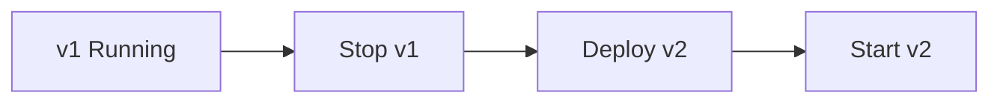

## Pros

- Simplest to implement and reason about
- No version coexistence issues
- Clean state (no mixed versions)

## Cons

- Downtime during the switch
- Slow or painful rollback (redeploy old version)
- All users hit the new version at once

## When to use

- Dev, staging, and internal tools
- Low-traffic apps or maintenance-window deployments
- Stateless batch jobs where downtime is acceptable

## Best practices

- Schedule maintenance windows and communicate clearly
- Keep the previous artifact/image tagged and ready to redeploy
- Run database migrations with a backward-compatible plan if a DB is involved

## Common mistakes

| Mistake | Fix |
|---------|-----|
| Recreate on production user-facing API | Use rolling or canary ([§2](02-rolling.md), [§4](04-canary.md)) |
| Non-backward-compatible migration before deploy | Expand/contract → [§12](12-schema-migrations-and-deploy.md) |
| No tagged previous artifact | Keep last-known-good image/build ID for fast redeploy |

---

# Rolling Deployment

> **Related:** SLO rollback triggers → [§13](13-slo-rollback-triggers.md) · Schema coupling → [§12](12-schema-migrations-and-deploy.md) · Stateless prerequisite → [api-design §11](../api-design-and-protection/includes/11-stateless-architecture.md)

## What it is

Replace instances gradually (e.g., one of N at a time) while traffic keeps flowing.

## Flow

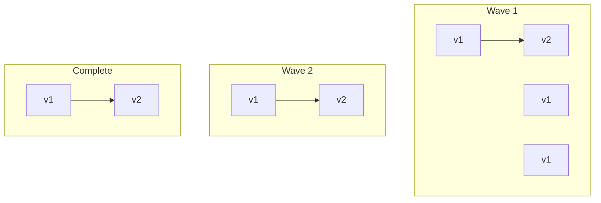

## Pros

- No full outage (usually)
- Uses existing infrastructure (no duplicate environment)
- Standard in Kubernetes, ECS, and VM fleets

## Cons

- Two versions run at once — schema and API compatibility required
- Rollback is slower (roll back instance by instance)
- A bad release can affect a subset of users before you stop

## When to use

- Default choice for most web APIs and microservices
- Container orchestration (Kubernetes `RollingUpdate`, ECS rolling updates)

## Best practices

- Set `maxUnavailable` / `maxSurge` conservatively
- Use health checks and readiness probes before receiving traffic
- Apply backward-compatible database migrations (expand → deploy → contract)
- Monitor error rate per wave; pause or abort the rollout on alerts

---

## Failure modes

| Failure | Symptom | Mitigation |
|---------|---------|------------|
| **New pod crash loop** | Rollout stuck; `maxUnavailable` blocks progress | Fix image; rollback deployment object |
| **Readiness never true** | No new pods receive traffic | Check DB migration, config, dependency health |
| **Schema incompatible** | 5xx on new pods only | Pause rollout; expand migration; redeploy old tag |
| **Long startup** | Surge pods killed before ready | Increase `initialDelaySeconds`; pre-warm connections |
| **Partial wave bad** | Error rate up on subset of traffic | `kubectl rollout pause`; undo or fix forward |

---

## Kubernetes example

```yaml
strategy:
  type: RollingUpdate
  rollingUpdate:
    maxSurge: 1
    maxUnavailable: 0   # safer for user-facing APIs
```

| Setting | Conservative | Aggressive |
|---------|--------------|------------|
| `maxUnavailable` | 0 | 25% |
| `maxSurge` | 1 | 50% |
| `minReadySeconds` | 30 | 0 |

Pair with **PodDisruptionBudget** so node drains don't take all replicas.

---

## Abort and rollback

1. `kubectl rollout pause deployment/my-api`
2. Confirm error rate stabilizes on remaining v1 pods
3. `kubectl rollout undo deployment/my-api` or set image to previous digest
4. Root-cause before resuming — see [13-slo-rollback-triggers.md](13-slo-rollback-triggers.md)

Schema note: rollback app only works if **contract** migrations were not applied → [12-schema-migrations-and-deploy.md](12-schema-migrations-and-deploy.md).

## Common mistakes

| Mistake | Fix |
|---------|-----|
| `maxUnavailable: 25%` on critical API | Prefer `maxUnavailable: 0` for user-facing |
| Readiness same as liveness | Readiness waits for DB/migrations |
| Roll out during incompatible schema | Expand migration before new code |
| No PodDisruptionBudget | PDB protects drains during node maintenance |
| Ignore mixed-version integration tests | Test v1↔v2 during rollout window |

---

# Blue-Green Deployment

> **Related:** Canary alternative → [§4 Canary](04-canary.md) · Rollback triggers → [§13](13-slo-rollback-triggers.md) · Schema compatibility → [§12](12-schema-migrations-and-deploy.md)

## What it is

Two full environments: **Blue** (live) and **Green** (idle). Deploy to Green, validate, switch traffic, keep Blue for rollback.

## Flow

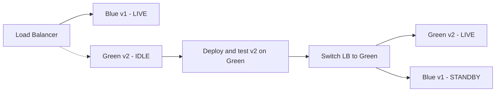

## Pros

- Near-instant rollback (flip the load balancer back to Blue)
- Test the full stack in a production-like environment before cutover
- Clear cutover moment

## Cons

- Double infrastructure cost (or capacity reservation)
- Database and state sync is hard if the app is not stateless
- The switch must be atomic at the edge (load balancer, DNS, service mesh)

## When to use

- High availability requirements
- Releases where rollback must be seconds, not minutes
- Stateless apps or apps with shared external state (RDS, Redis, etc.)

## Best practices

- Run smoke tests on Green before switching
- Use connection draining on the old pool
- For databases: prefer backward-compatible migrations; avoid two write paths
- Automate switch and rollback — manual DNS flips are error-prone

## Common mistakes

| Mistake | Fix |
|---------|-----|
| Blue/green with sticky session state | Stateless app tier or shared session store |
| Switch without connection draining | Drain old pool before cutover |
| Two write paths to database | Single writer; backward-compatible schema |
| Green tested with synthetic traffic only | Smoke tests on production-like load |
| Keep Blue idle indefinitely | Decommission after stable Green period |

---

# Canary Deployment

> **Related:** Feature flags → [§7 Feature flags](07-feature-flags.md) · SLO rollback → [§13](13-slo-rollback-triggers.md) · Progressive delivery → [§10](10-progressive-delivery.md)

## What it is

Route a small percentage of traffic to the new version; increase gradually if metrics look good.

## Flow

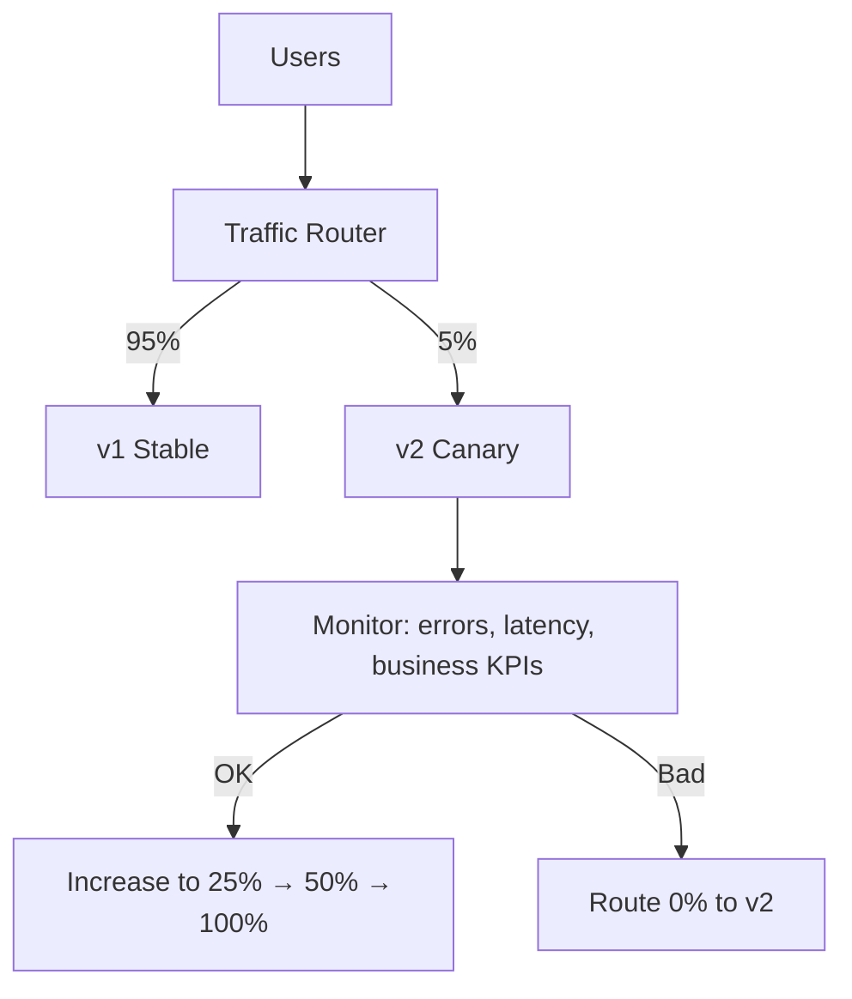

## Pros

- Limits blast radius
- Validates real user traffic and production load
- Natural fit for progressive delivery

## Cons

- Requires traffic splitting (service mesh, load balancer, CDN, API gateway)
- Two versions plus compatible schemas and APIs
- Observability and SLOs must be solid

## When to use

- Production services with measurable risk
- Payment, auth, checkout, search ranking changes
- Teams with good metrics and alerting in place

## Best practices

- Start small (1–5%); automate promotion steps
- Define rollback triggers (error rate, p99 latency, conversion drop)
- Canary on representative traffic (not only internal IPs)
- Pair with feature flags for logic-level control

---

## Failure modes

| Failure | Symptom | Action |
|---------|---------|--------|
| **Canary errors elevated** | 5xx/p99 up on canary slice only | Set canary weight to 0% |
| **Business KPI drop** | Conversion down on canary | Rollback before latency SLO |
| **Unrepresentative canary** | Internal IPs only | Route real user hash bucket |
| **Metric delay** | Promote too fast | Minimum bake time per step (e.g. 15 min) |

---

## Automated promotion example

| Step | Traffic to v2 | Bake time | Rollback if |
|------|---------------|-----------|-------------|
| 1 | 5% | 15 min | 5xx &gt; 2× baseline |
| 2 | 25% | 30 min | p99 &gt; SLO |
| 3 | 50% | 30 min | KPI drop &gt; 1% |
| 4 | 100% | — | — |

Tools: Argo Rollouts, Flagger, AWS CodeDeploy, custom LB weights.

---

## ECS / ALB canary (sketch)

- Target group A (stable) + B (canary)
- Listener rule: weighted forward 95/5
- CloudWatch alarm on canary TG 5xx → Lambda sets weight to 0

Full rollback triggers → [13-slo-rollback-triggers.md](13-slo-rollback-triggers.md).

## Common mistakes

| Mistake | Fix |
|---------|-----|
| Promote canary on latency only | Watch business KPIs and error rate |
| Canary traffic from internal IPs only | Hash route real user sessions |
| No minimum bake time per step | Hold 15–30 min per weight increase |
| Incompatible API/schema in canary slice | Backward-compatible migrations first |
| Manual promotion without automated rollback | Wire alarms to zero canary weight |

---

# A/B Testing (Experiment Deployment)

> **Related:** Traffic splitting → [§4 Canary](04-canary.md) · Feature flags → [§7 Feature flags](07-feature-flags.md) · Not a safety net alone → [§11 Choosing a strategy](11-choosing-and-practices.md)

## What it is

Similar to canary, but the goal is to **compare behavior** (conversion, engagement) — not just release safety.

## Flow

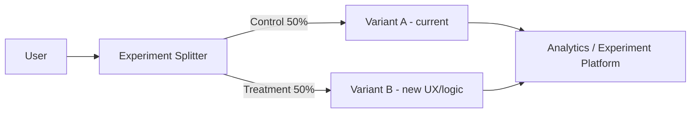

## Pros

- Data-driven product decisions
- Can test UX, algorithms, and pricing

## Cons

- Not primarily a safety or ops pattern
- Needs experiment design, statistics, and privacy review
- Can conflict with a "one stable production" ops mindset

## When to use

- Product experiments (UI, funnel, recommendations)
- **Not** as your only deployment safety net

## Best practices

- Use feature flags plus an experiment SDK (LaunchDarkly, Optimizely, GrowthBook, etc.)
- Separate "deploy code" from "enable experiment"
- Define success metrics and sample size upfront

## Common mistakes

| Mistake | Fix |
|---------|-----|
| Using A/B as the only deploy safety mechanism | Pair with canary/rolling + [§13 SLO rollback](13-slo-rollback-triggers.md) |
| Enabling experiment and deploy in one step | Separate code deploy from flag/experiment enable ([§7](07-feature-flags.md)) |
| No privacy review for logged experiment data | Treat experiment events like production PII |

---

# Shadow / Mirror / Dark Launch

> **Related:** Idempotent writes → [api-design §13 Idempotency](../api-design-and-protection/includes/13-idempotency.md) · Read-only validation first → [§11 Choosing](11-choosing-and-practices.md) · Before canary → [§4 Canary](04-canary.md)

## What it is

Copy production traffic to the new system **without** serving responses to users (or process but discard the response).

## Flow

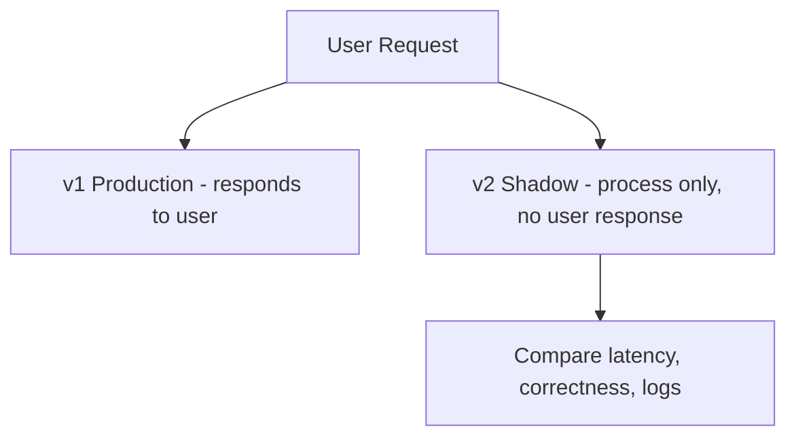

## Pros

- Validates the new system under real load with zero user impact
- Great for rewrites, new search backends, and ML models

## Cons

- Extra compute; duplicated side effects if not careful
- Hard with writes (need idempotency, read-only shadow, or synthetic traffic)

## When to use

- Major re-architecture
- Validating performance before any user-facing cutover

## Best practices

- Shadow **reads** first; treat writes with extreme care
- Compare outputs (diff, sampling) automatically
- Cap shadow traffic to control cost

## Common mistakes

| Mistake | Fix |
|---------|-----|
| Shadowing write paths without dedup | Read-only shadow first; idempotency keys for any write mirror |
| Shadow triggers duplicate side effects (email, billing) | Discard responses; never call external providers from shadow |
| 100% shadow of production load on day one | Cap traffic; ramp shadow percentage |

---

# Feature Flags (Toggle-Based Release)

> **Related:** Canary routing → [§4 Canary](04-canary.md) · Progressive delivery → [§10](10-progressive-delivery.md) · Rollback → [§13](13-slo-rollback-triggers.md)

## What it is

Deploy new code **disabled**; enable for users or segments when ready.

## Flow

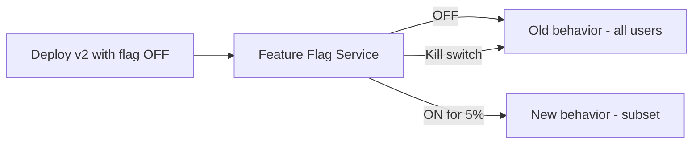

## Pros

- Decouple **deployment** (code on servers) from **release** (feature live)
- Instant rollback without redeploy
- Enables canary, A/B testing, and trunk-based development

## Cons

- Flag debt (dead code paths)
- Requires discipline: cleanup and testing both paths
- Another system to operate and secure

## When to use

- User-facing product teams at scale
- Long-running branches you want to merge early

## Best practices

- Keep flags short-lived; delete after full rollout
- Avoid flags deep in hot paths without performance testing
- Protect flag changes with audit logs and RBAC
- Test with flag ON and OFF in CI

---

## Failure modes

| Failure | Symptom | Fix |
|---------|---------|-----|
| **Flag service down** | Default path? Document fail-open vs closed | Usually fail → old behavior |
| **Stale flag cache** | Users see old behavior after toggle | Lower TTL; push invalidation |
| **Flag debt** | Many dead branches | Quarterly cleanup sprint |
| **Both paths untested** | Bug only when flag ON | CI matrix ON/OFF |

---

## Flag types

| Type | Use | Lifetime |
|------|-----|----------|
| **Release** | Gradual rollout | Delete after 100% |
| **Ops kill switch** | Disable risky feature | Permanent |
| **Experiment** | A/B test | End with decision |
| **Permission** | Entitlement / tier | Long-lived |

---

## LaunchDarkly / Unleash / custom

| Concern | Practice |
|---------|----------|
| **Targeting** | User ID hash for consistent experience |
| **Audit** | Who changed flag when |
| **RBAC** | Only platform/product can toggle prod |
| **Eval latency** | Cache locally; avoid RPC per request in hot path |

Decouple from deploy: ship code at 0% → canary via flag → 100% → remove flag → [04-canary.md](04-canary.md).

## Common mistakes

| Mistake | Fix |
|---------|-----|
| Permanent release flags | Delete after full rollout |
| Flag eval RPC on every hot request | Local cache with TTL |
| CI tests only flag OFF path | Matrix ON and OFF in pipeline |
| Flag service fail-open to new behavior | Default to safe/old path |
| No audit on production flag toggles | RBAC + change log on flag admin |

---

# Immutable Deployment

> **Related:** Blue/green cutover → [§3 Blue/green](03-blue-green.md) · Rolling replacement → [§2 Rolling](02-rolling.md) · Same artifact promotion → [§11 Best practices](11-choosing-and-practices.md)

## What it is

Never patch running servers — replace entire artifacts (AMI, container image, VM).

## Flow

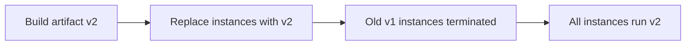

## Pros

- Reproducible, auditable releases
- No configuration drift
- Pairs well with blue-green and rolling strategies

## Cons

- Requires a solid image/build pipeline
- Slower if images are huge or builds are slow

## When to use

- Containers, cloud-native apps, regulated environments

## Best practices

- Tag images with git SHA; promote the same artifact across environments
- No SSH-and-fix in production — fix forward via a new image

## Common mistakes

| Mistake | Fix |
|---------|-----|
| Huge images slow every deploy | Slim base images; layer caching in CI |
| Immutable VMs but mutable config on disk | Config via env/secrets at boot — not manual edits |
| New image with non-backward-compatible DB migration | [§12](12-schema-migrations-and-deploy.md) expand/contract order |

---

# GitOps

> **Related:** Progressive delivery controllers → [§10 Progressive delivery](10-progressive-delivery.md) · Rollback triggers → [§13 SLO rollback](13-slo-rollback-triggers.md) · Scope note in [root README](../../README.md#scope)

## What it is

Git is the source of truth; a controller (Argo CD, Flux) reconciles cluster state to match the repo.

## Flow

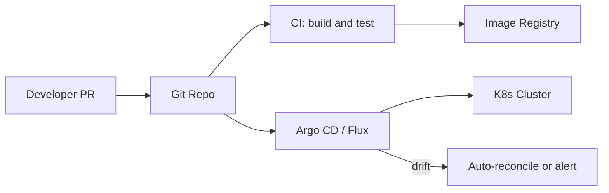

## Pros

- Auditable, declarative, repeatable
- Easy rollback = revert commit
- Clear separation: app repo vs infrastructure repo

## Cons

- Learning curve; needs disciplined repo structure
- Sync delays; secrets management needs care

## When to use

- Kubernetes-heavy organizations
- Teams wanting PR-reviewed infrastructure changes

## Best practices

- Separate environment branches or folders (dev / staging / prod)
- Use progressive sync (dev auto, prod manual approval)
- Never store secrets in plain Git

## Common mistakes

| Mistake | Fix |
|---------|-----|
| Auto-sync to production on every merge | Manual approval or progressive sync for prod |
| App + infra + secrets in one repo | External secrets operator; sealed secrets |
| Drift ignored when cluster was hot-patched | Reconcile or alert — no silent manual prod edits |

---

# Progressive Delivery

> **Related:** Canary basics → [§4 Canary](04-canary.md) · Feature flags → [§7 Feature flags](07-feature-flags.md) · SLO gates → [§13 SLO rollback](13-slo-rollback-triggers.md) · Observability → [HTS §11](../high-throughput-systems/includes/11-observability.md)

## What it is

Combines rolling deployment, canary releases, feature flags, and automated analysis (e.g., Argo Rollouts, Flagger).

## Flow

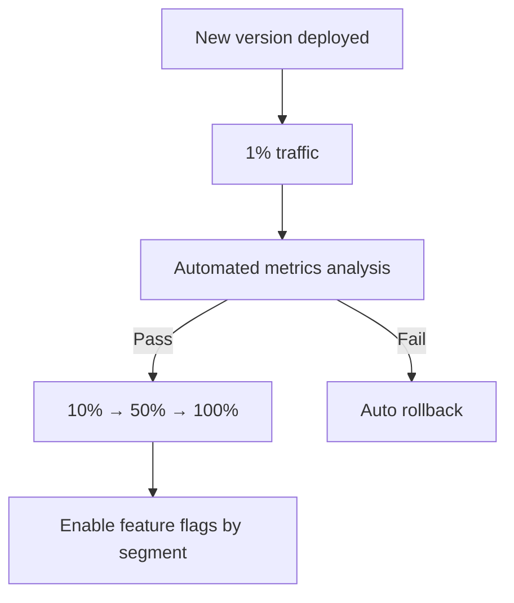

## Pros

- Strongest safety for high-stakes systems
- Reduces human error during promotion

## Cons

- Highest operational and tooling complexity

## When to use

- Large-scale SaaS, fintech, healthcare
- Teams with mature SRE and observability practices

## Best practices

- Define SLO-based promotion and rollback gates
- Automate the full pipeline — manual canary steps don't scale
- Combine with feature flags for logic that can't be split by traffic alone

## Common mistakes

| Mistake | Fix |
|---------|-----|
| Automated promote without error-rate guardrails | Wire [§13 SLO triggers](13-slo-rollback-triggers.md) to analysis step |
| Manual canary percentage steps at scale | Automate promote/rollback in Argo Rollouts / Flagger |
| Progressive delivery without metrics on new `build_id` | Tag metrics by version — [HTS §11](../high-throughput-systems/includes/11-observability.md) |

---

# Choosing a Strategy & Best Practices

> **Related:** Overview comparison → [§00 Overview](00-overview.md) · Schema migrations → [§12](12-schema-migrations-and-deploy.md) · SLO rollback → [§13](13-slo-rollback-triggers.md)

## Decision flow

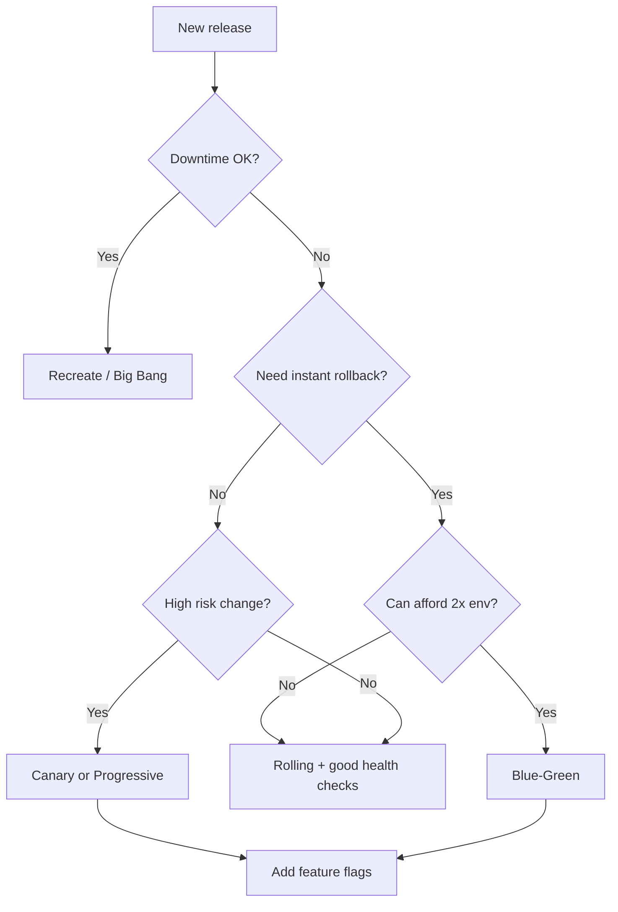

## Rule of thumb

| Stage | Recommendation |
|-------|----------------|
| **Start** | Rolling + health checks + backward-compatible migrations |
| **Add next** | Feature flags for product-facing changes |
| **Add when risk is high** | Canary releases |
| **Add when rollback time is SLA-critical** | Blue-green |
| **Add for major rewrites** | Shadow traffic |

## Cross-cutting best practices

1. **Backward-compatible changes** — Assume two versions run during rolling, canary, and blue-green.
2. **Database migrations** — Expand → deploy → contract; never break schema and code in one step.
3. **Health checks** — Liveness ≠ readiness; don't send traffic until ready.
4. **Observability** — Metrics, logs, and traces tied to version/build ID.
5. **Automated rollback** — Define SLO-based triggers, not gut feel.
6. **Same artifact across environments** — Build once, promote dev → staging → prod.
7. **Infrastructure as code** — Reproducible environments for blue-green and disaster recovery.
8. **Release checklist** — Smoke tests, runbooks, on-call awareness.
9. **Blast radius** — Deploy during low traffic when possible; use maintenance windows for recreate.
10. **Security** — Signed images, least-privilege deploy pipelines, secrets outside Git.

## Common combinations by stack

| Stack | Typical pattern |
|-------|-----------------|
| **Kubernetes** | Rolling default; Argo Rollouts/Flagger for canary; GitOps with Argo CD |
| **AWS ECS/Fargate** | Rolling update; CodeDeploy blue-green for Lambda/ECS |
| **Serverless** | Alias weighted routing (canary); immutable versions |
| **VMs + load balancer** | Rolling pool replace or blue-green ASG swap |
| **Mobile** | Phased store rollout (similar to canary, store-controlled) |

## Summary

- **Recreate** — simple, downtime OK
- **Rolling** — default for most services
- **Blue-green** — fast rollback, double capacity
- **Canary / progressive** — limit risk with real traffic
- **Feature flags** — separate deploy from release
- **Shadow** — validate rewrites safely
- **GitOps** — declarative, audifiable delivery on Kubernetes

Deep dives → [12-schema-migrations-and-deploy.md](12-schema-migrations-and-deploy.md) · [13-slo-rollback-triggers.md](13-slo-rollback-triggers.md)

## Common mistakes

| Mistake | Fix |
|---------|-----|
| Pick canary without metrics | Rolling + health checks first |
| Blue/green without 2× capacity plan | Rolling or canary instead |
| Deploy Friday without rollback runbook | SLO triggers + on-call aware |
| Different artifact per environment | Build once, promote same digest |
| Skip smoke test after deploy | Automated smoke on critical paths |

---

# Schema Migrations and Deploy Coupling

Application deploys and database schema changes must be **compatible across two code versions** whenever you use rolling, canary, or blue/green. Treat migrations as part of the release — not a separate step after deploy.

> **Related:** PostgreSQL migration checklist → [postgresql-performance/includes/15-schema-migration-checklist.md](../postgresql-performance/includes/15-schema-migration-checklist.md) · ES projector compatibility → [event-sourcing-and-cqrs/includes/06-decision-guide.md](../event-sourcing-and-cqrs/includes/06-decision-guide.md) · Rollback triggers → [13-slo-rollback-triggers.md](13-slo-rollback-triggers.md)

---

## At a glance

| Phase | Safe change | Risky change |
|-------|-------------|--------------|
| **Expand** | Add nullable column, new table, new index **concurrently** | Rename column, drop column, change type |
| **Deploy** | New code reads/writes new shape; old code still works | Code depends on column old version cannot see |
| **Contract** | Remove deprecated column after all instances upgraded | Drop before last old instance is gone |

**Rule of thumb:** **Expand → deploy → contract.** Never drop or rename in the same release that introduces dependent code.

---

## Expand / deploy / contract flow

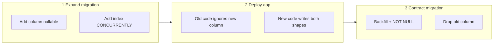

| Step | Example: rename `email` → `primary_email` |
|------|---------------------------------------------|
| **Expand** | Add `primary_email`; backfill from `email` in batches |
| **Deploy** | App writes both; reads prefer `primary_email` |
| **Contract** | Drop `email` after no old binaries remain |

---

## Deploy strategy × migration matrix

| Strategy | Migration constraint |
|----------|---------------------|
| **Rolling** | Old + new pods coexist — schema must work for both |
| **Canary** | Small % on new code — same as rolling |
| **Blue/green** | Can run expand on shared DB before switch; instant rollback = old code must still match schema |
| **Recreate** | Brief downtime — can run blocking DDL in maintenance window |

---

## Event-sourced and CQRS systems

| Component | Deploy concern |
|-----------|----------------|
| **Event store schema** | Append-only — prefer new event types over mutating old payloads |
| **Projectors** | New projector version must handle old events; run dual-write or lag-tolerant reads during rollout |
| **Read models** | Rebuild or backfill projections after schema expand — see [event-sourcing decision guide](../event-sourcing-and-cqrs/includes/06-decision-guide.md) |

Deploy projectors **before** or **with** API changes that depend on new read-model fields.

---

## Online vs blocking DDL (PostgreSQL)

| Operation | Blocking? | Prefer |
|-----------|-----------|--------|
| `ADD COLUMN` (nullable, no default) | Low lock | Safe in rolling deploy |
| `CREATE INDEX CONCURRENTLY` | Non-blocking | Always in production |
| `ADD COLUMN DEFAULT` (PG 11+) | Brief | Plan off-peak |
| `ALTER TYPE`, `DROP COLUMN` | Often exclusive lock | Contract phase only |
| `VACUUM FULL`, table rewrite | Blocking | Maintenance window |

Details → [postgresql-performance §15](../postgresql-performance/includes/15-schema-migration-checklist.md).

---

## Release checklist (schema + deploy)

- [ ] Migration is backward compatible with **previous** app version
- [ ] Expand migration applied and verified **before** traffic on new code (or in same pipeline stage)
- [ ] Index created `CONCURRENTLY` where applicable
- [ ] Backfill job idempotent and resumable
- [ ] Rollback plan: revert deploy **without** running contract migration
- [ ] Projectors / cache invalidation aligned with read-model changes
- [ ] Load test on staging with **both** schema and code versions if possible

---

## Common mistakes

| Mistake | Fix |
|---------|-----|
| Drop column same release as code change | Contract in a **later** release |
| Rename in one migration | Add new → migrate → drop old |
| Long backfill in one transaction | Batch with `LIMIT` and sleep |
| Deploy API before projector | Order: expand → projector → API |
| No rollback without reverse migration | Keep expand reversible until contract |

---

## Pros and cons

### Expand / contract discipline

**Pros:** Zero-downtime rolling deploys; safe rollback to previous binary; works with canary and blue/green.

**Cons:** Multi-release timelines; temporary schema duplication; requires team habit and CI checks.

---

# SLO-Based Rollback Triggers

Automated rollback beats human judgment under incident pressure — but only when triggers are **defined before deploy**, tied to **version/build ID**, and tested in staging.

> **Related:** Observability signals → [high-throughput-systems/includes/11-observability.md](../high-throughput-systems/includes/11-observability.md) · Progressive delivery → [10-progressive-delivery.md](10-progressive-delivery.md) · Schema coupling → [12-schema-migrations-and-deploy.md](12-schema-migrations-and-deploy.md)

---

## At a glance

| Trigger type | Example | Action |
|--------------|---------|--------|
| **Error rate** | 5xx > 2× baseline for 5 min on canary | Roll back canary / halt rollout |
| **Latency** | p99 > SLO for 10 min | Roll back or scale down new version |
| **Saturation** | DB pool wait p99 > threshold | Pause deploy; roll back if correlated with version |
| **Business metric** | Checkout success rate drop > 1% | Roll back feature flag or deployment |
| **Synthetic** | Smoke test fails post-deploy | Block promotion to next stage |

**Rule of thumb:** Roll back on **SLO burn**, not a single failed health check. Require **duration + correlation with new version**.

---

## Rollback decision flow

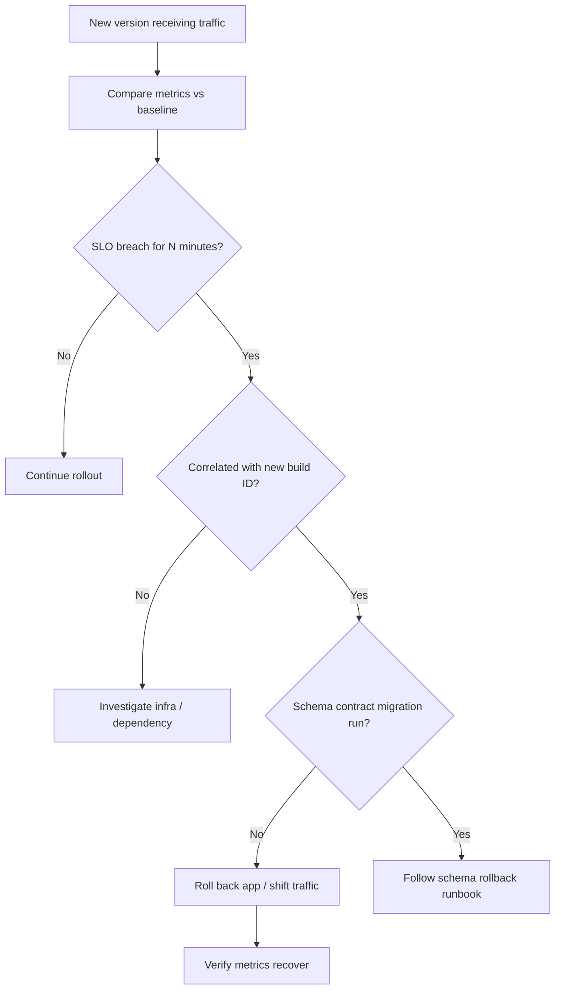

---

## Metrics to wire per deploy

| Metric | Baseline window | Typical threshold |
|--------|-----------------|-------------------|
| HTTP 5xx rate | Pre-deploy 30 min | > 2× baseline |
| p99 latency | Pre-deploy 30 min | > 1.5× baseline or SLO |
| 429 rate (paid tier) | Pre-deploy | Unexpected spike |
| Error budget burn | Rolling 1 h | > 10% budget in 15 min |
| Queue depth / consumer lag | Pre-deploy | Monotonic growth after deploy |
| DB replication lag | Steady state | > SLO |

Tag all series with **`version`** or **`build_id`** so canary analysis isolates the new release.

---

## Rollback mechanics by strategy

| Strategy | Fast rollback |
|----------|---------------|
| **Rolling** | Stop rollout; redeploy previous artifact |
| **Blue/green** | Switch LB to previous environment |
| **Canary** | Set canary weight to 0% |
| **Feature flag** | Disable flag — code stays deployed |
| **Serverless alias** | Shift traffic to previous alias |

Schema note: if only **expand** migrations ran, app rollback is usually enough. **Contract** migrations may require forward-only planning.

---

## Feature flags vs deploy rollback

| Situation | Prefer |
|-----------|--------|
| Bad logic in one feature | **Flag off** — instant, no redeploy |
| Bad binary (crash loop, memory leak) | **Deploy rollback** |
| Bad migration (contract phase) | **Stop deploy** + DBA runbook — flag may not help |

Use flags for **release**; use deploy rollback for **broken artifact**.

---

## Pre-deploy checklist

- [ ] Rollback triggers documented in runbook with thresholds
- [ ] Dashboard filtered by `build_id` / canary slice
- [ ] Previous artifact pinned and promotable in one step
- [ ] On-call notified before progressive rollout
- [ ] Schema migrations limited to **expand** phase if rollback needed
- [ ] Automated analysis (e.g. Argo Rollouts, Flagger) configured in staging

---

## Common mistakes

| Mistake | Fix |
|---------|-----|
| Roll back on one 500 | Require sustained breach |
| No version tag on metrics | Cannot blame canary |
| Contract migration before rollout completes | Expand only until stable |
| Manual rollback only | Automate halt at minimum |
| Roll back app but not bad cache | Invalidate or version cache keys |

---

## Pros and cons

### Automated SLO rollback

**Pros:** Limits blast radius; faster recovery; objective criteria reduce debate.

**Cons:** False positives if thresholds too tight; requires metric quality and version tagging.

---


---

## See also

| Guide | Topics |
|-------|--------|
| [api-design-and-protection](../api-design-and-protection/README.md) | Stateless app tier, lifecycle, reference architecture |
| [high-throughput-systems](../high-throughput-systems/README.md) | Autoscaling, multi-region, deploy during high load |
| [event-sourcing-and-cqrs](../event-sourcing-and-cqrs/README.md) | Projector compatibility during rolling deploys |
| [postgresql-performance](../postgresql-performance/README.md) | Schema changes and online maintenance |
| [postgresql-performance §15](../postgresql-performance/includes/15-schema-migration-checklist.md) | Online DDL and backfill patterns |
| [database-connection-and-security](../database-connection-and-security/README.md) | Secret rotation during deploys |
| [api-rate-limiting](../api-rate-limiting/README.md) | Limit rollout traffic during canary |
| [tree-and-index-structures](../tree-and-index-structures/README.md) | LSM vs B+ when schema drives storage |
