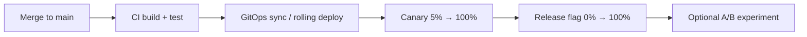

# Overview — Quick Comparison

> **Scope:** **Strategy comparison** — downtime, rollback speed, risk, and fit at a glance. Per-strategy mechanics → §1–§8; choosing and practices → [§11 Choosing a strategy](11-choosing-and-practices.md).
>
> **Related:** Stateless apps → [api-design §11 Stateless architecture](../../api-design-and-protection/includes/11-stateless-architecture.md) · Schema + deploy → [§12 Schema migrations](12-schema-migrations-and-deploy.md) · Decision guide → [§11 Choosing a strategy](11-choosing-and-practices.md)

---

## At a glance

| Need | Start here | Add when risk grows |
|------|------------|---------------------|
| Default production deploy | [§2 Rolling](02-rolling.md) | Health checks + backward-compatible schema |
| Fast rollback (seconds) | [§3 Blue-green](03-blue-green.md) | Double capacity or reserved idle stack |
| Limit blast radius | [§4 Canary](04-canary.md) or [§10 Progressive delivery](10-progressive-delivery.md) | SLO(Service Level Objective) gates → [§13](13-slo-rollback-triggers.md) |
| Decouple code ship from user exposure | [§7 Feature flags](07-feature-flags.md) | Short-lived release flags |
| Validate rewrite before cutover | [§6 Shadow](06-shadow.md) | Read-only shadow first |
| Product experiment (not deploy safety) | [§5 A/B testing](05-ab-testing.md) | Pair with canary — not instead of |
| Declarative K8s delivery | [§9 GitOps](09-gitops.md) | Progressive sync per environment |

**Rule of thumb:** Most teams run **rolling + expand/contract migrations + feature flags**. Add **canary** when error budget is tight; add **blue-green** when rollback SLA(Service Level Agreement) is seconds.

---

## Strategy comparison

| Strategy | Downtime | Rollback speed | Risk | Complexity | Best for |
|----------|----------|----------------|------|------------|----------|
| **Recreate (Big Bang)** | Yes | Slow | High | Low | Dev/staging, small apps |
| **Rolling** | Minimal/none | Medium | Medium | Medium | Most production services |
| **Blue-Green** | None (if done right) | Very fast | Low–Medium | Medium–High | Critical uptime, fast rollback |
| **Canary** | None | Fast | Low | High | Risk-sensitive releases |
| **A/B Testing** | None | N/A (experiment) | Low | High | Product/experimentation |
| **Shadow / Mirror** | None | N/A | Low (infra cost) | High | Validation before cutover |
| **Feature flags** | None | Instant (toggle) | Low | Medium | Decouple deploy from release |

---

## How strategies combine

Real pipelines stack patterns — they are not mutually exclusive:

| Layer | Pattern | Owns |
|-------|---------|------|
| **Artifact promotion** | GitOps(Git Operations), rolling, blue-green | *Which binary* is on servers |
| **Traffic shift** | Canary, progressive delivery | *What %* hits new version |
| **Behavior toggle** | Feature flags | *Which code path* runs inside a version |
| **Product experiment** | A/B | *Which variant* wins on metrics |

See [§5 A/B vs canary vs flags](05-ab-testing.md#ab-vs-feature-flags-vs-canary) — do not conflate traffic % for **version** with variant assignment for **UX**.

---

## Quick picks

- **Recreate** — simplest, accepts downtime
- **Rolling** — default for most services
- **Blue-green** — fast rollback, needs double capacity
- **Canary / progressive** — limit blast radius with real traffic
- **Feature flags** — separate *deploying code* from *releasing features*
- **Shadow** — validate rewrites safely before cutover
- **GitOps(Git Operations)** — declarative, auditable delivery (common on Kubernetes)

Full decision flow → [§11 Choosing a strategy](11-choosing-and-practices.md).

---

## Common mistakes

| Mistake | Fix |
|---------|-----|
| Breaking schema + code in one deploy | Expand → deploy → contract |
| Recreate in production for convenience | Rolling or canary with health checks |
| Rollback app after non-reversible migration | Forward-fix or expand/contract only |
| No build ID on metrics during canary | Tag version on traces and dashboards |
| Feature flags left on forever | Delete flag after 100% rollout |
| A/B as only deploy safety net | Pair with canary/rolling → [§5](05-ab-testing.md) |

---

## See also

| Guide | Topics |
|-------|--------|
| [api-design-and-protection](../../api-design-and-protection/includes/11-stateless-architecture.md) | Stateless app tier — prerequisite for rolling and blue/green |
| [high-throughput-systems §10](../../high-throughput-systems/includes/10-scale-and-deploy.md) | Autoscaling and deploy during high load |
| [event-sourcing-and-cqrs](../../event-sourcing-and-cqrs/README.md) | Projector compatibility during rolling deploys |