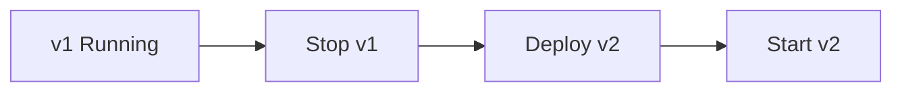

# Recreate (Big Bang)

> **Related:** Safer alternatives → [§2 Rolling](02-rolling.md), [§3 Blue/green](03-blue-green.md) · Schema + deploy → [§12 Schema migrations](12-schema-migrations-and-deploy.md) · Choosing guide → [§11](11-choosing-and-practices.md)

## What it is

Stop the old version entirely, deploy the new version, then start.

## Flow

## Pros

- Simplest to implement and reason about
- No version coexistence issues
- Clean state (no mixed versions)

## Cons

- Downtime during the switch
- Slow or painful rollback (redeploy old version)
- All users hit the new version at once

## When to use

- Dev, staging, and internal tools
- Low-traffic apps or maintenance-window deployments
- Stateless batch jobs where downtime is acceptable

## Best practices

- Schedule maintenance windows and communicate clearly
- Keep the previous artifact/image tagged and ready to redeploy
- Run database migrations with a backward-compatible plan if a DB is involved

## Common mistakes

| Mistake | Fix |
|---------|-----|
| Recreate on production user-facing API(Application Programming Interface) | Use rolling or canary ([§2](02-rolling.md), [§4](04-canary.md)) |
| Non-backward-compatible migration before deploy | Expand/contract → [§12](12-schema-migrations-and-deploy.md) |
| No tagged previous artifact | Keep last-known-good image/build ID for fast redeploy |

---

## Production signals

| Stack | Typical command / flow |
|-------|------------------------|
| **Docker Compose (dev)** | `docker compose down && docker compose up -d` |
| **Kubernetes Job** | One-shot Job replaces Deployment; delete old pods |
| **Systemd** | `systemctl stop app && deploy binary && systemctl start app` |
| **ECS** | Update service desired count to 0 → deploy task def → scale up |

Rollback = redeploy previous image tag or task definition revision — no in-place patch.