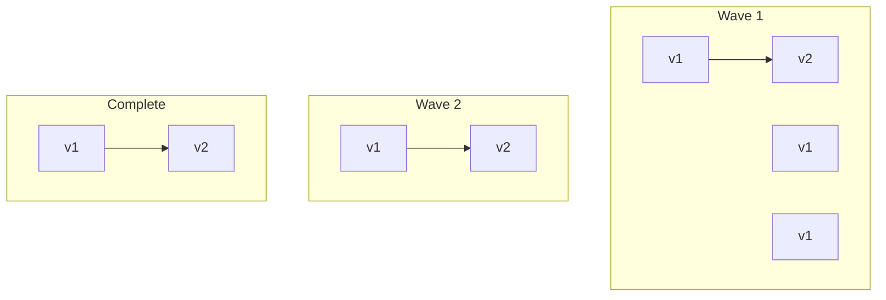

# Rolling Deployment

> **Related:** SLO rollback triggers → [§13](13-slo-rollback-triggers.md) · Schema coupling → [§12](12-schema-migrations-and-deploy.md) · Stateless prerequisite → [api-design §11](../../api-design-and-protection/includes/11-stateless-architecture.md)

## What it is

Replace instances gradually (e.g., one of N at a time) while traffic keeps flowing.

## Flow



## Pros

- No full outage (usually)
- Uses existing infrastructure (no duplicate environment)
- Standard in Kubernetes, ECS, and VM fleets

## Cons

- Two versions run at once — schema and API compatibility required
- Rollback is slower (roll back instance by instance)
- A bad release can affect a subset of users before you stop

## When to use

- Default choice for most web APIs and microservices
- Container orchestration (Kubernetes `RollingUpdate`, ECS rolling updates)

## Best practices

- Set `maxUnavailable` / `maxSurge` conservatively
- Use health checks and readiness probes before receiving traffic
- Apply backward-compatible database migrations (expand → deploy → contract)
- Monitor error rate per wave; pause or abort the rollout on alerts

---

## Failure modes

| Failure | Symptom | Mitigation |
|---------|---------|------------|
| **New pod crash loop** | Rollout stuck; `maxUnavailable` blocks progress | Fix image; rollback deployment object |
| **Readiness never true** | No new pods receive traffic | Check DB migration, config, dependency health |
| **Schema incompatible** | 5xx on new pods only | Pause rollout; expand migration; redeploy old tag |
| **Long startup** | Surge pods killed before ready | Increase `initialDelaySeconds`; pre-warm connections |
| **Partial wave bad** | Error rate up on subset of traffic | `kubectl rollout pause`; undo or fix forward |

---

## Kubernetes example

```yaml
strategy:
  type: RollingUpdate
  rollingUpdate:
    maxSurge: 1
    maxUnavailable: 0   # safer for user-facing APIs
```

| Setting | Conservative | Aggressive |
|---------|--------------|------------|
| `maxUnavailable` | 0 | 25% |
| `maxSurge` | 1 | 50% |
| `minReadySeconds` | 30 | 0 |

Pair with **PodDisruptionBudget** so node drains don't take all replicas.

---

## Abort and rollback

1. `kubectl rollout pause deployment/my-api`
2. Confirm error rate stabilizes on remaining v1 pods
3. `kubectl rollout undo deployment/my-api` or set image to previous digest
4. Root-cause before resuming — see [13-slo-rollback-triggers.md](13-slo-rollback-triggers.md)

Schema note: rollback app only works if **contract** migrations were not applied → [12-schema-migrations-and-deploy.md](12-schema-migrations-and-deploy.md).

## Common mistakes

| Mistake | Fix |
|---------|-----|
| `maxUnavailable: 25%` on critical API | Prefer `maxUnavailable: 0` for user-facing |
| Readiness same as liveness | Readiness waits for DB/migrations |
| Roll out during incompatible schema | Expand migration before new code |
| No PodDisruptionBudget | PDB protects drains during node maintenance |
| Ignore mixed-version integration tests | Test v1↔v2 during rollout window |
