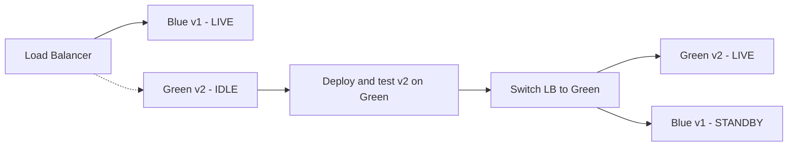

# Blue-Green Deployment

> **Scope:** **Full-environment swap** — two complete stacks; deploy to idle Green, validate, switch traffic; Blue stays warm for rollback. Gradual % rollout → [§4 Canary](04-canary.md).
>
> **Related:** Canary alternative → [§4 Canary](04-canary.md) · Rollback triggers → [§13](13-slo-rollback-triggers.md) · Schema compatibility → [§12](12-schema-migrations-and-deploy.md)

## What it is

Two full environments: **Blue** (live) and **Green** (idle). Deploy to Green, validate, switch traffic, keep Blue for rollback.

## Flow

## Pros

- Near-instant rollback (flip the load balancer back to Blue)
- Test the full stack in a production-like environment before cutover
- Clear cutover moment

## Cons

- Double infrastructure cost (or capacity reservation)
- Database and state sync is hard if the app is not stateless
- The switch must be atomic at the edge (load balancer, DNS, service mesh)

## When to use

- High availability requirements
- Releases where rollback must be seconds, not minutes
- Stateless apps or apps with shared external state (RDS, Redis, etc.)

## Best practices

- Run smoke tests on Green before switching
- Use connection draining on the old pool
- For databases: prefer backward-compatible migrations; avoid two write paths
- Automate switch and rollback — manual DNS flips are error-prone

## Common mistakes

| Mistake | Fix |
|---------|-----|
| Blue/green with sticky session state | Stateless app tier or shared session store |
| Switch without connection draining | Drain old pool before cutover |
| Two write paths to database | Single writer; backward-compatible schema |
| Green tested with synthetic traffic only | Smoke tests on production-like load |
| Keep Blue idle indefinitely | Decommission after stable Green period |
