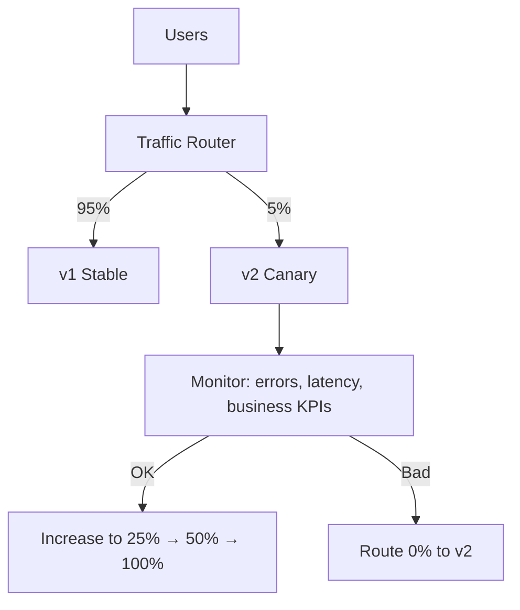

# Canary Deployment

> **Related:** Feature flags → [§7 Feature flags](07-feature-flags.md) · SLO rollback → [§13](13-slo-rollback-triggers.md) · Progressive delivery → [§10](10-progressive-delivery.md)

## What it is

Route a small percentage of traffic to the new version; increase gradually if metrics look good.

## Flow

## Pros

- Limits blast radius
- Validates real user traffic and production load
- Natural fit for progressive delivery

## Cons

- Requires traffic splitting (service mesh, load balancer, CDN, API gateway)
- Two versions plus compatible schemas and APIs
- Observability and SLOs must be solid

## When to use

- Production services with measurable risk
- Payment, auth, checkout, search ranking changes
- Teams with good metrics and alerting in place

## Best practices

- Start small (1–5%); automate promotion steps
- Define rollback triggers (error rate, p99 latency, conversion drop)
- Canary on representative traffic (not only internal IPs)
- Pair with feature flags for logic-level control

---

## Failure modes

| Failure | Symptom | Action |
|---------|---------|--------|
| **Canary errors elevated** | 5xx/p99 up on canary slice only | Set canary weight to 0% |
| **Business KPI drop** | Conversion down on canary | Rollback before latency SLO |
| **Unrepresentative canary** | Internal IPs only | Route real user hash bucket |
| **Metric delay** | Promote too fast | Minimum bake time per step (e.g. 15 min) |

---

## Automated promotion example

| Step | Traffic to v2 | Bake time | Rollback if |
|------|---------------|-----------|-------------|
| 1 | 5% | 15 min | 5xx &gt; 2× baseline |
| 2 | 25% | 30 min | p99 &gt; SLO |
| 3 | 50% | 30 min | KPI drop &gt; 1% |
| 4 | 100% | — | — |

Tools: Argo Rollouts, Flagger, AWS CodeDeploy, custom LB weights.

---

## ECS / ALB canary (sketch)

- Target group A (stable) + B (canary)
- Listener rule: weighted forward 95/5
- CloudWatch alarm on canary TG 5xx → Lambda sets weight to 0

Full rollback triggers → [13-slo-rollback-triggers.md](13-slo-rollback-triggers.md).

## Common mistakes

| Mistake | Fix |
|---------|-----|
| Promote canary on latency only | Watch business KPIs and error rate |
| Canary traffic from internal IPs only | Hash route real user sessions |
| No minimum bake time per step | Hold 15–30 min per weight increase |
| Incompatible API/schema in canary slice | Backward-compatible migrations first |
| Manual promotion without automated rollback | Wire alarms to zero canary weight |
