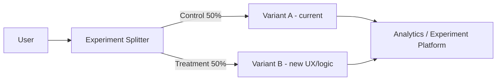

# A/B Testing (Experiment Deployment)

> **Related:** Traffic splitting → [§4 Canary](04-canary.md) · Feature flags → [§7 Feature flags](07-feature-flags.md) · Not a safety net alone → [§11 Choosing a strategy](11-choosing-and-practices.md)

## What it is

Similar to canary, but the goal is to **compare behavior** (conversion, engagement) — not just release safety.

## Flow

## Pros

- Data-driven product decisions
- Can test UX, algorithms, and pricing

## Cons

- Not primarily a safety or ops pattern
- Needs experiment design, statistics, and privacy review
- Can conflict with a "one stable production" ops mindset

## When to use

- Product experiments (UI, funnel, recommendations)
- **Not** as your only deployment safety net

## Best practices

- Use feature flags plus an experiment SDK (LaunchDarkly, Optimizely, GrowthBook, etc.)
- Separate "deploy code" from "enable experiment"
- Define success metrics and sample size upfront

## Common mistakes

| Mistake | Fix |
|---------|-----|
| Using A/B as the only deploy safety mechanism | Pair with canary/rolling + [§13 SLO rollback](13-slo-rollback-triggers.md) |
| Enabling experiment and deploy in one step | Separate code deploy from flag/experiment enable ([§7](07-feature-flags.md)) |
| No privacy review for logged experiment data | Treat experiment events like production PII |