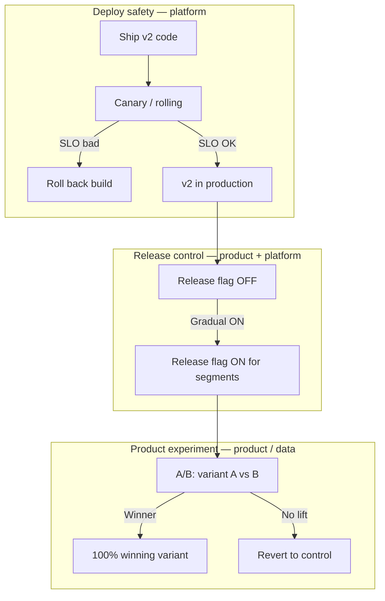
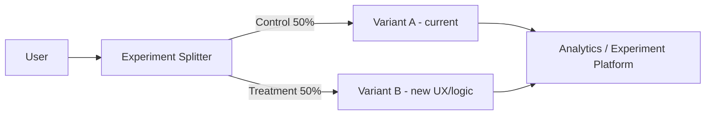

# A/B Testing (Experiment Deployment)

> **Scope:** **Product experiment lens** — compare variants for conversion, engagement, or algorithm quality. Not a deploy safety net — pair with [§4 Canary](04-canary.md), rolling, or blue-green for ops risk. **How** to toggle variants → [§7 Feature flags](07-feature-flags.md) (experiment flag type).
>
> **Related:** Traffic splitting → [§4 Canary](04-canary.md) · Feature flags → [§7 Feature flags](07-feature-flags.md) · Not a safety net alone → [§11 Choosing a strategy](11-choosing-and-practices.md)

---

## At a glance

| Pattern | Primary question | Who owns it | Rollback lever |
|---------|------------------|-------------|----------------|
| **A/B test** | Which variant wins? (product metric) | Product / data science | Turn off experiment flag |
| **Canary deploy** | Is new **code** safe in prod? (SLO, errors) | Platform / SRE(Site Reliability Engineering) | Route 0% to new version |
| **Feature flag (release)** | When to expose shipped code? | Product + platform | Flag OFF → old behavior |
| **Feature flag (experiment)** | Which UX/logic variant for this cohort? | Product | End experiment; pick winner |

**Rule of thumb:** **Deploy** with canary/rolling. **Expose** with release flags. **Compare** with A/B — never use A/B alone when the risk is broken checkout, auth, or data corruption.

---

## What it is

Similar to canary, but the goal is to **compare behavior** (conversion, engagement) — not just release safety.

Both can split traffic — the difference is **intent and success criteria**:

| | **A/B test** | **Canary deploy** |
|--|--------------|-------------------|
| **Goal** | Product decision (CTR, revenue, retention) | Ops safety (errors, latency, saturation) |
| **Split basis** | User ID hash → sticky variant | Request % or header → new **version** |
| **Duration** | Days–weeks until statistical significance | Minutes–hours until promoted or rolled back |
| **Success** | p-value / Bayesian lift on business KPI(Key Performance Indicator) | SLO(Service Level Objective) green, error budget intact |
| **Failure action** | Stop experiment; keep stable variant | Roll back traffic to previous **build** |

---

## A/B vs feature flags vs canary

A/B tests almost always **run on top of** feature flags or an experiment platform — but the three patterns solve different problems.

### Decision table

| You need… | Use | Not |
|-----------|-----|-----|
| Validate new **binary** is stable under load | [§4 Canary](04-canary.md) or rolling | A/B alone |
| Ship code early but hidden | [§7 Release flag](07-feature-flags.md#flag-types) at 0% | Long-lived branch |
| Gradual product rollout by segment | Release flag (% users, allowlist) | Canary % (that routes **versions**) |
| Compare checkout UX A vs B | A/B + **experiment** flag | Two production deploys without flag |
| Kill broken feature instantly | Ops kill switch ([§7 flag types](07-feature-flags.md#flag-types)) | Redeploy |
| Test algorithm ranking quality | A/B with sticky assignment | Shadow only (no user-facing variant) |

### Feature flag types mapped to A/B

From [§7 Flag types](07-feature-flags.md#flag-types):

| Flag type | Role in A/B workflow |
|-----------|----------------------|
| **Release** | Gets v2 code to prod at 0% before any experiment |
| **Experiment** | Splits users A/B; owned by experiment SDK or flag platform |
| **Ops kill switch** | Emergency off — independent of experiment outcome |
| **Permission** | Not A/B — entitlements (enterprise tier), not variant testing |

**Experiment flags** should be **short-lived** — end with a decision, delete the losing path, and promote the winner to 100% via release flag or default code path.

### Overlap: canary vs A/B traffic split

Both can send 50% of users somewhere — avoid conflating them:

| Scenario | Correct approach |
|----------|------------------|
| New payment service **build** might 500 | Canary: 5% traffic to **new pods**, watch error rate |
| New checkout **button color** might hurt conversion | A/B: same build, flag assigns `color=red` vs `blue` |
| New ranking **model** in same API(Application Programming Interface) version | A/B with sticky `user_id` hash; monitor latency + business KPI |
| New ranking model in **new deploy** with different deps | Canary the deploy first; **then** A/B model variants inside stable binary |

Running canary and A/B on the same cohort without documentation confuses incident response — tag traces with `build_id`, `flag_variant`, and `experiment_id`.

---

## Flow

Typical sequence:

1. **Deploy** new code with experiment flag **off** for all users ([§7](07-feature-flags.md))
2. **Enable** experiment for a % of traffic (or allowlist internal users first)
3. **Collect** events with variant dimension — same schema, different `variant` field
4. **Analyze** with pre-registered metrics and minimum sample size
5. **Ship** winner to 100%; remove losing code path in a follow-up deploy

---

## Pros

- Data-driven product decisions
- Can test UX, algorithms, and pricing
- Combines cleanly with release flags — code on prod, experiment opt-in

## Cons

- Not primarily a safety or ops pattern
- Needs experiment design, statistics, and privacy review
- Can conflict with a "one stable production" ops mindset
- Adds flag and analytics debt if experiments never end

## When to use

- Product experiments (UI, funnel, recommendations, pricing copy)
- Algorithm quality when **build is already proven safe** via canary/rolling
- **Not** as your only deployment safety net
- **Not** for schema-breaking or untested infra changes — use [§4](04-canary.md) + [§12 schema migrations](12-schema-migrations-and-deploy.md) first

## Best practices

- Use feature flags plus an experiment SDK (LaunchDarkly, Optimizely, GrowthBook, etc.)
- Separate **deploy code** from **enable experiment** — three steps: merge → deploy (flag off) → start experiment
- Define success metrics, minimum detectable effect, and sample size **before** launch
- **Sticky assignment** — same user always sees the same variant (`hash(user_id) % 100`)
- Run A/B on **one change at a time** when possible — multivariate tests need more traffic
- Coordinate with platform on canary windows — don't start a big experiment during a risky deploy

## Common mistakes

| Mistake | Fix |
|---------|-----|
| Using A/B as the only deploy safety mechanism | Pair with canary/rolling + [§13 SLO rollback](13-slo-rollback-triggers.md) |
| Enabling experiment and deploy in one step | Separate code deploy from flag/experiment enable ([§7](07-feature-flags.md)) |
| No privacy review for logged experiment data | Treat experiment events like production PII(Personally Identifiable Information) |
| Canary % confused with A/B variant % | Document: canary = **version** routing; A/B = **behavior** within a version |
| Experiment flag lives forever | End experiment; delete losing branch ([§7 flag debt](07-feature-flags.md#failure-modes)) |
| Different variants call different API versions | Prefer one version + flag; avoids schema drift during experiment |