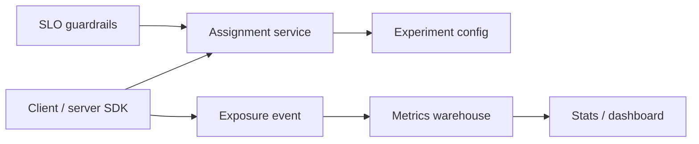

# Experimentation Platform

An experimentation platform owns **assignment, exposure logging, and metric computation** — distinct from **deploy safety** (canary) and **release toggles** (flags). Product A/B tests run here; code rollouts run elsewhere.

> **Scope:** Platform concerns — sticky assignment, exposure events, guardrails, and analysis hooks. Product A/B lens → [§5](05-ab-testing.md). Release exposure → [§7](07-feature-flags.md) · [§7A](07A-feature-flag-operations.md). Deploy safety → [§4](04-canary.md) · [§10](10-progressive-delivery.md).
>
> **Related:** Stats and KPI(Key Performance Indicator) ownership → [tech-lead §7](../../tech-lead-practice/includes/07-stakeholder-communication.md) · Privacy / consent → [enterprise-security-compliance](../../enterprise-security-compliance/README.md)

---

## At a glance

| Concern | Experiment platform | Feature flag (release) | Canary deploy |
|---------|---------------------|------------------------|---------------|
| **Question** | Which variant wins? | When to expose code? | Is new build safe? |
| **Unit** | User / account (sticky) | User / cohort | Request / instance |
| **Duration** | Days–weeks | Until stable default | Minutes–hours |
| **Success** | Lift on business metric | Adoption without incident | SLO(Service Level Objective) green |
| **Rollback** | End experiment | Flag OFF | Route 0% to new version |

**Rule of thumb:** **Never** use experiment traffic split as the only safety net for checkout, auth, or schema change — pair with [§4](04-canary.md) or [§10](10-progressive-delivery.md).

---

## Platform components

| Component | Responsibility |
|-----------|----------------|
| **Assignment** | Deterministic hash(`user_id`, `experiment_id`) → variant; sticky |
| **Exposure** | Log when user **actually saw** variant (not just assigned) |
| **Metrics** | Pre-registered primary + guardrail metrics |
| **Guardrails** | Auto-pause on error/revenue crash — [§13](13-slo-rollback-triggers.md) |

---

## Assignment vs exposure vs deploy

| Event | Meaning | Used for |
|-------|---------|----------|
| **Assignment** | User bucketed to B | Sticky UX |
| **Exposure** | Variant rendered / code path executed | Analysis denominator |
| **Deploy** | New binary in prod | Ops risk — [§5](05-ab-testing.md) |

Analysis on assignment without exposure inflates lift. Log exposure at the **same layer** the variant affects (UI render or server branch).

---

## Integration with flags

| Pattern | Flow |
|---------|------|
| **Experiment flag type** | Flag SDK returns variant; platform records exposure — [§7](07-feature-flags.md) |
| **Layered** | Release flag ON → then experiment splits inside |
| **Mutual exclusion** | Holdout groups; priority rules when experiments overlap |

One config service should not mix **release** and **experiment** semantics without typed flags — ops conflates “turn off broken code” with “stop the test.”

---

## Metric contract

| Rule | Why |
|------|-----|
| **Pre-register primary metric** | Avoid p-hacking |
| **Guardrails** (errors, latency, revenue) | Auto-stop harm |
| **Minimum runtime + sample** | Power; seasonality |
| **CUPED / stratification** (if used) | Document in analysis plan |

Ship analysis plan with PRR(Production Readiness Review) for large experiments — [§14A](14A-production-readiness-review.md).

---

## Common mistakes

| Mistake | Why it hurts | Fix |
|---------|--------------|-----|
| Canary called “A/B” | Wrong rollback lever | Separate platforms — [§5](05-ab-testing.md) |
| No exposure log | Wrong denominators | Log at render/execute |
| Non-sticky assignment | UX flicker | Hash on stable ID |
| Many overlapping tests | Interaction confusion | Layer / mutual exclusion |
| No guardrails | Revenue crash while “collecting data” | SLO-linked pause |

---

## Pros and cons

| Approach | Pros | Cons |
|----------|------|------|
| **Buy (Optimizely, Statsig, …)** | Stats + UI | Cost, vendor lock |
| **In-house on flag SDK** | Control | Easy to get analysis wrong |
| **Manual splits in code** | Fast hack | Not sticky; not auditable |
