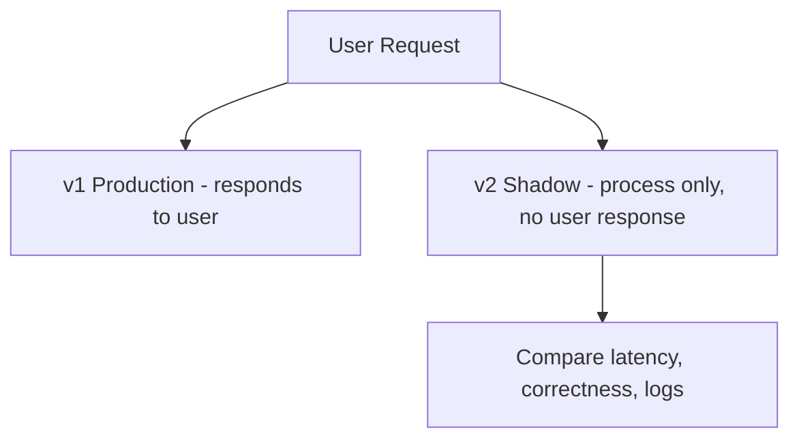

# Shadow / Mirror / Dark Launch

> **Related:** Idempotent writes → [api-design §13 Idempotency](../../api-design-and-protection/includes/13-idempotency.md) · Read-only validation first → [§11 Choosing](11-choosing-and-practices.md) · Before canary → [§4 Canary](04-canary.md)

## What it is

Copy production traffic to the new system **without** serving responses to users (or process but discard the response).

## Flow

## Pros

- Validates the new system under real load with zero user impact
- Great for rewrites, new search backends, and ML models

## Cons

- Extra compute; duplicated side effects if not careful
- Hard with writes (need idempotency, read-only shadow, or synthetic traffic)

## When to use

- Major re-architecture
- Validating performance before any user-facing cutover

## Best practices

- Shadow **reads** first; treat writes with extreme care
- Compare outputs (diff, sampling) automatically
- Cap shadow traffic to control cost

## Common mistakes

| Mistake | Fix |
|---------|-----|
| Shadowing write paths without dedup | Read-only shadow first; idempotency keys for any write mirror |
| Shadow triggers duplicate side effects (email, billing) | Discard responses; never call external providers from shadow |
| 100% shadow of production load on day one | Cap traffic; ramp shadow percentage |
