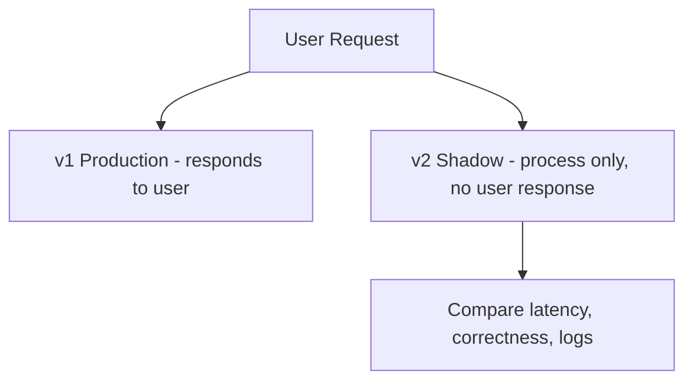

# Shadow / Mirror / Dark Launch

> **Related:** Idempotent writes → [api-design §13 Idempotency](../../api-design-and-protection/includes/13-idempotency.md) · Read-only validation first → [§11 Choosing](11-choosing-and-practices.md) · Before canary → [§4 Canary](04-canary.md)

---

## At a glance

| | Shadow | Canary |
|--|--------|--------|
| **User sees new version?** | No — primary path responds | Yes — subset of users |
| **Purpose** | Compare correctness/latency offline | Validate SLO(Service Level Objective) under real user traffic |
| **Writes** | Dangerous without dedup | Full production path |
| **Cost** | ~2× compute on mirrored requests | Partial traffic to new version |
| **Next step after success** | Canary or blue-green cutover | Promote to 100% |

---

## What it is

Copy production traffic to the new system **without** serving responses to users (or process but discard the response).

## Flow

## Pros

- Validates the new system under real load with zero user impact
- Great for rewrites, new search backends, and ML(Machine Learning) models

## Cons

- Extra compute; duplicated side effects if not careful
- Hard with writes (need idempotency, read-only shadow, or synthetic traffic)

## When to use

- Major re-architecture
- Validating performance before any user-facing cutover
- **Not** as a substitute for canary — shadow proves equivalence; canary proves production safety

## Shadow ramp

| Phase | Traffic | Endpoints | Gate |
|-------|---------|-----------|------|
| 1 | 1–5% mirror | `GET` read-only | Latency p99 within 10% of prod |
| 2 | 10–25% mirror | Search, list APIs | Output diff sampling < threshold |
| 3 | Optional write mirror | Idempotent writes only | Dedup + no external side effects |
| 4 | Cutover | Canary 5% user-facing | SLO green → [§4](04-canary.md) |

## Best practices

- Shadow **reads** first; treat writes with extreme care
- Compare outputs (diff, sampling) automatically
- Cap shadow traffic to control cost
- Tag shadow spans with `shadow=true` and `build_id` — separate dashboards from prod SLOs

## Common mistakes

| Mistake | Fix |
|---------|-----|
| Shadowing write paths without dedup | Read-only shadow first; idempotency keys for any write mirror |
| Shadow triggers duplicate side effects (email, billing) | Discard responses; never call external providers from shadow |
| 100% shadow of production load on day one | Cap traffic; ramp shadow percentage |
| Shadow success → immediate 100% cutover | Canary promote after shadow gates pass |

---

## Production signals

| Stack | How shadow traffic is routed |
|-------|------------------------------|
| **Envoy / service mesh** | `mirror` cluster — duplicate request, ignore response |
| **API(Application Programming Interface) gateway** | Shadow route or traffic mirror to secondary upstream |
| **Load balancer** | ALB weighted target group at 0% user response (mirror TG) |
| **App-level** | Async fan-out to shadow handler; primary path returns to user |

Start with **read-only** endpoints (`GET /search`) before mirroring `POST` writes.