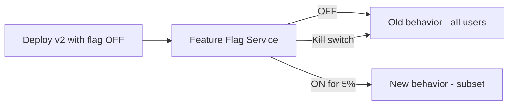

# Feature Flags (Toggle-Based Release)

> **Related:** Canary routing → [§4 Canary](04-canary.md) · Progressive delivery → [§10](10-progressive-delivery.md) · Rollback → [§13](13-slo-rollback-triggers.md)

## What it is

Deploy new code **disabled**; enable for users or segments when ready.

## Flow

## Pros

- Decouple **deployment** (code on servers) from **release** (feature live)
- Instant rollback without redeploy
- Enables canary, A/B testing, and trunk-based development

## Cons

- Flag debt (dead code paths)
- Requires discipline: cleanup and testing both paths
- Another system to operate and secure

## When to use

- User-facing product teams at scale
- Long-running branches you want to merge early

## Best practices

- Keep flags short-lived; delete after full rollout
- Avoid flags deep in hot paths without performance testing
- Protect flag changes with audit logs and RBAC(Role-Based Access Control)
- Test with flag ON and OFF in CI(Continuous Integration)

---

## Failure modes

| Failure | Symptom | Fix |
|---------|---------|-----|
| **Flag service down** | Default path? Document fail-open vs closed | Usually fail → old behavior |
| **Stale flag cache** | Users see old behavior after toggle | Lower TTL; push invalidation |
| **Flag debt** | Many dead branches | Quarterly cleanup sprint |
| **Both paths untested** | Bug only when flag ON | CI matrix ON/OFF |

---

## Flag types

| Type | Use | Lifetime |
|------|-----|----------|
| **Release** | Gradual rollout | Delete after 100% |
| **Ops kill switch** | Disable risky feature | Permanent |
| **Experiment** | A/B test | End with decision |
| **Permission** | Entitlement / tier | Long-lived |

---

## LaunchDarkly / Unleash / custom

| Concern | Practice |
|---------|----------|
| **Targeting** | User ID hash for consistent experience |
| **Audit** | Who changed flag when |
| **RBAC** | Only platform/product can toggle prod |
| **Eval latency** | Cache locally; avoid RPC per request in hot path |

Decouple from deploy: ship code at 0% → canary via flag → 100% → remove flag → [04-canary.md](04-canary.md).

## Common mistakes

| Mistake | Fix |
|---------|-----|
| Permanent release flags | Delete after full rollout |
| Flag eval RPC on every hot request | Local cache with TTL |
| CI tests only flag OFF path | Matrix ON and OFF in pipeline |
| Flag service fail-open to new behavior | Default to safe/old path |
| No audit on production flag toggles | RBAC + change log on flag admin |