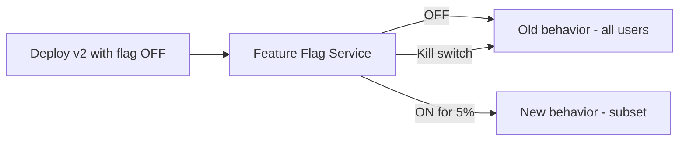
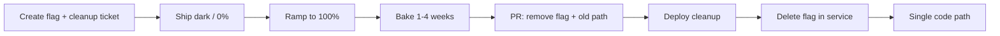

# Feature Flags (Toggle-Based Release)

> **Related:** Canary routing → [§4 Canary](04-canary.md) · Progressive delivery → [§10](10-progressive-delivery.md) · Rollback → [§13](13-slo-rollback-triggers.md) · Flags as control → [cicd §4](../../cicd-and-environments/includes/04-feature-flags-as-control.md) · Operate cleanup → [cursor-workflows §6](../../cursor-workflows/includes/06-operate-and-learn.md)

## What it is

Deploy new code **disabled**; enable for users or segments when ready.

## Flow

## Pros

- Decouple **deployment** (code on servers) from **release** (feature live)
- Instant rollback without redeploy
- Enables canary, A/B testing, and trunk-based development

## Cons

- Flag debt (dead code paths)
- Requires discipline: cleanup and testing both paths
- Another system to operate and secure

## When to use

- User-facing product teams at scale
- Long-running branches you want to merge early

## Best practices

- Keep flags short-lived; delete after full rollout — see [Lifecycle and cleanup](#lifecycle-and-cleanup)
- Avoid flags deep in hot paths without performance testing
- Protect flag changes with audit logs and RBAC(Role-Based Access Control)
- Test with flag ON and OFF in CI(Continuous Integration)
- Create the **cleanup ticket when the flag is created** (owner + target date)

---

## Failure modes

| Failure | Symptom | Fix |
|---------|---------|-----|
| **Flag service down** | Default path? Document fail-open vs closed | Usually fail → old behavior |
| **Stale flag cache** | Users see old behavior after toggle | Lower TTL(Time To Live); push invalidation |
| **Flag debt** | Many dead branches | Quarterly inventory + burn-down — [Lifecycle](#lifecycle-and-cleanup) |
| **Both paths untested** | Bug only when flag ON | CI matrix ON/OFF |

---

## Flag types

| Type | Use | Lifetime |
|------|-----|----------|
| **Release** | Gradual rollout | Delete after 100% + bake (days–weeks, not months) |
| **Ops kill switch** | Disable risky feature | Long-lived; named owner; rare toggle |
| **Experiment** | A/B test | End with decision; delete losing path |
| **Permission** | Entitlement / tier | Long-lived product config — not a release flag |

**Rule of thumb:** A **release** flag still on after **~90 days** is debt — remove it or **reclassify** in writing (kill switch or permission) with an owner.

---

## Lifecycle and cleanup

Release toggles are temporary scaffolding. Stable in PROD(Production) at 100% means the **new path is the product** — remove the flag so you do not carry two code paths for months or years.

### When to clean up (by type)

| Type | Trigger to start cleanup | Typical target |
|------|--------------------------|----------------|
| **Release** | 100% on + metrics OK | **1–4 weeks** after full ramp (not 6–12 months) |
| **Experiment** | Winner chosen | Days after decision; delete loser |
| **Ops kill switch** | Only if feature retired or risk gone | May stay years |
| **Permission** | Product change | Keep; manage as entitlement config |

Do **not** wait six months or a year to remove a release flag unless you explicitly reclassified it.

### How to remove a release flag

| Step | Action |
|------|--------|
| 1 | Confirm 100% exposure and bake window passed (errors, latency, business KPI stable) |
| 2 | Open/complete cleanup ticket (created at flag birth) |
| 3 | PR removes **evaluations**, **old branch**, and **ON/OFF-only tests**; default = new behavior |
| 4 | Deploy cleanup (canary if the delete touches a hot path) |
| 5 | After new binary is live everywhere, **delete the flag** in the flag service |
| 6 | Grep/CI: no remaining references; drop ON/OFF matrix for that key |

**Order:** prefer **code ignores flag → deploy → delete config**. Deleting the flag while old binaries still branch on it can surprise fail-open/closed behavior.

### Cadence

| Cadence | Practice |
|---------|----------|
| **At creation** | Ticket: `Remove flag team_feature_… after 100%` with owner + due date |
| **Weekly / biweekly** | Burn down flags past due date |
| **Quarterly** | Inventory: any release flag >90 days → remove or reclassify with written reason |

### Reclassify instead of delete (rare)

| Keep only if | Then |
|--------------|------|
| Need emergency off forever | Rename/type as **ops kill switch**; document default and owner |
| Really an entitlement | Move to permission/authZ config; stop calling it a release flag |

Leaving “temporary” release flags for a year without reclassification is a process failure, not a strategy.

---

## LaunchDarkly / Unleash / custom

| Concern | Practice |
|---------|----------|
| **Targeting** | User ID hash for consistent experience |
| **Audit** | Who changed flag when |
| **RBAC** | Only platform/product can toggle prod |
| **Eval latency** | Cache locally; avoid RPC per request in hot path |

Decouple from deploy: ship code at 0% → canary via flag → 100% → remove flag → [04-canary.md](04-canary.md) · cleanup detail → [Lifecycle](#lifecycle-and-cleanup).

## Common mistakes

| Mistake | Fix |
|---------|-----|
| Permanent release flags | Delete after full rollout + bake — [Lifecycle](#lifecycle-and-cleanup) |
| Waiting 6–12 months “just in case” | Bake weeks, not quarters; kill switch if you truly need emergency off |
| Flag eval RPC on every hot request | Local cache with TTL |
| CI tests only flag OFF path | Matrix ON and OFF until cleanup merges |
| Flag service fail-open to new behavior | Default to safe/old path |
| No audit on production flag toggles | RBAC + change log on flag admin |
| Delete flag config before code | Deploy code that ignores flag first |
| Cleanup ticket never created | Create with the flag; due date on the FEATURE |