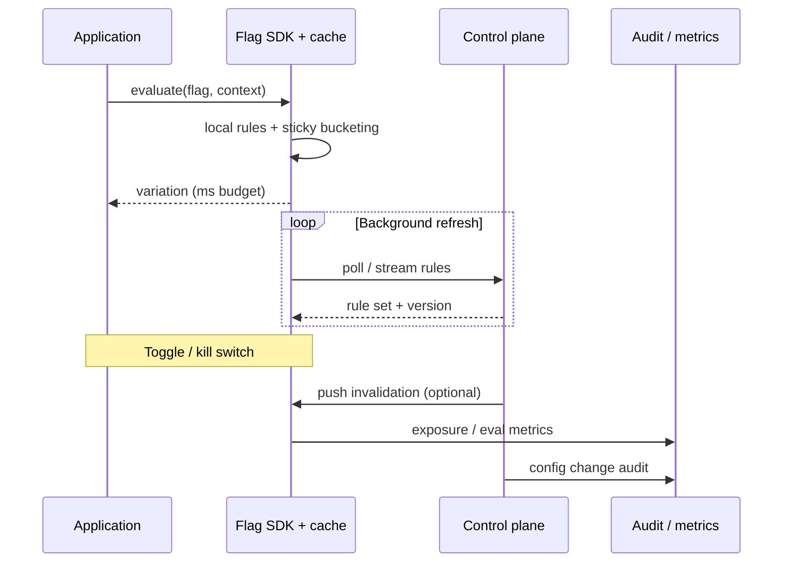
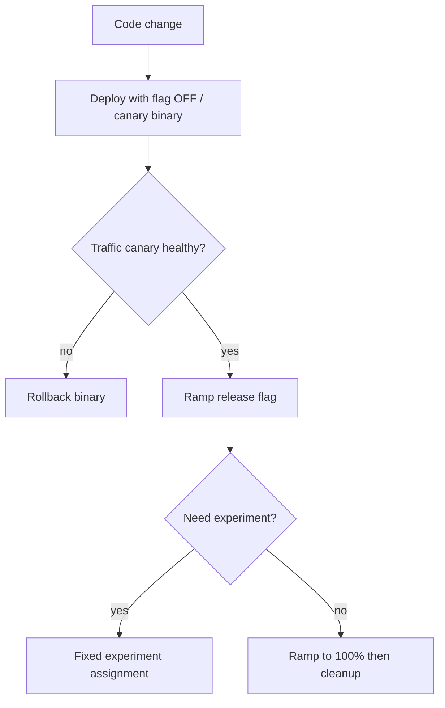

# Feature Flag Operations

Feature flags are a **control plane** in production: evaluation latency, sticky assignment, experiment vs canary interaction, and kill-switch behavior under SEV(Severity) incidents matter as much as the toggle itself. Strategy and lifecycle → [§7](07-feature-flags.md). Flags as release control in pipelines → [cicd §4](../../cicd-and-environments/includes/04-feature-flags-as-control.md).

> **Scope:** **Operating the flag platform** — SDK(Software Development Kit) cache behavior, assignment consistency, interaction with traffic canaries, and incident kill switches. Flag types and cleanup lifecycle → [§7](07-feature-flags.md). Progressive delivery orchestration → [§10](10-progressive-delivery.md).
>
> **Related:** [§7 Feature flags](07-feature-flags.md) · Canary → [§4](04-canary.md) · A/B → [§5](05-ab-testing.md) · SLO(Service Level Objective) rollback → [§13](13-slo-rollback-triggers.md) · Flags as control → [cicd §4](../../cicd-and-environments/includes/04-feature-flags-as-control.md) · Incident command → [sre §6](../../sre-and-incidents/includes/06-incident-command.md)

---

## At a glance

| Concern | Ops default |
|---------|-------------|
| **Eval latency** | Local cache / embedded rules; control plane off the request hot path |
| **Sticky assignment** | Stable bucketing key + salt; survive process restart |
| **Experiment vs canary** | One exposure mechanism owns a change; do not double-randomize |
| **Kill switch** | Fail toward safe path; documented SEV owners and audit |
| **Control-plane outage** | Serve last-known-good rules; alert platform |

**Rule of thumb:** If evaluating a flag requires a synchronous network hop on every request, you have built a **new SPOF(Single Point of Failure)** into every feature — cache rules locally and refresh asynchronously.

---

## SDK cache and control plane

| Component | Responsibility |
|-----------|----------------|
| **SDK + cache** | Sub-millisecond to low-ms eval; sticky assignment; fail-safe defaults |
| **Control plane** | AuthZ(Authorization) for toggles, targeting, audit, streaming updates |
| **App** | Pass stable context keys; never invent client-side “random” for experiments |

Document **fail-open vs fail-closed** per flag type. Release and experiment flags usually fail to **old/control**; security kill switches may fail **closed** (feature off).

---

## Evaluation latency budget

| Budget piece | Guidance |
|--------------|----------|
| Local eval | Dominate the path; aim well under your API(Application Programming Interface) p50 noise floor |
| Refresh interval | Seconds to minutes; push invalidation for kill switches |
| Context size | Bound attributes sent to SDK; avoid PII(Personally Identifiable Information) in flag context logs |
| Hot-path nesting | Cap nested flag checks; prefer one decision at the edge of the feature |

Measure `flag_eval_latency` and `flag_refresh_age`. Stale cache after a toggle is a common “it didn’t turn off” incident class — [§7 failure modes](07-feature-flags.md#failure-modes).

---

## Sticky assignment

| Requirement | Why |
|-------------|-----|
| Stable unit key (`user_id`, `account_id`, `device_id`) | Same subject sees same variation across requests |
| Salt / flag-specific seed | Independent experiments do not correlate unintentionally |
| Persist assignment when needed | Multi-device or long experiments may need server-side assignment store |
| Do not re-bucket on rule edit carelessly | Changing percentage mid-flight can move subjects between arms |

Sticky assignment is mandatory for experiments and for any release where UX would thrash if a user flipped mid-session.

---

## Experiments vs canaries

| Mechanism | Optimizes for | Typical signal |
|-----------|---------------|----------------|
| **Traffic canary** ([§4](04-canary.md)) | Deploy safety | SLO / error / latency on new **binary** |
| **Release flag** ([§7](07-feature-flags.md)) | Product exposure | Business + SLO on new **behavior** |
| **Experiment / A/B** ([§5](05-ab-testing.md)) | Causal product learning | Primary metric + guardrails |

| Anti-pattern | Fix |
|--------------|-----|
| Canary 5% **and** flag random 5% independently | Compose: canary the binary first, then ramp one flag; or drive both from one progressive-delivery controller — [§10](10-progressive-delivery.md) |
| Experiment on unstable canary binary | Stabilize deploy, then start experiment |
| Kill-switch off while experiment still assigning | Pause experiment exposure; do not leave half-dead arms |

---

## Kill switch under SEV

| Practice | Why |
|----------|-----|
| Named ops / kill-switch flags with owners | Discoverable in the war room |
| RBAC(Role-Based Access Control) + audit on toggle | Who flipped what, when |
| Prefer control-plane push for kill switches | Do not wait for poll TTL(Time To Live) |
| Default safe path coded and tested | Flag off must be a known-good state |
| Link from incident runbook | [sre §6](../../sre-and-incidents/includes/06-incident-command.md) · [RUNBOOK-TEMPLATE](../../RUNBOOK-TEMPLATE.md) |

During SEV, **turn off exposure first**, then debug. Do not “fix forward” through a broken flag path unless IC(Incident Commander) explicitly chooses that over disable.

If the control plane itself is down, rely on last-known-good local rules and emergency process (redeploy with hard-coded off, or config override) documented in advance.

---

## Operational checklist

- [ ] SDK local cache; eval off the network hot path
- [ ] Sticky bucketing keys documented per flag type
- [ ] Canary vs flag vs experiment ownership written for each major change
- [ ] Kill-switch flags listed in service runbook with fail-safe defaults
- [ ] Audit log for targeting and percentage changes
- [ ] Metrics: eval latency, refresh age, exposure rate, toggle events
- [ ] Cleanup SLOs for release flags — [§7 lifecycle](07-feature-flags.md#lifecycle-and-cleanup)

---

## Common mistakes

| Mistake | Fix |
|---------|-----|
| Sync call to flag service on every request | Local rules cache + async refresh |
| Random() in app code for “A/B” | SDK sticky assignment |
| Double randomization (canary × flag) | Single exposure controller |
| Kill switch waits for 5-minute poll | Push invalidation or short TTL for ops flags |
| No audit on percentage changes | Control-plane RBAC + audit |
| Experiment continues during SEV disable | Pause assignment; document |

---

## Pros and cons

### Flag platform with local SDK cache

**Pros:** Fast eval, survive control-plane blips, consistent sticky assignment.

**Cons:** Brief staleness after toggles; must operate refresh and invalidation carefully.

### Remote eval on every request

**Pros:** Instant consistency.

**Cons:** Latency and availability coupling; cascading failure under load.