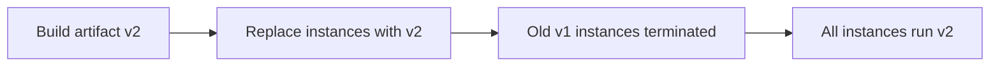

# Immutable Deployment

> **Related:** Blue/green cutover → [§3 Blue/green](03-blue-green.md) · Rolling replacement → [§2 Rolling](02-rolling.md) · Same artifact promotion → [§11 Best practices](11-choosing-and-practices.md)

## What it is

Never patch running servers — replace entire artifacts (AMI, container image, VM).

## Flow

## Pros

- Reproducible, auditable releases
- No configuration drift
- Pairs well with blue-green and rolling strategies

## Cons

- Requires a solid image/build pipeline
- Slower if images are huge or builds are slow

## When to use

- Containers, cloud-native apps, regulated environments

## Best practices

- Tag images with git SHA; promote the same artifact across environments
- No SSH-and-fix in production — fix forward via a new image

## Common mistakes

| Mistake | Fix |
|---------|-----|
| Huge images slow every deploy | Slim base images; layer caching in CI |
| Immutable VMs but mutable config on disk | Config via env/secrets at boot — not manual edits |
| New image with non-backward-compatible DB migration | [§12](12-schema-migrations-and-deploy.md) expand/contract order |
