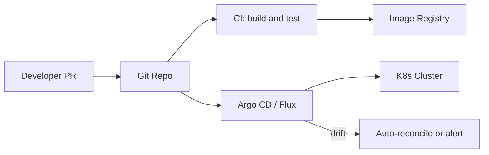

# GitOps

> **Related:** Progressive delivery controllers → [§10 Progressive delivery](10-progressive-delivery.md) · Rollback triggers → [§13 SLO rollback](13-slo-rollback-triggers.md) · Scope note in [root README](../../README.md#scope)

## What it is

Git is the source of truth; a controller (Argo CD, Flux) reconciles cluster state to match the repo.

## Flow

## Pros

- Auditable, declarative, repeatable
- Easy rollback = revert commit
- Clear separation: app repo vs infrastructure repo

## Cons

- Learning curve; needs disciplined repo structure
- Sync delays; secrets management needs care

## When to use

- Kubernetes-heavy organizations
- Teams wanting PR-reviewed infrastructure changes

## Best practices

- Separate environment branches or folders (dev / staging / prod)
- Use progressive sync (dev auto, prod manual approval)
- Never store secrets in plain Git

## Common mistakes

| Mistake | Fix |
|---------|-----|
| Auto-sync to production on every merge | Manual approval or progressive sync for prod |
| App + infra + secrets in one repo | External secrets operator; sealed secrets |
| Drift ignored when cluster was hot-patched | Reconcile or alert — no silent manual prod edits |
