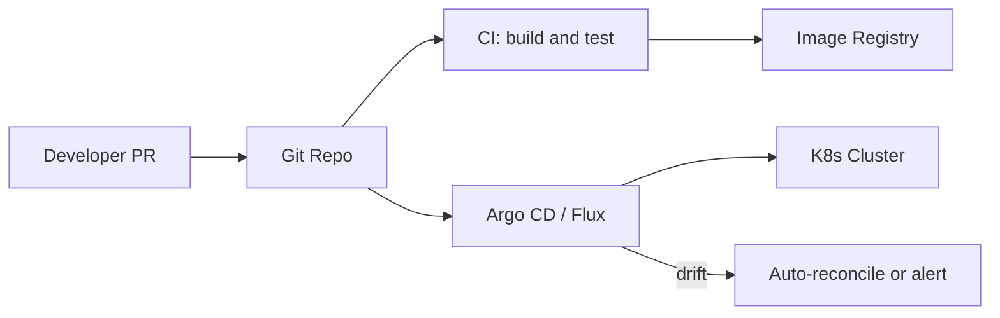

# GitOps

> **Related:** Progressive delivery controllers → [§10 Progressive delivery](10-progressive-delivery.md) · Rollback triggers → [§13 SLO rollback](13-slo-rollback-triggers.md) · Scope note in [root README](../../README.md#scope)

---

## At a glance

| | GitOps | Traditional CI/CD push |
|--|--------|------------------------|
| **Trigger** | Git commit merged → controller reconciles | Pipeline SSH/API(Application Programming Interface) deploys to servers |
| **Source of truth** | Git manifest (desired state) | Often last pipeline run + manual drift |
| **Rollback** | Revert Git commit; controller syncs | Re-run old pipeline or manual rollback |
| **Drift detection** | Built-in reconcile loop | Requires separate audit |
| **Best fit** | Kubernetes, declarative infra | VMs, legacy push deploys |

---

## What it is

Git is the source of truth; a controller (Argo CD, Flux) reconciles cluster state to match the repo.

## Flow



## Repo layout (typical)

```text
infra-repo/
├── apps/
│   ├── orders-api/
│   │   ├── base/           # Deployment, Service, Kustomize
│   │   └── overlays/
│   │       ├── staging/    # image tag, replicas
│   │       └── production/
└── clusters/
    ├── staging/            # Argo CD Application → apps/*/staging
    └── production/         # manual sync or approval gate
```

- **App repo:** source code, Dockerfile, unit tests
- **Infra/GitOps repo:** manifests, image digests/tags, env config
- **Image promotion:** CI pushes image → bot PR updates tag in GitOps repo → sync

## Pros

- Auditable, declarative, repeatable
- Easy rollback = revert commit
- Clear separation: app repo vs infrastructure repo

## Cons

- Learning curve; needs disciplined repo structure
- Sync delays; secrets management needs care
- Not a deploy *strategy* by itself — pairs with rolling/canary inside the cluster

## When to use

- Kubernetes-heavy organizations
- Teams wanting PR-reviewed infrastructure changes

## Sync policies by environment

| Environment | Sync | Approval |
|-------------|------|----------|
| **Dev** | Auto on merge | None |
| **Staging** | Auto or scheduled | Optional |
| **Production** | Manual or automated after gate | Required — human or SLO(Service Level Objective) bot |

Pair prod promotion with [§10 progressive delivery](10-progressive-delivery.md) (Argo Rollouts) rather than blind `kubectl apply`.

## Best practices

- Separate environment branches or folders (dev / staging / prod)
- Use progressive sync (dev auto, prod manual approval)
- Never store secrets in plain Git — External Secrets Operator, Sealed Secrets, Vault
- Pin images by **digest** in prod manifests, not floating `:latest`

## Common mistakes

| Mistake | Fix |
|---------|-----|
| Auto-sync to production on every merge | Manual approval or progressive sync for prod |
| App + infra + secrets in one repo | External secrets operator; sealed secrets |
| Drift ignored when cluster was hot-patched | Reconcile or alert — no silent manual prod edits |
| GitOps without health checks | Readiness probes + [§13 SLO rollback](13-slo-rollback-triggers.md) on failed sync |
| `:latest` tag in production manifest | Immutable digest per deploy |
