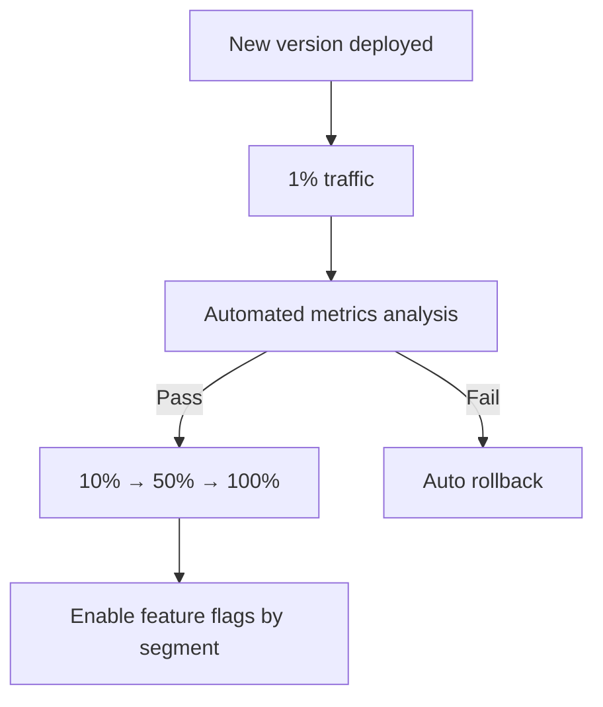

# Progressive Delivery

> **Scope:** **Orchestration layer** — combines canary ramps, feature flags, and automated analysis (e.g. Argo Rollouts, Flagger). Canary mechanics alone → [§4 Canary](04-canary.md). Toggle patterns without traffic split → [§7 Feature flags](07-feature-flags.md).
>
> **Related:** Canary basics → [§4 Canary](04-canary.md) · Feature flags → [§7 Feature flags](07-feature-flags.md) · SLO(Service Level Objective) gates → [§13 SLO rollback](13-slo-rollback-triggers.md) · Observability → [HTS §11](../../high-throughput-systems/includes/11-observability.md)

## What it is

Combines rolling deployment, canary releases, feature flags, and automated analysis (e.g., Argo Rollouts, Flagger).

## Flow

## Pros

- Strongest safety for high-stakes systems
- Reduces human error during promotion

## Cons

- Highest operational and tooling complexity

## When to use

- Large-scale SaaS, fintech, healthcare
- Teams with mature SRE and observability practices

## Best practices

- Define SLO-based promotion and rollback gates
- Automate the full pipeline — manual canary steps don't scale
- Combine with feature flags for logic that can't be split by traffic alone

## Common mistakes

| Mistake | Fix |
|---------|-----|
| Automated promote without error-rate guardrails | Wire [§13 SLO triggers](13-slo-rollback-triggers.md) to analysis step |
| Manual canary percentage steps at scale | Automate promote/rollback in Argo Rollouts / Flagger |
| Progressive delivery without metrics on new `build_id` | Tag metrics by version — [HTS §11](../../high-throughput-systems/includes/11-observability.md) |