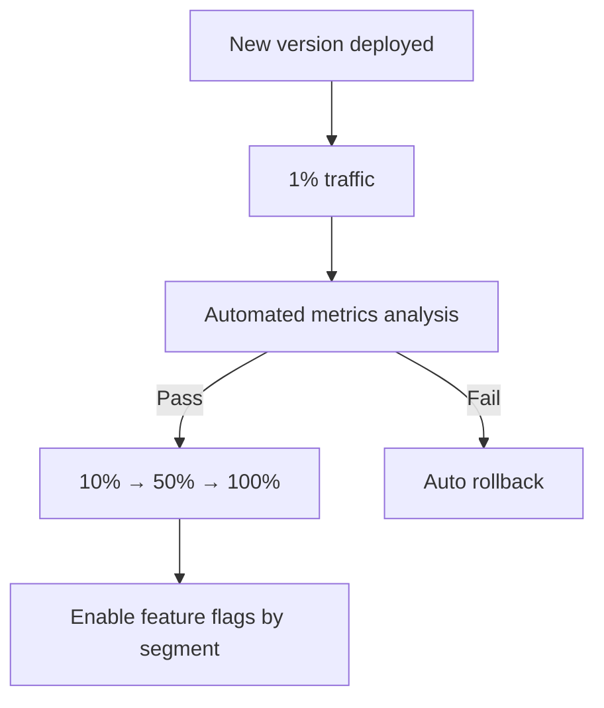

# Progressive Delivery

> **Scope:** **Orchestration layer** — combines canary ramps, feature flags, and automated analysis (e.g. Argo Rollouts, Flagger). Canary mechanics alone → [§4 Canary](04-canary.md). Toggle patterns without traffic split → [§7 Feature flags](07-feature-flags.md).
>
> **Related:** Canary basics → [§4 Canary](04-canary.md) · Feature flags → [§7 Feature flags](07-feature-flags.md) · SLO(Service Level Objective) gates → [§13 SLO rollback](13-slo-rollback-triggers.md) · Observability → [HTS §11](../../high-throughput-systems/includes/11-observability.md)

---

## At a glance

| Tool | Runs on | Automates | Pairs with |
|------|---------|-----------|------------|
| **Argo Rollouts** | Kubernetes | Canary steps, analysis, rollback | Argo CD(Continuous Delivery) GitOps(Git Operations) |
| **Flagger** | K8s + Istio/NGINX/App Mesh | Metric-based canary promotion | Flux or Argo CD |
| **AWS CodeDeploy** | ECS/Lambda | Blue-green / linear / canary | CodePipeline |
| **Spinnaker** | Multi-cloud | Pipelines, manual judgments | Any cluster |

**Rule of thumb:** Progressive delivery = **canary + automated promotion/rollback** — not just manual “set canary to 10%.”

---

## What it is

Combines rolling deployment, canary releases, feature flags, and automated analysis (e.g., Argo Rollouts, Flagger).

## Flow

## Promotion gates (define before deploy)

| Gate | Example threshold | Data source |
|------|-------------------|-------------|
| **Error rate** | Canary 5xx ≤ stable + 0.1% | Prometheus / Datadog by `build_id` |
| **Latency** | Canary p99 ≤ stable × 1.2 | APM traces |
| **Business KPI** | Checkout success rate flat | Product metrics (optional, slower) |
| **Saturation** | CPU < 80%, pool wait flat | USE(Utilization, Saturation, Errors) metrics → [HTS §11](../../high-throughput-systems/includes/11-observability.md) |

Failed gate → auto-rollback to stable ReplicaSet — wire to [§13 SLO triggers](13-slo-rollback-triggers.md).

## Pros

- Strongest safety for high-stakes systems
- Reduces human error during promotion

## Cons

- Highest operational and tooling complexity
- Requires metrics tagged by version — without `build_id`, analysis is blind

## When to use

- Large-scale SaaS(Software as a Service), fintech, healthcare
- Teams with mature SRE(Site Reliability Engineering) and observability practices
- **After** basic rolling + feature flags work — not day-one for small teams

## Best practices

- Define SLO-based promotion and rollback gates
- Automate the full pipeline — manual canary steps don't scale
- Combine with feature flags for logic that can't be split by traffic alone
- Run analysis for minimum duration (e.g. 5–15 min per step) — not one metric sample

## Common mistakes

| Mistake | Fix |
|---------|-----|
| Automated promote without error-rate guardrails | Wire [§13 SLO triggers](13-slo-rollback-triggers.md) to analysis step |
| Manual canary percentage steps at scale | Automate promote/rollback in Argo Rollouts / Flagger |
| Progressive delivery without metrics on new `build_id` | Tag metrics by version — [HTS §11](../../high-throughput-systems/includes/11-observability.md) |
| Promote on latency alone | Include error rate and saturation — latency can look fine while failing |
| Feature flag at 100% but canary still at 5% | Align traffic % with flag rollout plan |