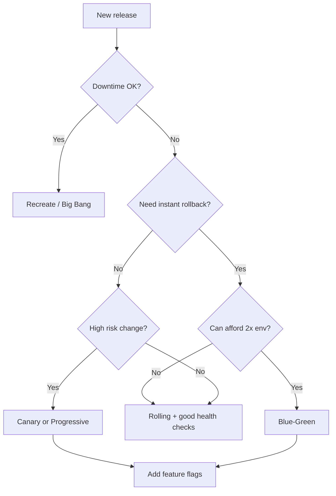

# Choosing a Strategy & Best Practices

> **Related:** Overview comparison → [§00 Overview](00-overview.md) · Schema migrations → [§12](12-schema-migrations-and-deploy.md) · SLO(Service Level Objective) rollback → [§13](13-slo-rollback-triggers.md) · End-to-end release order → [§14 Feature to PROD playbook](14-feature-to-prod-playbook.md)

## Decision flow

## Rule of thumb

| Stage | Recommendation |
|-------|----------------|
| **Start** | Rolling + health checks + backward-compatible migrations |
| **Add next** | Feature flags for product-facing changes |
| **Add when risk is high** | Canary releases |
| **Add when rollback time is SLA(Service Level Agreement)-critical** | Blue-green |
| **Add for major rewrites** | Shadow traffic |

## Cross-cutting best practices

1. **Backward-compatible changes** — Assume two versions run during rolling, canary, and blue-green.
2. **Database migrations** — Expand → deploy → contract; never break schema and code in one step.
3. **Health checks** — Liveness ≠ readiness; don't send traffic until ready.
4. **Observability** — Metrics, logs, and traces tied to version/build ID.
5. **Automated rollback** — Define SLO-based triggers, not gut feel.
6. **Same artifact across environments** — Build once, promote dev → staging → prod.
7. **Infrastructure as code** — Reproducible environments for blue-green and disaster recovery.
8. **Release checklist** — Smoke tests, runbooks, on-call awareness.
9. **Blast radius** — Deploy during low traffic when possible; use maintenance windows for recreate.
10. **Security** — Signed images, least-privilege deploy pipelines, secrets outside Git.

## Common combinations by stack

| Stack | Typical pattern |
|-------|-----------------|
| **Kubernetes** | Rolling default; Argo Rollouts/Flagger for canary; GitOps(Git Operations) with Argo CD(Continuous Delivery) |
| **AWS ECS/Fargate** | Rolling update; CodeDeploy blue-green for Lambda/ECS |
| **Serverless** | Alias weighted routing (canary); immutable versions |
| **VMs + load balancer** | Rolling pool replace or blue-green ASG swap |
| **Mobile** | Phased store rollout (similar to canary, store-controlled) |

## Summary

- **Recreate** — simple, downtime OK
- **Rolling** — default for most services
- **Blue-green** — fast rollback, double capacity
- **Canary / progressive** — limit risk with real traffic
- **Feature flags** — separate deploy from release
- **Shadow** — validate rewrites safely
- **GitOps** — declarative, audifiable delivery on Kubernetes

Deep dives → [12-schema-migrations-and-deploy.md](12-schema-migrations-and-deploy.md) · [13-slo-rollback-triggers.md](13-slo-rollback-triggers.md)

## Common mistakes

| Mistake | Fix |
|---------|-----|
| Pick canary without metrics | Rolling + health checks first |
| Blue/green without 2× capacity plan | Rolling or canary instead |
| Deploy Friday without rollback runbook | SLO triggers + on-call aware |
| Different artifact per environment | Build once, promote same digest |
| Skip smoke test after deploy | Automated smoke on critical paths |