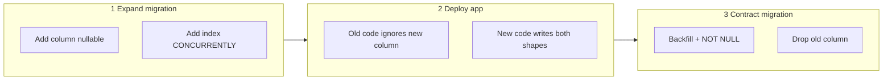

# Schema Migrations and Deploy Coupling

Application deploys and database schema changes must be **compatible across two code versions** whenever you use rolling, canary, or blue/green. Treat migrations as part of the release — not a separate step after deploy.

> **Related:** PostgreSQL migration checklist → [postgresql-performance/includes/15-schema-migration-checklist.md](../../postgresql-performance/includes/15-schema-migration-checklist.md) · ES projector compatibility → [event-sourcing-and-cqrs/includes/06-decision-guide.md](../../event-sourcing-and-cqrs/includes/06-decision-guide.md) · Rollback triggers → [13-slo-rollback-triggers.md](13-slo-rollback-triggers.md)

---

## At a glance

| Phase | Safe change | Risky change |
|-------|-------------|--------------|
| **Expand** | Add nullable column, new table, new index **concurrently** | Rename column, drop column, change type |
| **Deploy** | New code reads/writes new shape; old code still works | Code depends on column old version cannot see |
| **Contract** | Remove deprecated column after all instances upgraded | Drop before last old instance is gone |

**Rule of thumb:** **Expand → deploy → contract.** Never drop or rename in the same release that introduces dependent code.

---

## Expand / deploy / contract flow

| Step | Example: rename `email` → `primary_email` |
|------|---------------------------------------------|
| **Expand** | Add `primary_email`; backfill from `email` in batches |
| **Deploy** | App writes both; reads prefer `primary_email` |
| **Contract** | Drop `email` after no old binaries remain |

---

## Deploy strategy × migration matrix

| Strategy | Migration constraint |
|----------|---------------------|
| **Rolling** | Old + new pods coexist — schema must work for both |
| **Canary** | Small % on new code — same as rolling |
| **Blue/green** | Can run expand on shared DB before switch; instant rollback = old code must still match schema |
| **Recreate** | Brief downtime — can run blocking DDL in maintenance window |

---

## Event-sourced and CQRS systems

| Component | Deploy concern |
|-----------|----------------|
| **Event store schema** | Append-only — prefer new event types over mutating old payloads |
| **Projectors** | New projector version must handle old events; run dual-write or lag-tolerant reads during rollout |
| **Read models** | Rebuild or backfill projections after schema expand — see [event-sourcing decision guide](../../event-sourcing-and-cqrs/includes/06-decision-guide.md) |

Deploy projectors **before** or **with** API changes that depend on new read-model fields.

---

## Online vs blocking DDL (PostgreSQL)

| Operation | Blocking? | Prefer |
|-----------|-----------|--------|
| `ADD COLUMN` (nullable, no default) | Low lock | Safe in rolling deploy |
| `CREATE INDEX CONCURRENTLY` | Non-blocking | Always in production |
| `ADD COLUMN DEFAULT` (PG 11+) | Brief | Plan off-peak |
| `ALTER TYPE`, `DROP COLUMN` | Often exclusive lock | Contract phase only |
| `VACUUM FULL`, table rewrite | Blocking | Maintenance window |

Details → [postgresql-performance §15](../../postgresql-performance/includes/15-schema-migration-checklist.md).

---

## Release checklist (schema + deploy)

- [ ] Migration is backward compatible with **previous** app version
- [ ] Expand migration applied and verified **before** traffic on new code (or in same pipeline stage)
- [ ] Index created `CONCURRENTLY` where applicable
- [ ] Backfill job idempotent and resumable
- [ ] Rollback plan: revert deploy **without** running contract migration
- [ ] Projectors / cache invalidation aligned with read-model changes
- [ ] Load test on staging with **both** schema and code versions if possible

---

## Common mistakes

| Mistake | Fix |
|---------|-----|
| Drop column same release as code change | Contract in a **later** release |
| Rename in one migration | Add new → migrate → drop old |
| Long backfill in one transaction | Batch with `LIMIT` and sleep |
| Deploy API before projector | Order: expand → projector → API |
| No rollback without reverse migration | Keep expand reversible until contract |

---

## Pros and cons

### Expand / contract discipline

**Pros:** Zero-downtime rolling deploys; safe rollback to previous binary; works with canary and blue/green.

**Cons:** Multi-release timelines; temporary schema duplication; requires team habit and CI checks.
