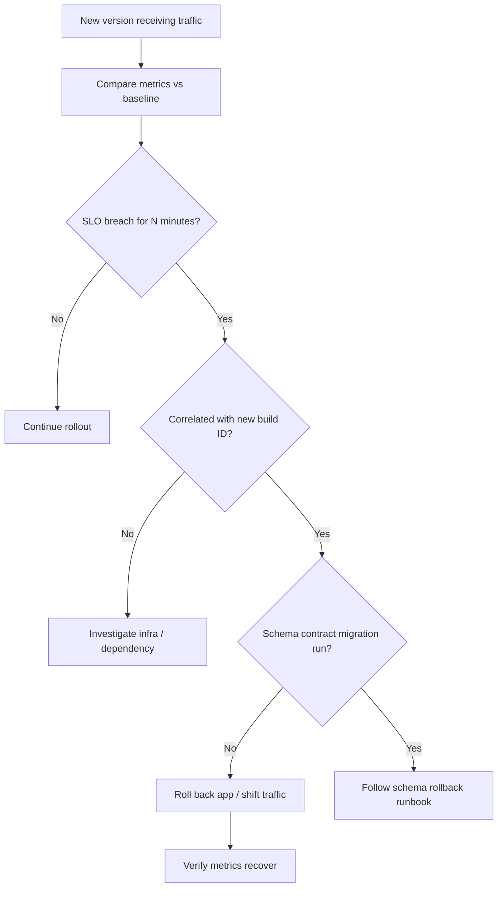

# SLO-Based Rollback Triggers

Automated rollback beats human judgment under incident pressure — but only when triggers are **defined before deploy**, tied to **version/build ID**, and tested in staging.

> **Related:** Observability signals → [high-throughput-systems/includes/11-observability.md](../../high-throughput-systems/includes/11-observability.md) · Progressive delivery → [10-progressive-delivery.md](10-progressive-delivery.md) · Schema coupling → [12-schema-migrations-and-deploy.md](12-schema-migrations-and-deploy.md)

---

## At a glance

| Trigger type | Example | Action |
|--------------|---------|--------|
| **Error rate** | 5xx > 2× baseline for 5 min on canary | Roll back canary / halt rollout |
| **Latency** | p99 > SLO for 10 min | Roll back or scale down new version |
| **Saturation** | DB pool wait p99 > threshold | Pause deploy; roll back if correlated with version |
| **Business metric** | Checkout success rate drop > 1% | Roll back feature flag or deployment |
| **Synthetic** | Smoke test fails post-deploy | Block promotion to next stage |

**Rule of thumb:** Roll back on **SLO burn**, not a single failed health check. Require **duration + correlation with new version**.

---

## Rollback decision flow

---

## Metrics to wire per deploy

| Metric | Baseline window | Typical threshold |
|--------|-----------------|-------------------|
| HTTP(Hypertext Transfer Protocol) 5xx rate | Pre-deploy 30 min | > 2× baseline |
| p99 latency | Pre-deploy 30 min | > 1.5× baseline or SLO |
| 429 rate (paid tier) | Pre-deploy | Unexpected spike |
| Error budget burn | Rolling 1 h | > 10% budget in 15 min |
| Queue depth / consumer lag | Pre-deploy | Monotonic growth after deploy |
| DB replication lag | Steady state | > SLO |

Tag all series with **`version`** or **`build_id`** so canary analysis isolates the new release.

---

## Rollback mechanics by strategy

| Strategy | Fast rollback |
|----------|---------------|
| **Rolling** | Stop rollout; redeploy previous artifact |
| **Blue/green** | Switch LB to previous environment |
| **Canary** | Set canary weight to 0% |
| **Feature flag** | Disable flag — code stays deployed |
| **Serverless alias** | Shift traffic to previous alias |

Schema note: if only **expand** migrations ran, app rollback is usually enough. **Contract** migrations may require forward-only planning.

---

## Feature flags vs deploy rollback

| Situation | Prefer |
|-----------|--------|
| Bad logic in one feature | **Flag off** — instant, no redeploy |
| Bad binary (crash loop, memory leak) | **Deploy rollback** |
| Bad migration (contract phase) | **Stop deploy** + DBA runbook — flag may not help |

Use flags for **release**; use deploy rollback for **broken artifact**.

---

## Pre-deploy checklist

- [ ] Rollback triggers documented in runbook with thresholds
- [ ] Dashboard filtered by `build_id` / canary slice
- [ ] Previous artifact pinned and promotable in one step
- [ ] On-call notified before progressive rollout
- [ ] Schema migrations limited to **expand** phase if rollback needed
- [ ] Automated analysis (e.g. Argo Rollouts, Flagger) configured in staging

---

## Common mistakes

| Mistake | Fix |
|---------|-----|
| Roll back on one 500 | Require sustained breach |
| No version tag on metrics | Cannot blame canary |
| Contract migration before rollout completes | Expand only until stable |
| Manual rollback only | Automate halt at minimum |
| Roll back app but not bad cache | Invalidate or version cache keys |

---

## Pros and cons

### Automated SLO rollback

**Pros:** Limits blast radius; faster recovery; objective criteria reduce debate.

**Cons:** False positives if thresholds too tight; requires metric quality and version tagging.