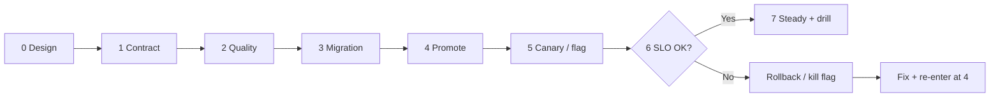

# Feature to PROD Playbook

> **Scope:** **Ordered checklist** from design sign-off through canary, rollback, and post-ship drills — links into specialist guides; does not re-teach algorithms.
>
> **Related:** Strategy chooser → [§11](11-choosing-and-practices.md) · Canary → [§4](04-canary.md) · Flags → [§7](07-feature-flags.md) · Progressive delivery → [§10](10-progressive-delivery.md) · Schema ↔ deploy → [§12](12-schema-migrations-and-deploy.md) · SLO(Service Level Objective) rollback → [§13](13-slo-rollback-triggers.md) · Cursor ship phase → [cursor-workflows §5](../../cursor-workflows/includes/05-ship-to-prod.md)

One path for Tech Leads shipping a user-facing feature to production at scale. Walk the gates in order; skip only with an explicit, written risk accept.

**Rule of thumb:** If you cannot name the **rollback action** and the **metric that triggers it** before promote, you are not ready for PROD(Production).

---

## At a glance

| Phase | Outcome | Primary docs |
|-------|---------|--------------|
| **0. Design** | Capacity + SLOs + blast radius written | [architecture §13](../../architecture-decisions/includes/13-capacity-estimation.md) · [HTS §1](../../high-throughput-systems/includes/01-measurement-and-slo.md) · [SRE §1–2](../../sre-and-incidents/includes/01-sli-slo-sla.md) |
| **1. Contract** | API(Application Programming Interface)/auth/idempotency agreed | [api-design](../../api-design-and-protection/README.md) · [§13 idempotency](../../api-design-and-protection/includes/13-idempotency.md) |
| **2. Build quality** | Tests + security gates green | [testing-strategy](../../testing-strategy/README.md) · [enterprise-security](../../enterprise-security-compliance/README.md) |
| **3. Data change** | Expand/contract migration plan | [§12](12-schema-migrations-and-deploy.md) · [PG §15](../../postgresql-performance/includes/15-schema-migration-checklist.md) |
| **4. Promote** | Same digest → staging → prod | [cicd §2](../../cicd-and-environments/includes/02-cd-and-promotion.md) |
| **5. Progressive release** | Canary and/or flag with bake time | [§4](04-canary.md) · [§7](07-feature-flags.md) · [§10](10-progressive-delivery.md) |
| **6. Observe / abort** | Version-tagged metrics; auto or one-click rollback | [§13](13-slo-rollback-triggers.md) · [HTS §11](../../high-throughput-systems/includes/11-observability.md) |
| **7. Steady state** | Hypercare closed; runbook current; drill on calendar | [SRE §10A hypercare](../../sre-and-incidents/includes/10A-hypercare-checklist.md) · [RUNBOOK-TEMPLATE](../../RUNBOOK-TEMPLATE.md) · [SRE §9](../../sre-and-incidents/includes/09-game-days-and-drills.md) |

---

## Gate 0 — Design (before coding finishes)

| Check | Done when |
|-------|-----------|
| [ ] Peak QPS / storage / fan-out estimated | Numbers in design or ADR; see [architecture §13](../../architecture-decisions/includes/13-capacity-estimation.md) |
| [ ] SLIs/SLOs for the new path named | Latency, error, and at least one business KPI if user-visible |
| [ ] Failure domains listed | What breaks if this feature or its dependency dies — [architecture §11](../../architecture-decisions/includes/11-failure-domains.md) |
| [ ] Overload story | Rate limit / shed / queue — [HTS §9](../../high-throughput-systems/includes/09-backpressure-and-limits.md) · [api-rate-limiting](../../api-rate-limiting/README.md) |
| [ ] Global users (if applicable) | Consistency + region story — [HTS §13](../../high-throughput-systems/includes/13-multi-region-read-routing.md) · [PG §14](../../postgresql-performance/includes/14-consistency-promises-and-costs.md) |

---

## Gate 1 — Contract and correctness

| Check | Done when |
|-------|-----------|
| [ ] API contract reviewed | OpenAPI/proto + versioning — [api-design §7](../../api-design-and-protection/includes/07-openapi-swagger.md) · [§14](../../api-design-and-protection/includes/14-api-versioning-and-deprecation.md) |
| [ ] AuthZ(Authorization) model clear | Who can call what — [api-design §4](../../api-design-and-protection/includes/04-auth-model.md) · [§12](../../api-design-and-protection/includes/12-identity-rbac-iam-ad.md) |
| [ ] Idempotency for side effects | Client key + server dedup — [api-design §13](../../api-design-and-protection/includes/13-idempotency.md) · money → [payments §2](../../payments-and-fintech/includes/02-idempotency-and-double-charge.md) |
| [ ] Resilience defaults on dependencies | Timeouts, retries with jitter, breakers — [resilience-patterns](../../resilience-patterns/README.md) |
| [ ] Threat notes for new attack surface | [api-design §6](../../api-design-and-protection/includes/06-threat-model.md) · [enterprise-security](../../enterprise-security-compliance/README.md) |

---

## Gate 2 — Build and quality gates

| Check | Done when |
|-------|-----------|
| [ ] Tests match risk | Contract + critical path coverage — [testing-strategy](../../testing-strategy/README.md) · [§7 quality gates](../../testing-strategy/includes/07-quality-gates.md) |
| [ ] CI(Continuous Integration) green on the release digest | [cicd §1](../../cicd-and-environments/includes/01-ci-pipeline-design.md) |
| [ ] Load or soak for hot paths (when capacity risk) | [testing §5](../../testing-strategy/includes/05-load-soak-resilience-tests.md) · [SRE §3](../../sre-and-incidents/includes/03-capacity-and-load-testing.md) |
| [ ] Secrets/config not in the image | [cicd §3](../../cicd-and-environments/includes/03-config-vs-secrets.md) |

---

## Gate 3 — Schema and data

| Check | Done when |
|-------|-----------|
| [ ] Expand → deploy → contract plan | Dual-write / dual-read windows named — [§12](12-schema-migrations-and-deploy.md) |
| [ ] Online-safe DDL where needed | [PG §15](../../postgresql-performance/includes/15-schema-migration-checklist.md) |
| [ ] Downstream consumers compatible | CDC(Change Data Capture)/search/projectors — [data-platforms §6](../../data-platforms/includes/06-migration-coordination.md) |
| [ ] Rollback path for schema | Documented; app rollback does not require impossible down-migration |

Skip only for pure config/flag or code-only changes with **no** schema or event shape change.

---

## Gate 4 — Promote the artifact

| Check | Done when |
|-------|-----------|
| [ ] Build once; promote by digest | No “rebuild for prod” — [cicd §2](../../cicd-and-environments/includes/02-cd-and-promotion.md) |
| [ ] Staging smoke / synthetics pass | [SRE §10](../../sre-and-incidents/includes/10-synthetic-monitoring.md) · [testing §8](../../testing-strategy/includes/08-production-verification.md) |
| [ ] On-call aware of the window | Who owns abort — [SRE §8](../../sre-and-incidents/includes/08-on-call-design.md) |

---

## Gate 5 — Progressive release (canary and/or flag)

| Check | Done when |
|-------|-----------|
| [ ] Strategy chosen | High risk → canary; product toggle → flag; both for money/auth — [§11](11-choosing-and-practices.md) |
| [ ] Start small with bake time | e.g. 1–5% for ≥15 min — [§4](04-canary.md) |
| [ ] Representative traffic | Not only internal IPs |
| [ ] Kill switch exists | Flag off or weight 0 without waiting for a full redeploy — [§7](07-feature-flags.md) |
| [ ] Two versions compatible | APIs and schema tolerate overlap during ramp |

---

## Gate 6 — Observe and abort

| Check | Done when |
|-------|-----------|
| [ ] Metrics tagged with `version` / `build_id` | Canary slice comparable to baseline — [HTS §11](../../high-throughput-systems/includes/11-observability.md) |
| [ ] Rollback triggers written **before** promote | 5xx, p99, KPI, error-budget burn — [§13](13-slo-rollback-triggers.md) |
| [ ] Abort rehearsed | Who clicks / which automation fires — [cicd §6](../../cicd-and-environments/includes/06-rollback-vs-forward-fix.md) |
| [ ] Post-abort path clear | Fix forward vs roll back; schema constraints respected |

**Abort examples (tune per service):** canary 5xx > 2× baseline for 5 min; p99 > SLO for 10 min; checkout success drop > 1%.

---

## Gate 7 — Steady state and drills

| Check | Done when |
|-------|-----------|
| [ ] Hypercare 24–72 h complete (or written extension) | SLOs + business KPI + CX glance — [SRE §10A](../../sre-and-incidents/includes/10A-hypercare-checklist.md) |
| [ ] Runbook updated same day | Symptoms, dashboards, rollback, contacts — [RUNBOOK-TEMPLATE](../../RUNBOOK-TEMPLATE.md) |
| [ ] Feature fully ramped or flag cleaned up | No permanent 5% canary leftover; release flag on cleanup track — [§7 lifecycle](07-feature-flags.md#lifecycle-and-cleanup) |
| [ ] Next drill on calendar | Bad deploy / kill switch / dependency loss — [SRE §9](../../sre-and-incidents/includes/09-game-days-and-drills.md) |

Cadence reminder: runbook dry-run monthly; failover / restore / tabletop quarterly. Practice is part of shipping safely at million-user scale — not optional reading.

Cursor hand-off after ramp → [cursor-workflows §6 Operate and learn](../../cursor-workflows/includes/06-operate-and-learn.md).

---

## Risk shortcuts (explicit only)

| Change type | Minimum gates | Still required |
|-------------|---------------|----------------|
| Docs / non-serving | 2 (CI) | — |
| Low-risk config | 2, 4, 6 | Observability + quick revert |
| Flag-gated UX | 0–2, 4–7 | Kill switch + KPI watch |
| API + schema | **All gates** | Expand/contract + canary |
| Payments / auth / PII(Personally Identifiable Information) | **All gates** + security review | Prefer flag **and** canary |

---

## Common mistakes

| Mistake | Fix |
|---------|-----|
| Big-bang to 100% on first prod touch | Canary or flag first; ramp on metrics |
| Rollback undefined until things burn | Write [§13](13-slo-rollback-triggers.md) triggers in the release ticket |
| Schema and breaking code in one step | [§12](12-schema-migrations-and-deploy.md) expand/contract |
| Canary on employees only | Hash real users into the canary bucket |
| Runbook written after the first SEV | Fill template before Gate 5 |
| “We read the game-day doc” | Schedule the drill; time detect/mitigate/recover |

---

## Other guides in this repo

| Need | Guide |
|------|-------|
| CI/CD(Continuous Delivery) promotion and flags as control | [cicd-and-environments](../../cicd-and-environments/README.md) |
| Incidents, error budgets, game days, hypercare | [sre-and-incidents](../../sre-and-incidents/README.md) · [§10A](../../sre-and-incidents/includes/10A-hypercare-checklist.md) |
| Cursor post-merge ship workflow | [cursor-workflows §5](../../cursor-workflows/includes/05-ship-to-prod.md) |
| After ramp: operate and learn | [cursor-workflows §6](../../cursor-workflows/includes/06-operate-and-learn.md) |
| Design → code loop before this playbook | [cursor-workflows](../../cursor-workflows/README.md) |
| TL ownership of releases | [tech-lead-practice](../../tech-lead-practice/README.md) |