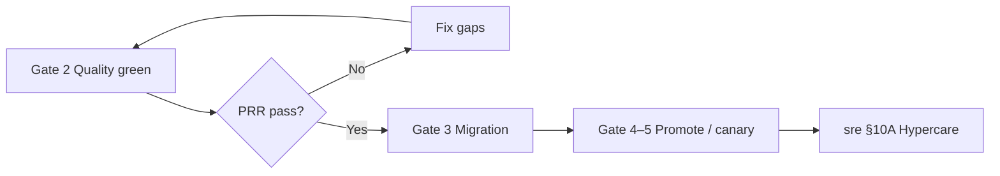

# Production Readiness Review

A Production Readiness Review (PRR) is the **go-live gate** before high-blast-radius work reaches PROD(Production) — evidence that design, quality, rollback, and operate paths are real, not slide-deck promises.

> **Scope:** PRR(Production Readiness Review) checklist and reviewers for user-facing or infra-critical launches. Ordered ship gates → [§14](14-feature-to-prod-playbook.md). Post-ship watch → [sre §10A hypercare](../../sre-and-incidents/includes/10A-hypercare-checklist.md). SLO(Service Level Objective) abort → [§13](13-slo-rollback-triggers.md).
>
> **Related:** Capacity → [architecture §13](../../architecture-decisions/includes/13-capacity-estimation.md) · Testing gates → [testing §7](../../testing-strategy/includes/07-quality-gates.md) · Runbooks → [RUNBOOK-TEMPLATE](../../RUNBOOK-TEMPLATE.md) · Governance → [architecture §5A](../../architecture-decisions/includes/05A-architecture-governance.md)

---

## At a glance

| PRR tier | When required | Reviewers |
|----------|---------------|-----------|
| **Light** | Low-risk, flag-gated, easy rollback | Tech lead + on-call ack |
| **Standard** | New user path, new dependency | TL + SRE(Site Reliability Engineering) + security as needed |
| **Heavy** | Money, auth, multi-region, schema contract | TL + SRE + platform + ARB(Architecture Review Board) note |

**Rule of thumb:** If rollback is “redeploy and hope” or the **business KPI(Key Performance Indicator)** is unnamed, PRR fails — send back to [§14 Gate 0–2](14-feature-to-prod-playbook.md).

---

## PRR in the ship path

PRR sits **after** test/security gates, **before** irreversible prod migration or wide traffic — not as a postmortem after launch.

---

## Evidence checklist

### Design and capacity

| Item | Pass when |
|------|-----------|
| [ ] Peak load estimated | Numbers in ADR or design — [architecture §13](../../architecture-decisions/includes/13-capacity-estimation.md) |
| [ ] SLI(Service Level Indicator)s / SLOs named | Latency, errors, business KPI if user-visible |
| [ ] Failure domains | Dependency loss story — [architecture §11](../../architecture-decisions/includes/11-failure-domains.md) |
| [ ] Overload / fairness | Limits, queues — [HTS §9](../../high-throughput-systems/includes/09-backpressure-and-limits.md) |

### Quality and security

| Item | Pass when |
|------|-----------|
| [ ] Tests green in CI(Continuous Integration) | Unit, contract, critical E2E |
| [ ] Threat model / data class | For auth, PII(Personally Identifiable Information), payments |
| [ ] Idempotency on money paths | [api §13](../../api-design-and-protection/includes/13-idempotency.md) |

### Operate

| Item | Pass when |
|------|-----------|
| [ ] Rollback named | One-click revert, flag off, or schema-safe back — [§13](13-slo-rollback-triggers.md) |
| [ ] Dashboards + alerts | Version/flag tagged — [HTS §11](../../high-throughput-systems/includes/11-observability.md) |
| [ ] Runbook | Matches reality — [RUNBOOK-TEMPLATE](../../RUNBOOK-TEMPLATE.md) |
| [ ] Hypercare owner | 72 h watch scheduled — [sre §10A](../../sre-and-incidents/includes/10A-hypercare-checklist.md) |
| [ ] Support comms | Release tag, known issues |

### Data change

| Item | Pass when |
|------|-----------|
| [ ] Expand/contract plan | [§12](12-schema-migrations-and-deploy.md) · [PG §15](../../postgresql-performance/includes/15-schema-migration-checklist.md) |
| [ ] Backfill job + observation window | Dated owner |

---

## Review meeting (30–45 min)

| Section | Question |
|---------|----------|
| **Blast radius** | Worst realistic failure? |
| **Rollback** | Who pulls lever; in under 5 min? |
| **Observe** | Which metric aborts canary? |
| **CX(Customer Experience)** | Web Vitals / support tag? — [sre §10A](../../sre-and-incidents/includes/10A-hypercare-checklist.md) |
| **Debt** | What ships known-rough? Ticket filed? |

Output: **go**, **go with conditions** (dated), or **hold**.

---

## Common mistakes

| Mistake | Why it hurts | Fix |
|---------|--------------|-----|
| PRR after prod ship | Theater | Gate before promote |
| Checkbox without links | No evidence | Require dashboard/runbook URLs |
| SRE-only review | Misses product KPI | Name business metric |
| No hypercare handoff | Silent day-2 failures | [sre §10A](../../sre-and-incidents/includes/10A-hypercare-checklist.md) |
| Eternal “conditional go” | Debt never closes | Expiry date on conditions |

---

## Pros and cons

| Approach | Pros | Cons |
|----------|------|------|
| **Tiered PRR** | Right rigor for risk | Needs calibration |
| **Skip PRR** | Faster | Regret on big launches |
| **Heavy PRR always** | Safe | Slows small fixes |
