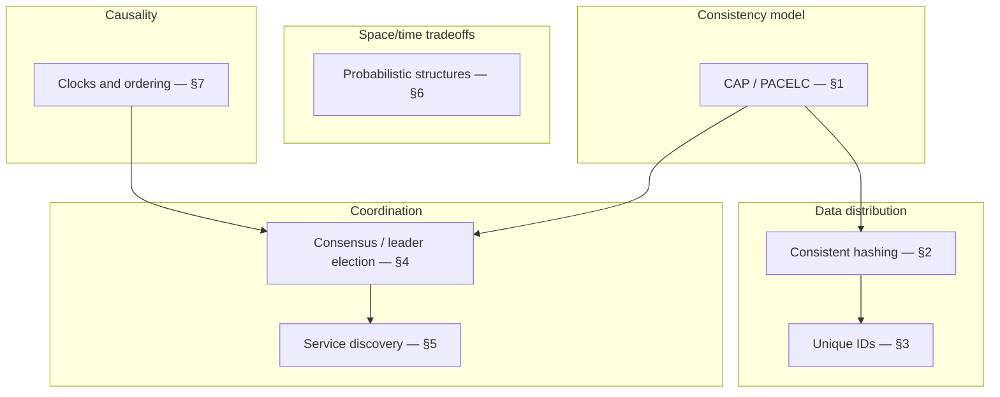

# Overview — Distributed Systems Primitives

Every architectural CAP(Consistency, Availability, Partition Tolerance) choice, every sharded cache, every generated ID, and every "which node is the leader" question rests on a small set of primitives. This guide explains **how they work** so the choices made elsewhere in this corpus stop feeling like folklore.

> **Scope:** **Mechanisms** — the algorithms and data structures themselves, independent of any one product decision. Product-level framing of *when* a team should care about CAP/PACELC, consensus, or tenancy tradeoffs → [architecture-decisions §6](../../architecture-decisions/includes/06-tradeoff-frameworks.md). This guide goes deeper on the mechanics behind that framing.
>
> **Related:**
> - Product CAP/PACELC framing → [architecture-decisions §6](../../architecture-decisions/includes/06-tradeoff-frameworks.md)
> - Where these primitives show up in a real store → [nosql-and-key-value-stores](../../nosql-and-key-value-stores/README.md)
> - Capstone → [08-decision-guide.md](08-decision-guide.md)

---

## Why primitives matter

Teams that reach for a NoSQL store, a service mesh, or a "distributed lock" without understanding the primitive underneath tend to either **over-build** (running their own consensus service for a problem a database already solves) or **under-build** (shipping a UUID(Universally Unique Identifier) collision bug, a hot-shard cache, or a split-brain leader election). This guide is the reference that lets you reason about **cost and correctness** before reaching for a primitive, and points you to the **battle-tested implementation** instead of hand-rolling one.

| Primitive | Answers | Reach for it when |
|-----------|---------|---------------------|
| **CAP/PACELC** ([§1](01-cap-and-pacelc.md)) | What do I give up during a partition, and normally? | Choosing or explaining a store's consistency behavior |
| **Consistent hashing** ([§2](02-consistent-hashing.md)) | How do I spread keys across nodes with minimal churn on resize? | Sharding a cache, CDN(Content Delivery Network), or database |
| **Unique IDs** ([§3](03-unique-ids.md)) | How do I generate IDs without a central bottleneck? | Primary keys, idempotency keys, sortable event IDs |
| **Consensus / leader election** ([§4](04-consensus-and-leader-election.md)) | How do distributed nodes agree on one value or one leader? | Coordinating locks, config, or leader-only work — almost always via an existing system |
| **Service discovery** ([§5](05-service-discovery.md)) | How does a caller find a healthy instance of a service? | Any service-to-service call in a dynamic (autoscaled/orchestrated) environment |
| **Probabilistic structures** ([§6](06-probabilistic-structures.md)) | How do I answer approximate membership/count questions cheaply? | Rate limiting, analytics cardinality, LSM(Log-Structured Merge) read paths |
| **Clocks and ordering** ([§7](07-clocks-and-ordering.md)) | What happened before what, across machines with no shared clock? | Conflict resolution, causal ordering, event sourcing |

**Rule of thumb:** Every one of these primitives has a production-grade implementation you can adopt (a database, a coordination service, a library). The skill this guide teaches is **recognizing which primitive you need and how it behaves under failure** — not writing your own Raft implementation.

---

## Map of primitives

---

## Document map

| # | Topic | File |
|---|-------|------|
| 1 | CAP and PACELC | [01-cap-and-pacelc.md](01-cap-and-pacelc.md) |
| 2 | Consistent hashing | [02-consistent-hashing.md](02-consistent-hashing.md) |
| 3 | Unique IDs | [03-unique-ids.md](03-unique-ids.md) |
| 4 | Consensus and leader election | [04-consensus-and-leader-election.md](04-consensus-and-leader-election.md) |
| 5 | Service discovery | [05-service-discovery.md](05-service-discovery.md) |
| 6 | Probabilistic structures | [06-probabilistic-structures.md](06-probabilistic-structures.md) |
| 7 | Clocks and ordering | [07-clocks-and-ordering.md](07-clocks-and-ordering.md) |
| 8 | Decision guide | [08-decision-guide.md](08-decision-guide.md) |

---

## Where these primitives are already running in this corpus

| Primitive | Already in production, in this corpus |
|-----------|-----------------------------------------|
| Quorum reads/writes | Cassandra `QUORUM` — [nosql-and-key-value-stores §4](../../nosql-and-key-value-stores/includes/04-cassandra-wide-column.md) |
| Consistent hashing | DynamoDB/Cassandra partitioning, CDN routing, cache sharding |
| Raft consensus | Kafka's KRaft(Kafka Raft) metadata quorum — [apache-kafka §1](../../apache-kafka/includes/01-commit-log-and-internals.md) |
| ISR(In-Sync Replicas) quorum | Kafka partition replication — [apache-kafka §2](../../apache-kafka/includes/02-topics-partitions-and-replication.md) |
| Bloom filters | LSM read-path filtering — [tree-and-index-structures §4](../../tree-and-index-structures/includes/04-lsm-trees.md) |
| Sortable unique IDs | DynamoDB sort keys — [nosql-and-key-value-stores §2](../../nosql-and-key-value-stores/includes/02-access-pattern-modeling.md) |

---

## Common mistakes

| Mistake | Fix |
|---------|-----|
| Building a custom leader-election/lock service | Use etcd/ZooKeeper/a managed lock service — [§4](04-consensus-and-leader-election.md) |
| Treating "distributed" as one consistency model | Name the CAP/PACELC tier per operation — [§1](01-cap-and-pacelc.md) |
| Random or sequential shard keys | Consistent hashing with virtual nodes — [§2](02-consistent-hashing.md) |
| Auto-increment IDs across multiple writers | Coordination-free ID scheme — [§3](03-unique-ids.md) |
| Hardcoded IPs/ports for service calls | Service discovery + health checks — [§5](05-service-discovery.md) |
| Exact counting where approximate is good enough and expensive otherwise | Probabilistic structures — [§6](06-probabilistic-structures.md) |
| Trusting wall-clock timestamps for event order across machines | Logical clocks — [§7](07-clocks-and-ordering.md) |