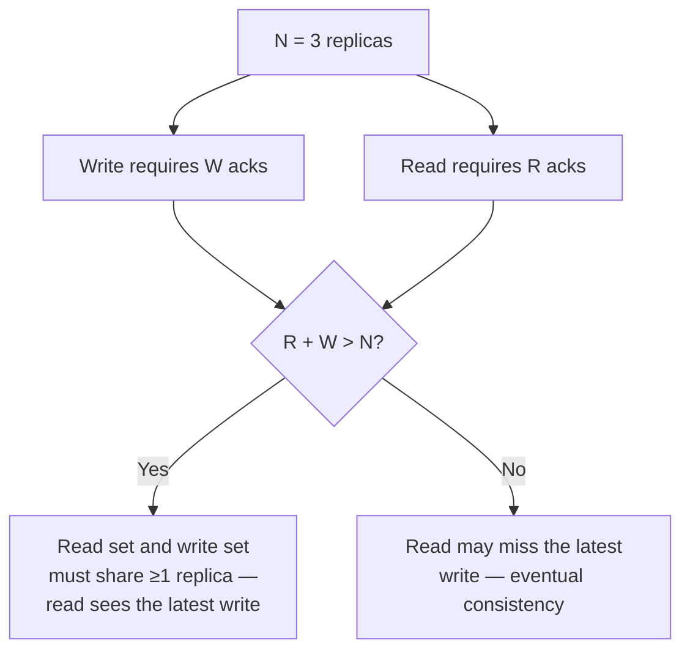
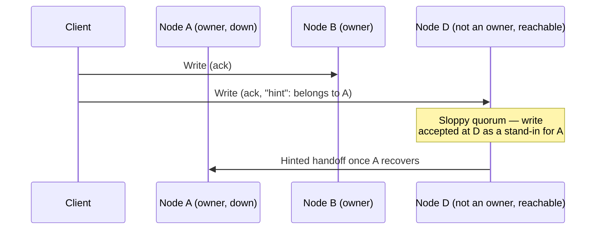

# CAP and PACELC — Mechanisms

The mechanics underneath the CAP(Consistency, Availability, Partition Tolerance)/PACELC framing: quorum systems, sloppy quorums, hinted handoff, and the Dynamo-style tunable consistency that real stores implement.

> **Scope:** **Mechanisms** — quorum math, replica reconciliation, tunable consistency knobs. Product-level framing of *when* to pick a consistency tier and how it maps to user journeys → [architecture-decisions §6 tradeoff frameworks](../../architecture-decisions/includes/06-tradeoff-frameworks.md). Read that guide first for the product lens; this file is the mechanism reference underneath it.
>
> **Related:** Cassandra's implementation of tunable consistency → [nosql-and-key-value-stores §4](../../nosql-and-key-value-stores/includes/04-cassandra-wide-column.md) · PostgreSQL's single-primary baseline → [PG §14 consistency promises](../../postgresql-performance/includes/14-consistency-promises-and-costs.md)

---

## At a glance

| Term | Mechanism |
|------|-----------|
| **CAP** | During a partition, a node must choose to serve (possibly stale) reads or refuse them |
| **PACELC** | Extends CAP with the **normal-operation** tradeoff: even with **no** partition, do you favor **L**atency or **C**onsistency? |
| **Quorum (`R`/`W`/`N`)** | Read from `R` replicas, write to `W` replicas, out of `N` total — `R + W > N` guarantees the read set overlaps the write set |
| **Sloppy quorum + hinted handoff** | Accept writes from *any* `W` reachable nodes during a partition, replay to the "correct" nodes once healed |

**Rule of thumb:** `R + W > N` is the single formula behind most "tunable consistency" marketing. Everything else — sloppy quorums, hinted handoff, read repair, vector clocks — exists to make that formula survive real node failures and partitions gracefully.

---

## Quorum systems

Given `N` replicas of a piece of data, a **quorum system** decides how many replicas must participate in a read (`R`) or write (`W`) for the operation to succeed.

| Configuration (`N=3`) | `R + W` | Guarantee |
|--------------------------|---------|-----------|
| `W=1, R=1` | 2 | Fastest, weakest — reads may miss recent writes (Cassandra `ONE`/`ONE`) |
| `W=2, R=2` (majority/majority) | 4 | Strongly consistent — every read overlaps every write (Cassandra `QUORUM`/`QUORUM`) |
| `W=3, R=1` | 4 | Strong, but a single unreachable replica blocks every write |
| `W=1, R=3` | 4 | Strong, but a single unreachable replica blocks every read |

`QUORUM`/`QUORUM` is the sweet spot most tunable-consistency stores default to: it satisfies `R + W > N` while tolerating one node being down on **either** the read or write side.

---

## Sloppy quorums and hinted handoff

A **strict quorum** requires the acknowledging replicas to be the *specific* `N` nodes that own the data. Amazon's Dynamo paper (and Cassandra after it) relaxed this to a **sloppy quorum**: during a partition, accept the write from *any* `W` reachable nodes, even ones that do not normally own that key.

| Term | Meaning |
|------|---------|
| **Sloppy quorum** | Accept a write from reachable non-owner nodes to preserve availability during a partition |
| **Hinted handoff** | The stand-in node forwards ("hands off") the write to the correct owner once it recovers |
| **Read repair** | On a read that finds replicas disagree, propagate the newest value to the stale replicas inline |
| **Anti-entropy repair** | Scheduled, out-of-band reconciliation (Cassandra `nodetool repair`) — catches what hinted handoff misses if a node is down too long |

Sloppy quorums trade strict correctness for availability — exactly the **AP** choice in CAP terms. A strict-quorum system that refuses writes when it cannot reach the true owners is the **CP** choice.

---

## PACELC in mechanism terms

PACELC's **"else" branch** — behavior with **no** partition — is where most of the day-to-day latency/consistency tradeoff actually lives, since partitions are rare and normal operation is constant:

| Choice (no partition) | Mechanism |
|-------------------------|-----------|
| **Favor consistency (EC)** | Synchronous replication or `R+W>N` quorum on every operation — every read pays the latency of contacting enough replicas |
| **Favor latency (EL)** | Read from the nearest single replica; accept it might be stale by however long replication lag is |

A store's **tunable consistency level** (Cassandra's `ONE`/`QUORUM`/`ALL`, DynamoDB's eventually-consistent vs strongly-consistent reads) is PACELC's "else" branch exposed as a per-request knob rather than a fixed architectural choice — see [nosql-and-key-value-stores §4](../../nosql-and-key-value-stores/includes/04-cassandra-wide-column.md#consistency-levels) for the concrete API(Application Programming Interface).

---

## Reconciling divergent replicas

When replicas disagree (from a sloppy quorum, a missed hinted handoff, or async replication lag), something must decide the winning value:

| Strategy | How it resolves conflicts |
|----------|------------------------------|
| **Last-write-wins (LWW)** | Highest timestamp wins — simple, can silently drop concurrent writes |
| **Vector clocks** | Detect *genuinely concurrent* writes (neither happened-before the other) and surface both to the application — see [§7 clocks and ordering](07-clocks-and-ordering.md) |
| **CRDTs (Conflict-free Replicated Data Types)** | Data structures (counters, sets, sequences) that merge deterministically without coordination — used in some multi-region caches and collaborative-editing systems |
| **Application-level merge** | Business logic resolves the conflict (e.g. shopping cart union) — the classic Dynamo pattern |

Most teams should pick a store that already implements one of these (Cassandra: LWW(Last-Write-Wins) by default with tunable overrides; DynamoDB Global Tables: LWW) rather than building conflict resolution from scratch.

---

## Common mistakes

| Mistake | Fix |
|---------|-----|
| Treating CAP as a permanent global choice for a whole system | Tier by operation — payments CP, feed AP, per [architecture-decisions §6](../../architecture-decisions/includes/06-tradeoff-frameworks.md) |
| Configuring `R+W ≤ N` and expecting strong consistency | Verify `R+W > N` for the operations that need it |
| Ignoring hinted handoff backlog after an extended node outage | Monitor handoff queue depth; run anti-entropy repair before it grows unbounded |
| Assuming "eventually consistent" has a bounded time window | Document it as *unbounded without monitoring* — measure actual replication lag |
| Rolling a custom conflict-resolution scheme | Prefer a store with vector clocks or CRDTs already built in |

---

## See also

- [architecture-decisions §6 tradeoff frameworks](../../architecture-decisions/includes/06-tradeoff-frameworks.md) — product-level CAP/PACELC framing
- [nosql-and-key-value-stores §4](../../nosql-and-key-value-stores/includes/04-cassandra-wide-column.md) — Cassandra's tunable consistency levels in practice
- [PG §14 consistency promises and costs](../../postgresql-performance/includes/14-consistency-promises-and-costs.md) — the single-primary baseline these mechanisms generalize beyond