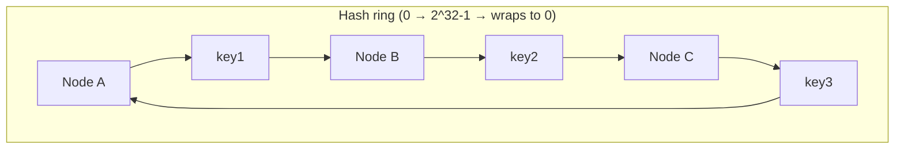
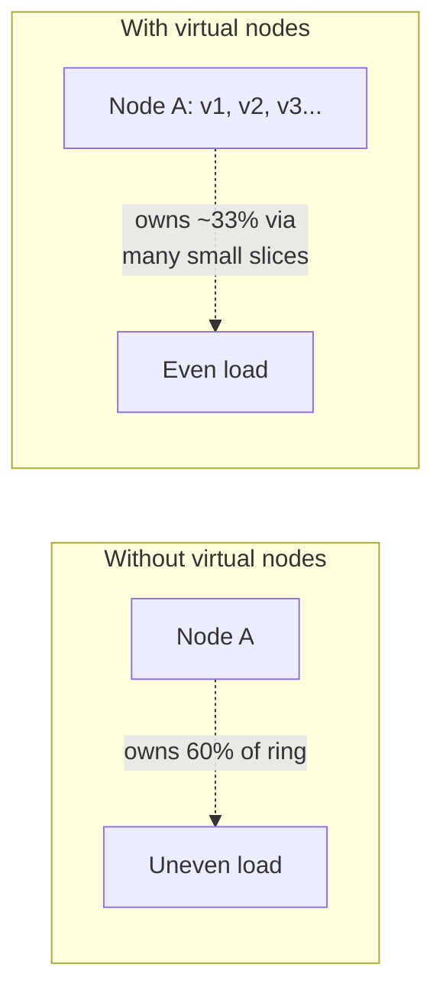

# Consistent Hashing

How to spread keys across a changing set of nodes without reshuffling everything on every scale event — the ring, virtual nodes, and the remapping cost you are actually trying to minimize.

> **Related:** Where this runs in production in this corpus → [nosql-and-key-value-stores §2](../../nosql-and-key-value-stores/includes/02-access-pattern-modeling.md#hot-partitions-and-write-sharding) · Cache layer placement → [HTS §4 caching layers](../../high-throughput-systems/includes/04-caching-layers.md) · Multi-region routing → [HTS §13](../../high-throughput-systems/includes/13-multi-region-read-routing.md)

---

## At a glance

| Approach | Nodes added/removed | Keys remapped |
|----------|------------------------|-----------------|
| **Naive modulo hashing** (`hash(key) % N`) | Any change to `N` | Nearly **all** keys |
| **Consistent hashing (ring)** | Add/remove one node | Only the keys owned by the **adjacent** node on the ring — roughly `1/N` of keys |
| **Consistent hashing + virtual nodes** | Add/remove one node | Same fraction, but **evenly spread** across all remaining nodes instead of dumped on one neighbor |

**Rule of thumb:** If resizing your node pool ever means "recompute where nearly every key lives," you are doing modulo hashing. Consistent hashing exists specifically to make that cost proportional to what changed, not to the total data size.

---

## The problem with modulo hashing

```text
3 nodes: key -> hash(key) % 3
4 nodes: key -> hash(key) % 4   # nearly every key's owner changes
```

Adding a single node to a modulo scheme invalidates almost every key-to-node mapping — every cache becomes cold, every shard needs a full data migration, all at once.

---

## The ring

Consistent hashing places both **nodes** and **keys** on the same conceptual ring (a fixed hash space, e.g. 0 to 2³²−1). A key belongs to the **first node clockwise** from its position.



| Step | Rule |
|------|------|
| **Place nodes** | `hash(node_id)` gives each node a position on the ring |
| **Place keys** | `hash(key)` gives each key a position |
| **Assign ownership** | Walk clockwise from the key's position to the first node found |
| **Add a node** | It takes ownership of a slice of keys from its new clockwise neighbor only |
| **Remove a node** | Its keys fall to the next node clockwise — no one else is affected |

---

## Why one hash position per node is not enough

With exactly one ring position per node, load is **uneven** (gaps between nodes are random-sized) and removing one node dumps its **entire** load onto a single neighbor.



## Virtual nodes

Each physical node is assigned **many** positions ("virtual nodes" or "vnodes") on the ring instead of one — e.g. 256 vnodes per physical node.

| Benefit | Why |
|---------|-----|
| **Even load distribution** | Many small, randomly distributed slices average out per node, instead of a few large uneven ones |
| **Even remapping on node change** | Removing a node spreads its load across **many** neighbors (one per vnode) instead of dumping it on one |
| **Heterogeneous capacity** | A bigger node can be assigned more vnodes to take a proportionally larger share |

Cassandra (`num_tokens`), Amazon DynamoDB's internal partitioning, and most CDN(Content Delivery Network) load balancers use virtual nodes for exactly this reason.

---

## Remapping cost

| Event | Naive modulo | Consistent hashing (no vnodes) | Consistent hashing + vnodes |
|-------|--------------|-----------------------------------|--------------------------------|
| Add 1 node to N | ~100% of keys remapped | ~`1/(N+1)` of keys, from one neighbor | ~`1/(N+1)` of keys, spread across many nodes |
| Remove 1 node | ~100% of keys remapped | That node's full load → one neighbor | That node's load spread across many nodes |
| Node fails unexpectedly | Full remap, cache stampede | One neighbor absorbs a spike | Spike spread thin — much less visible |

This is the mechanism behind why adding a Redis node to a consistently-hashed cache cluster does not cause a stampede, while naive `% N` sharding does.

---

## Where it is used

| System | Use |
|--------|-----|
| **DynamoDB, Cassandra** | Partition placement across storage nodes |
| **Memcached client libraries, Redis Cluster** | Client-side key-to-shard routing without a central lookup on every request |
| **CDNs** (Akamai, CloudFront edge routing) | Mapping content keys to edge/origin shards |
| **Load balancers with session affinity** | Sticky routing that survives backend pool resizing |

---

## Common mistakes

| Mistake | Problem | Fix |
|---------|---------|-----|
| `hash(key) % N` for a resizable pool | Near-total remap on every scale event | Consistent hashing ring |
| One ring position per physical node | Uneven load, large remap dumped on one neighbor | Virtual nodes (100s per physical node) |
| Hashing on a key prefix that is not evenly distributed (e.g. a single hot tenant) | Hot node regardless of hashing scheme | Fix the key distribution first — [nosql-and-key-value-stores §2](../../nosql-and-key-value-stores/includes/02-access-pattern-modeling.md#hot-partitions-and-write-sharding) |
| Rebuilding the whole ring client-side on every node change without caching | Unnecessary CPU/latency on every topology change | Incremental ring updates; most client libraries handle this already |
| Assuming consistent hashing alone fixes hot keys | It fixes *node* distribution, not a single overloaded *key* | Combine with write sharding for hot individual keys |