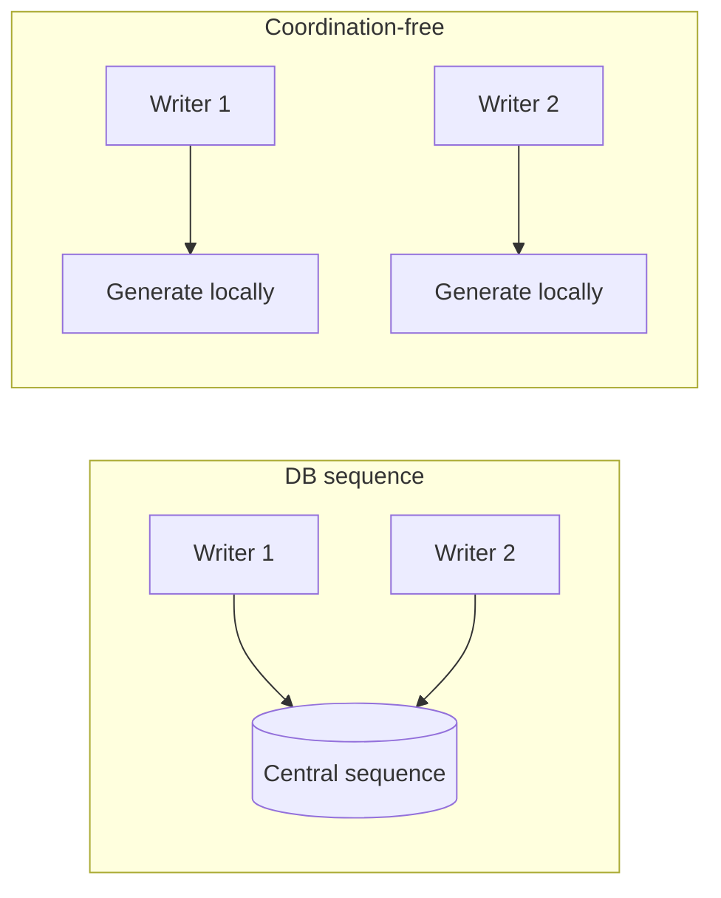
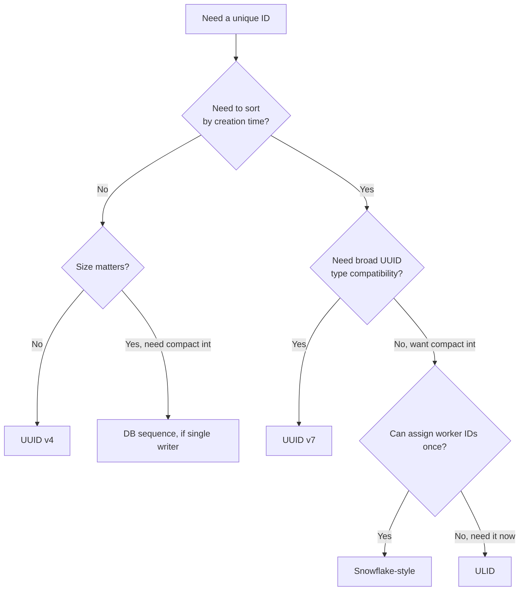

# Unique IDs

Generating IDs without a central bottleneck: UUID(Universally Unique Identifier) v4 vs v7, ULID(Universally Unique Lexicographically Sortable Identifier), Snowflake-style IDs, and plain database sequences — plus the coordination tradeoffs and sortability each one buys or costs.

> **Related:** Sort keys built from IDs → [nosql-and-key-value-stores §2](../../nosql-and-key-value-stores/includes/02-access-pattern-modeling.md) · PostgreSQL ID column choices → [PG §4 schema design](../../postgresql-performance/includes/04-schema-design.md) · Idempotency keys → [api-design §13 idempotency](../../api-design-and-protection/includes/13-idempotency.md)

---

## At a glance

| Scheme | Coordination needed | Sortable by time | Size |
|--------|------------------------|---------------------|------|
| **DB sequence / auto-increment** | Central — one database | Yes (monotonic) | 4–8 bytes |
| **UUID v4** | None — pure randomness | No | 16 bytes |
| **UUID v7** | None — timestamp + randomness | Yes (millisecond) | 16 bytes |
| **ULID** | None — timestamp + randomness | Yes (millisecond), plus lexicographic string sort | 16 bytes (26-char string encoding) |
| **Snowflake-style** | Minimal — one-time worker-ID assignment | Yes (millisecond, and monotonic per worker) | 8 bytes (64-bit int) |

**Rule of thumb:** If you need IDs to **sort by creation time** (event logs, DynamoDB sort keys, pagination cursors), do not reach for UUID v4 — it is the single most common source of "why is this index/partition slow" in systems that generate IDs at any real rate.

---

## Why coordination-free IDs matter

A **database sequence** requires every writer to round-trip to the same database to get the next value — a central bottleneck and a single point of failure at write time. Coordination-free schemes (UUID, ULID, Snowflake) let **any node generate a globally unique ID independently**, which is the point of using them in a distributed system in the first place.



---

## UUID v4 vs v7

Both are 128-bit values formatted as `8-4-4-4-12` hex groups, but they encode very different information:

| | UUID v4 | UUID v7 |
|---|---------|---------|
| **Content** | 122 random bits (6 bits are version/variant) | 48-bit millisecond timestamp + random bits |
| **Sortable by creation time?** | No — random, causes index/B-tree page fragmentation on insert | Yes — monotonically increasing prefix |
| **Insert locality (B-tree indexes)** | Poor — inserts scatter across the whole index | Good — inserts cluster at the end, like a sequence |
| **Leaks creation time?** | No | Yes (millisecond precision) — consider if that is sensitive |
| **When to use** | Legacy compatibility, or when insert locality genuinely does not matter | Default choice for **new** systems needing a UUID-shaped, coordination-free, sortable ID |

```text
UUID v4:  f47ac10b-58cc-4372-a567-0e02b2c3d479   (fully random)
UUID v7:  018f4b3c-2a91-7c3e-9b21-6a2f4e8d1c02   (timestamp prefix, then random)
```

Random UUID primary keys (v4) on a B-tree-indexed table cause the same page-scatter problem covered in [PG §4 schema design](../../postgresql-performance/includes/04-schema-design.md) — UUID v7 or a Snowflake-style ID avoids it by keeping inserts append-mostly.

---

## ULID

A ULID encodes a 48-bit millisecond timestamp plus 80 bits of randomness, but — unlike UUID — it is **designed to be represented as a 26-character Base32 string that sorts lexicographically in timestamp order**, which UUID v7's hex-with-dashes formatting does not guarantee as cleanly across all string comparisons.

```text
01ARZ3NDEKTSV4RRFFQ69G5FAV
└──────────┘└──────────────────┘
 timestamp        randomness
```

| Trait | Detail |
|-------|--------|
| **String-sortable** | Yes, by design — useful as a DynamoDB sort key or a URL-safe pagination cursor |
| **Case** | Case-insensitive Base32 alphabet, no ambiguous characters (no `I`, `L`, `O`, `U`) |
| **Interop** | Newer, less universally supported across languages/drivers than UUID |

Use ULID when the **string representation itself** needs to sort correctly (e.g. as a literal DynamoDB sort key or a filename) — use UUID v7 when you want timestamp ordering but need broad UUID-type compatibility (native `uuid` column types, existing tooling).

---

## Snowflake-style IDs

Twitter's Snowflake scheme (and its many descendants — Discord, Instagram, Sony's Sonyflake) packs a **64-bit integer** from three fields:

```text
| 1 bit unused | 41 bits timestamp (ms) | 10 bits worker ID | 12 bits sequence |
```

| Trait | Detail |
|-------|--------|
| **Size** | 8 bytes — half of a UUID, fits a native `bigint` column |
| **Sortable** | Yes, monotonically increasing, even within the same millisecond (via the sequence field) |
| **Coordination** | One-time: each worker needs a unique **worker ID** (assigned via config, ZooKeeper/etcd registration, or a leased range) |
| **Collision risk** | None, as long as worker IDs are genuinely unique and clocks do not regress |
| **Clock regression risk** | A worker whose clock jumps backward (NTP(Network Time Protocol) correction) can emit duplicate/out-of-order IDs — needs a clock-regression guard |

Snowflake-style IDs are the right choice when you want **compact, integer, index-friendly, time-sortable** IDs and can tolerate the one-time operational cost of worker-ID assignment (often solved once via [§4 leader election](04-consensus-and-leader-election.md#leader-election-as-a-consensus-application) or a simple config value per deployment).

---

## Coordination tradeoffs summary



| Scheme | Best fit |
|--------|----------|
| **DB sequence** | Single-writer systems that already have one DB and want the simplest option |
| **UUID v4** | No sortability need; maximum portability; legacy systems |
| **UUID v7** | New systems wanting sortable, coordination-free, standard UUID type |
| **ULID** | String-sortable IDs used directly as sort keys or cursors |
| **Snowflake-style** | High-volume systems wanting compact, sortable, integer IDs with one-time worker coordination |

---

## Common mistakes

| Mistake | Problem | Fix |
|---------|---------|-----|
| UUID v4 as a B-tree primary key at high insert volume | Index page fragmentation, cache-unfriendly inserts | UUID v7 or Snowflake-style |
| Assuming any UUID version sorts by time | Only v7 (and time-based schemes) do | Check the version before relying on ordering |
| Central DB sequence across multiple regions | Cross-region round trip on every insert; single point of failure | Region-local Snowflake-style IDs or per-region sequence ranges |
| Reusing worker IDs across Snowflake generators | Silent ID collisions | Unique worker-ID assignment via config, leased range, or coordination service |
| No clock-regression guard on a Snowflake generator | Duplicate/out-of-order IDs after an NTP(Network Time Protocol) correction | Buffer/reject IDs when the local clock moves backward |
| Exposing sequential DB IDs in public URLs | Enumeration risk, leaks approximate row count | UUID/ULID for public-facing identifiers |