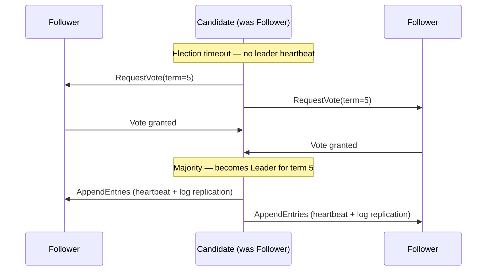
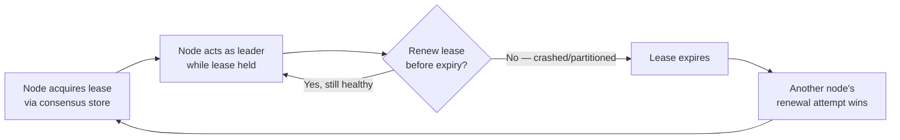

# Consensus and Leader Election

The intuition behind Raft/Paxos-style consensus, how leader election falls out of it, and why almost no application team should implement either from scratch.

> **Related:** Quorum math underneath consensus → [§1 CAP and PACELC](01-cap-and-pacelc.md) · Kafka's KRaft(Kafka Raft) metadata quorum → [apache-kafka §1](../../apache-kafka/includes/01-commit-log-and-internals.md) · Distributed locks built on top of consensus → [resilience-patterns §7](../../resilience-patterns/includes/07-distributed-locks.md)

---

## At a glance

| System | Role |
|--------|------|
| **etcd** | Raft-based key-value store; Kubernetes' cluster state store; general-purpose distributed config/lock service |
| **ZooKeeper** | Paxos-family (ZAB) coordination service; historically Kafka's metadata store, still widely used (HBase, Solr) |
| **KRaft(Kafka Raft)** | Kafka's own Raft implementation, replacing ZooKeeper for Kafka metadata (default since Kafka 3.x, mandatory in 4.x) |
| **Consul** | Raft-based service catalog, config, and health-check store — see [§5 service discovery](05-service-discovery.md) |

**Rule of thumb:** Consensus algorithms are notoriously hard to implement correctly — subtle bugs surface only under specific failure/timing sequences that are nearly impossible to find without formal verification or years of production hardening. Use etcd, ZooKeeper, KRaft, or your database's built-in consensus (e.g. Postgres synchronous replication + a fencing mechanism) instead of writing your own.

---

## What consensus actually solves

**Consensus** is the problem of getting a set of nodes to agree on a single value (or a single ordered sequence of values) even when some nodes fail or messages are delayed — and to do so **without ever agreeing on two different values** (safety), while still making progress when a majority of nodes are healthy (liveness).

```mermaid
flowchart TD
    P[Proposal: "value = X"] --> Q{Majority of nodes<br/>accept X?}
    Q -->|Yes| C[X is committed —<br/>durable, agreed, final]
    Q -->|No majority yet| R[Retry with new term/round]
    C --> Apply[All nodes apply X<br/>in the same order]
```

The core guarantee: once a value is **committed** (accepted by a majority), it can never be un-committed or replaced — even if the node that proposed it crashes immediately after.

---

## Raft intuition

Raft (designed to be more understandable than Paxos, which it has now mostly displaced in new systems) breaks consensus into three roles and a **term** (a monotonically increasing election epoch):

| Role | Behavior |
|------|----------|
| **Leader** | One per term; the only node that accepts new writes/proposals; replicates them to followers |
| **Follower** | Passively replicates the leader's log; votes in elections |
| **Candidate** | A follower that has not heard from a leader within a timeout; requests votes to become leader |



| Concept | Role |
|---------|------|
| **Term** | Logical clock for elections — every message carries a term; higher term always wins |
| **Log replication** | Leader appends an entry, replicates to a majority, then commits it |
| **Election timeout** | Randomized per-node, so simultaneous candidacies are rare and elections converge quickly |
| **Split vote** | Two candidates tie — timeout again with a new randomized delay, try again |

**Paxos** solves the same problem with a two-phase (prepare/accept) protocol per value rather than Raft's leader-and-log model — functionally similar guarantees, generally considered harder to reason about and implement correctly, which is why most new systems pick Raft.

---

## Leader election as a consensus application

Leader election is just consensus applied to the question **"which node holds the lease to act as leader right now?"** — the leader is the value everyone agrees on, with a **time-bounded lease** so a leader that goes silent (crash, network partition) automatically loses leadership instead of holding it forever.



| Failure mode | What a correct implementation must guard against |
|---------------|------------------------------------------------------|
| **Split-brain** | Two nodes both believe they are leader (e.g. old leader paused by GC, comes back after a new leader was elected) — guard with a **fencing token** (monotonic lease version) that downstream systems check and reject if stale |
| **Slow follower promoted too early** | A follower behind on replicated log becomes leader and "forgets" committed writes — Raft's election rules require a candidate to have an up-to-date log to win |
| **Thundering herd re-election** | All followers detect leader loss simultaneously and campaign at once — randomized election timeouts reduce collision |

---

## When apps should NOT reinvent this

| Temptation | Use instead |
|------------|----------------|
| "We'll write our own distributed lock with Redis `SETNX`" | Fine for **advisory**, low-stakes locks with a TTL(Time To Live); for correctness-critical locks, use a consensus-backed lock service (etcd, ZooKeeper) — see [resilience-patterns §7 distributed locks](../../resilience-patterns/includes/07-distributed-locks.md) |
| "We'll implement leader election ourselves for our worker pool" | Use etcd/ZooKeeper leases, or a Kubernetes `Lease` object if already on k8s |
| "We need a config store that's always consistent across regions" | etcd or Consul — both handle the consensus for you |
| "We'll build a mini Raft for our own service's internal coordination" | Almost never justified — embed an existing Raft library (e.g. HashiCorp's `raft` package) if you truly need consensus **inside** your own service, rather than the wire protocol and edge cases from scratch |

The pattern across all of these: **delegate the consensus problem to a system whose entire job is getting it right**, and consume its result (a value, a lease, a leader address) as a client.

---

## Where consensus already runs in this corpus

| System | Consensus mechanism |
|--------|------------------------|
| **Kafka (KRaft mode)** | Raft-based metadata quorum among controller nodes — [apache-kafka §1](../../apache-kafka/includes/01-commit-log-and-internals.md) |
| **Kafka partition replication** | Not full consensus, but a related quorum concept — ISR(In-Sync Replicas) — [apache-kafka §2](../../apache-kafka/includes/02-topics-partitions-and-replication.md) |
| **Kubernetes control plane** | etcd (Raft) stores all cluster state |
| **PostgreSQL synchronous replication** | Not general consensus — a simpler primary-confirms-standby model; failover still needs an external fencing mechanism to avoid split-brain |

---

## Common mistakes

| Mistake | Problem | Fix |
|---------|---------|-----|
| Hand-rolled leader election without lease expiry | Permanent split-brain if the leader hangs | Use a consensus store's lease/TTL primitive |
| No fencing token on leader-only writes | Stale ex-leader corrupts data after a new leader is elected | Every leader-only write carries and checks a monotonic lease token |
| Treating Redis `SETNX` as consensus-grade | It is advisory, not fault-tolerant under network partitions | Consensus-backed lock service for correctness-critical locks |
| Building a bespoke Raft/Paxos implementation | Extremely easy to get subtly wrong; failures show up only under rare timing | Use etcd, ZooKeeper, KRaft, or an established library |
| Assuming a "leader" from application-level heartbeats alone (no consensus) | Two nodes can both believe they lead during a partition | Back leadership with an actual consensus store's lease |