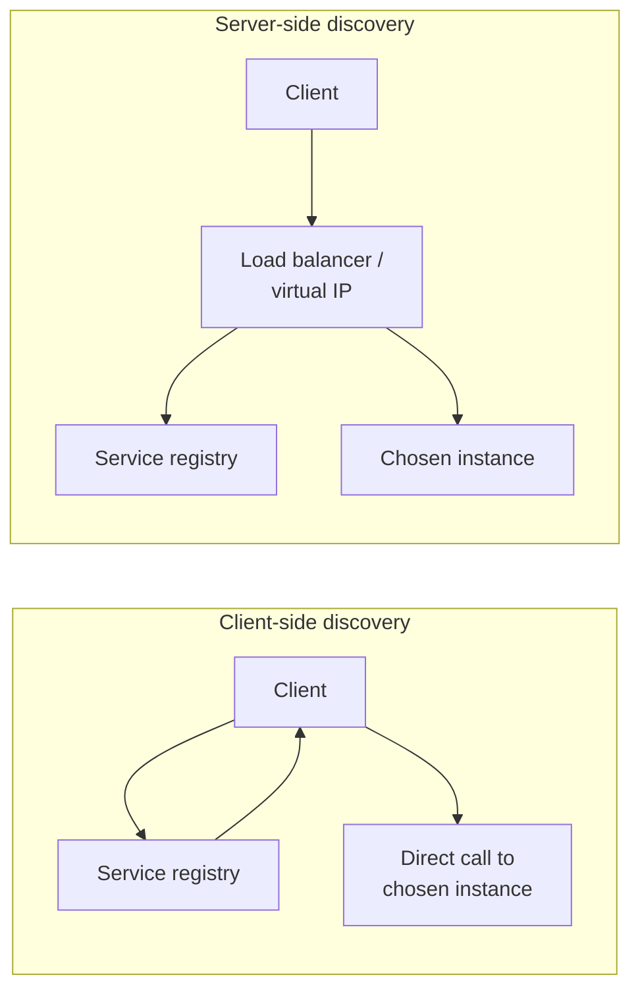
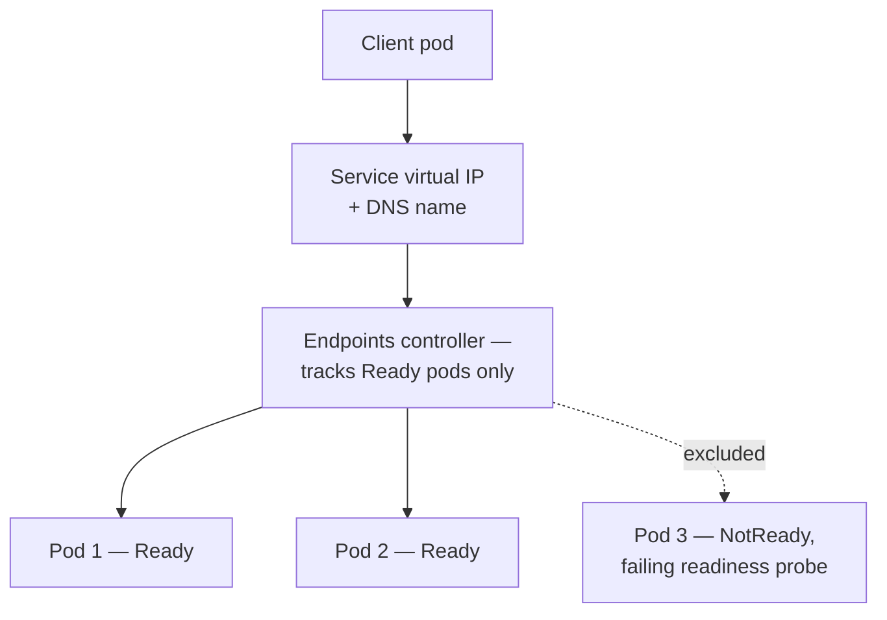

# Service Discovery

How a caller finds a healthy instance of a service in an environment where instances start, stop, and move constantly — DNS(Domain Name System), Consul, Kubernetes Services, and service mesh, plus the health checks that keep discovery honest.

> **Related:** Consensus underneath Consul/etcd-backed discovery → [§4](04-consensus-and-leader-election.md) · Timeouts and retries once a target is found → [resilience-patterns §1](../../resilience-patterns/includes/01-timeouts.md) · Circuit breakers for unhealthy targets → [HTS §9 backpressure](../../high-throughput-systems/includes/09-backpressure-and-limits.md)

---

## At a glance

| Mechanism | How it resolves a service name | Freshness |
|-----------|-----------------------------------|-----------|
| **DNS(Domain Name System) round-robin** | Returns a set of IPs from a records; client/OS picks one | Slow — bounded by TTL(Time to Live), caching at every layer |
| **DNS with short TTLs / DNS-SD** | Same, tuned for faster propagation | Better, still resolver-cache-dependent |
| **Consul** | Client queries or watches a service catalog; health-checked entries only | Fast — active health checks, near-real-time deregistration |
| **Kubernetes Services** | `kube-proxy`/`iptables`/`ipvs` (or a Service mesh sidecar) route to healthy pod IPs behind a stable virtual IP | Fast — endpoint controller reacts to pod readiness within seconds |
| **Service mesh (Istio, Linkerd)** | Sidecar proxies discover peers via the mesh control plane; adds mTLS(Mutual Transport Layer Security), retries, and traffic policy on top | Fast, plus request-level observability |

**Rule of thumb:** DNS-based discovery is simple and ubiquitous but **assumes short-lived, cacheable IP-to-name mappings** — the moment your instances change faster than DNS/resolver caches expire, you need an active health-checked catalog (Consul, Kubernetes endpoints) instead.

---

## Client-side vs server-side discovery



| Pattern | Who picks the instance | Examples |
|---------|---------------------------|----------|
| **Client-side** | The calling application, using a client library that queries the registry | Consul + client library, Netflix Eureka + Ribbon |
| **Server-side** | A load balancer or virtual IP in front of the registry | Kubernetes Service, most cloud load balancers, DNS pointed at an LB |

Server-side discovery is simpler for application code (it just calls a stable name/IP) and is the default in Kubernetes; client-side discovery avoids an extra network hop and load-balancer hop but pushes registry-awareness into every service.

---

## DNS-based discovery

```text
orders-service.internal.example.com  A     10.0.1.4
orders-service.internal.example.com  A     10.0.1.9
orders-service.internal.example.com  A     10.0.1.15
```

| Limitation | Why it bites |
|-------------|----------------|
| **TTL(Time to Live) + resolver caching** | An instance removed from DNS may still receive traffic from clients holding a cached record |
| **No health awareness** | DNS returns an IP regardless of whether the process behind it is healthy |
| **No weighting/priority by default** | Plain round-robin; `SRV` records add priority/weight but few HTTP(Hypertext Transfer Protocol) clients honor them well |

DNS-SD (`SRV` records) improves on plain `A` records by encoding priority, weight, and port — still fundamentally limited by caching layers between the client and the authoritative resolver.

---

## Consul

Consul runs a Raft-based consensus cluster ([§4](04-consensus-and-leader-election.md)) to maintain a strongly consistent service catalog, combined with **active health checks**.

| Feature | Role |
|---------|------|
| **Service catalog** | Registered services + their current instances |
| **Health checks** | HTTP(Hypertext Transfer Protocol)/TCP/script checks; failing instances are removed from query results automatically |
| **DNS and HTTP(Hypertext Transfer Protocol) interfaces** | Query the catalog via DNS(Domain Name System) (drop-in for existing DNS-based clients) or a richer HTTP(Hypertext Transfer Protocol) API(Application Programming Interface) |
| **Multi-datacenter federation** | Discovery across regions/DCs with WAN gossip between Consul clusters |

Consul closes DNS's biggest gap — health awareness — while still offering a DNS interface for clients that cannot integrate a client library.

---

## Kubernetes Services

Kubernetes solves discovery **within a cluster** with a layered mechanism:



| Component | Role |
|-----------|------|
| **Service** | Stable virtual IP + DNS name (`svc-name.namespace.svc.cluster.local`) fronting a changing set of pods |
| **Readiness probe** | Determines whether a pod receives traffic — failing pods are removed from the Service's endpoints, not just marked down |
| **Liveness probe** | Determines whether a pod should be restarted (separate concern from routing) |
| **`kube-proxy` / eBPF dataplane** | Implements the virtual IP → pod IP translation on every node |

A **service mesh sidecar** (Istio, Linkerd) can sit on top of Kubernetes Services to add per-request retries, mTLS(Mutual Transport Layer Security), and fine-grained traffic policy — Kubernetes Services alone give you discovery and basic load balancing, not resilience policy.

---

## Health checks — the piece that makes discovery trustworthy

| Check type | Detects |
|------------|---------|
| **Liveness** | Process is alive but should be restarted (deadlock, unrecoverable state) |
| **Readiness** | Process is alive but not yet ready for traffic (still warming caches, draining connections) |
| **Active (poller-initiated)** | Registry/orchestrator polls the instance directly (Consul checks, Kubernetes probes) |
| **Passive (traffic-based)** | Infer health from real request success/failure rates — pairs with a [circuit breaker](../../high-throughput-systems/includes/09-backpressure-and-limits.md) |

Discovery without health checks just tells you **what exists**, not **what is safe to call** — always pair a discovery mechanism with an active or passive health signal before routing production traffic.

---

## Common mistakes

| Mistake | Problem | Fix |
|---------|---------|-----|
| Plain DNS with long TTLs for fast-scaling services | Traffic to terminated instances until caches expire | Short TTLs + health-checked catalog (Consul/k8s), not DNS alone |
| No readiness probe, only liveness | Traffic sent to a pod that is alive but not warmed up | Add a readiness probe distinct from liveness |
| Client caches a resolved instance forever | Stale target after a deploy/scale event | Re-resolve on a schedule or on connection failure |
| Treating discovery as sufficient for resilience | Discovery finds a target; it does not protect you from a slow/failing one | Pair with timeouts, retries, circuit breakers — [resilience-patterns](../../resilience-patterns/README.md) |
| Hardcoded IPs "just for this one integration" | Breaks silently on the next redeploy/scale event | Always resolve through discovery, even for "temporary" hardcoded cases |